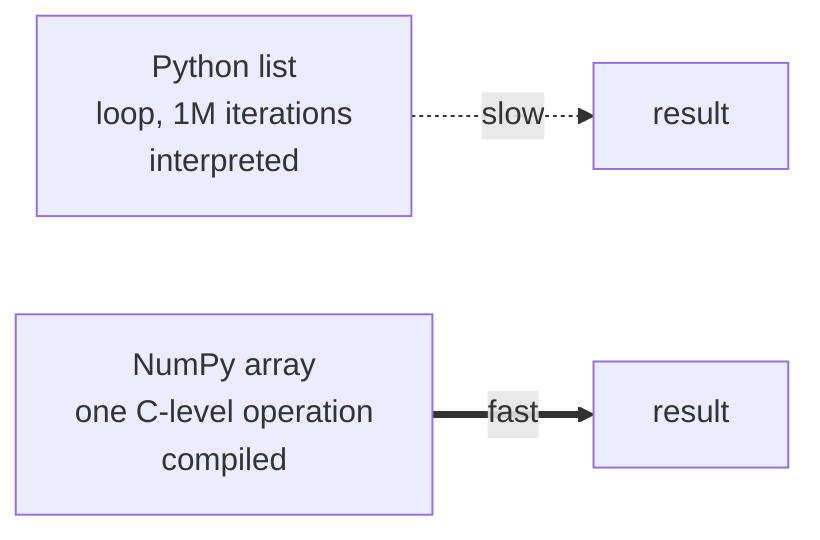

# NumPy

**What it is:** fast numeric arrays. Every other library in this section —
pandas, scikit-learn, PyTorch — is built on top of it or speaks its language.

**Why it exists:** a Python list of a million numbers is a million separate
objects scattered in memory. A NumPy array is one contiguous block, typed and
compact, operated on by compiled C code.

```python
import numpy as np
```

---

## The idea: vectorisation

```python
import numpy as np

prices = np.array([45, 60, 85, 30])

print(prices * 1.14)
print(prices + prices)
print(prices > 50)
```

```text
[51.3 68.4 96.9 34.2]
[ 90 120 170  60]
[False  True  True False]
```

No loop. The operation applies to every element at once. This is the whole
point of NumPy, and it is both shorter to write and roughly 10–100× faster than
the equivalent Python loop.



---

## Creating arrays

```python
import numpy as np

print(np.array([1, 2, 3]))
print(np.zeros(3))
print(np.ones((2, 3)))
print(np.arange(0, 10, 2))
print(np.linspace(0, 1, 5))
```

```text
[1 2 3]
[0. 0. 0.]
[[1. 1. 1.]
 [1. 1. 1.]]
[0 2 4 6 8]
[0.   0.25 0.5  0.75 1.  ]
```

Random numbers, reproducibly:

```python
rng = np.random.default_rng(seed=42)
print(rng.normal(loc=0, scale=1, size=4).round(3))
```

```text
[ 0.305 -1.04   0.75   0.941]
```

Always set a seed in anything you will report. "It worked yesterday" is not a
result.

---

## Shape, dtype, reshape

```python
import numpy as np

a = np.arange(12)
b = a.reshape(3, 4)

print(a.shape, b.shape)
print(b.dtype)
print(b)
print(b.T.shape)
```

```text
(12,) (3, 4)
int64
[[ 0  1  2  3]
 [ 4  5  6  7]
 [ 8  9 10 11]]
(4, 3)
```

`shape` is the size of each dimension. Nearly every error you will hit with
NumPy, and later with PyTorch, is a shape error — print shapes first, think
second.

`reshape(-1, 1)` means "one column, as many rows as it takes". scikit-learn
asks for this constantly.

---

## Indexing and slicing

```python
import numpy as np

m = np.array([[1, 2, 3],
              [4, 5, 6],
              [7, 8, 9]])

print(m[0, 2])       # row 0, column 2
print(m[:, 1])       # whole column 1
print(m[1:, :2])     # rows from 1, first two columns
```

```text
3
[2 5 8]
[[4 5]
 [7 8]]
```

**Boolean masking** — the most useful indexing there is:

```python
values = np.array([12, 45, 7, 88, 23])

mask = values > 20
print(mask)
print(values[mask])
print(values[(values > 20) & (values < 50)])
```

```text
[False  True False  True  True]
[45 88 23]
[45 23]
```

Use `&` and `|`, not `and` and `or`, and bracket each condition. This is a
different operation from lesson 04 and the plain keywords raise an error here.

---

## The functions you will use

| Function | Does |
|---|---|
| `np.array(x)` | Build an array from a list |
| `np.zeros / ones / full` | Pre-fill an array |
| `np.arange / linspace` | Ranges by step or by count |
| `a.reshape(r, c)` | Change shape, same data |
| `a.mean / sum / std / min / max` | Aggregate, optionally per axis |
| `np.where(cond, a, b)` | Vectorised if/else |
| `np.concatenate / stack` | Join arrays |
| `np.unique(a)` | Distinct values, optionally with counts |
| `np.dot(a, b)` or `a @ b` | Matrix multiply |
| `np.isnan(a)` | Find missing values |

---

## Aggregation and axis

```python
import numpy as np

sales = np.array([[10, 20, 30],
                  [40, 50, 60]])

print(sales.sum())
print(sales.sum(axis=0))    # down the rows -> per column
print(sales.sum(axis=1))    # across the columns -> per row
print(sales.mean(axis=1))
```

```text
210
[50 70 90]
[ 60 150]
[20. 50.]
```

`axis=0` collapses rows, `axis=1` collapses columns. If you remember it as
"the axis that disappears", you will stop guessing.

---

## where — vectorised if/else

```python
import numpy as np

marks = np.array([45, 78, 92, 30])
print(np.where(marks >= 50, "pass", "fail"))
```

```text
['fail' 'pass' 'pass' 'fail']
```

---

## Broadcasting

Arrays of different shapes can still combine, if the shapes are compatible:

```python
import numpy as np

matrix = np.array([[1, 2, 3],
                   [4, 5, 6]])
row = np.array([10, 20, 30])

print(matrix + row)
```

```text
[[11 22 33]
 [14 25 36]]
```

The row was applied to every row of the matrix without being copied. This is
how you normalise a dataset in one line:

```python
import numpy as np

data = np.array([[10., 200.], [20., 400.], [30., 600.]])
normalised = (data - data.mean(axis=0)) / data.std(axis=0)
print(normalised.round(3))
```

```text
[[-1.225 -1.225]
 [ 0.     0.   ]
 [ 1.225  1.225]]
```

Broadcasting rules, compared right to left: dimensions must be equal, or one
of them must be 1.

---

## Common mistakes

| Mistake | What happens |
|---|---|
| `and` / `or` on arrays | `ValueError: truth value of an array is ambiguous` — use `&` / `\|` |
| Looping over an array element by element | Correct, and 50× slower than it needs to be |
| `b = a` then editing `b` | Slices are **views** — changes hit the original. Use `a.copy()` |
| Mixing `int` and `float` arrays unknowingly | Silent truncation |
| Ignoring `shape` | Every broadcast error starts here |

---

## Exercises

1. Make a 5×5 array of random integers 0–100. Print its mean per row and column.
2. Replace every value below the mean with 0 using `np.where`.
3. Normalise a 2-D array to mean 0 and standard deviation 1, per column.
4. Time a sum over one million values as a Python loop and as `.sum()`.
