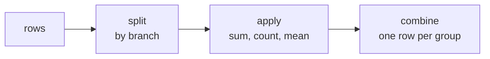

# pandas

**What it is:** tables in Python. A `DataFrame` is rows and columns with names
and types — a spreadsheet you can program, backed by NumPy.

**Where it fits:** you will spend most of your time as a data scientist or data
engineer here. Loading, inspecting, cleaning, joining, grouping. The model is
twenty lines at the end; this is the other four hours.

```python
import pandas as pd
```

---

## The two objects

```python
import pandas as pd

s = pd.Series([45, 60, 85], name="price")

df = pd.DataFrame({
    "item":  ["Espresso", "Latte", "V60"],
    "price": [45, 60, 85],
    "cups":  [120, 340, 90],
})

print(s)
print(df)
```

```text
0    45
1    60
2    85
Name: price, dtype: int64
       item  price  cups
0  Espresso     45   120
1     Latte     60   340
2       V60     85    90
```

A `Series` is one column. A `DataFrame` is a dict of Series sharing an index.

---

## Loading and saving

```python
df = pd.read_csv("menu.csv")
df = pd.read_csv("menu.csv", usecols=["item", "price"], dtype={"price": "float"})
df = pd.read_excel("report.xlsx", sheet_name="Sales")
df = pd.read_parquet("events.parquet")
df = pd.read_sql("SELECT * FROM orders", connection)
df = pd.read_json("data.json")

df.to_csv("out.csv", index=False)
df.to_parquet("out.parquet")
```

Two habits worth forming now: pass `index=False` when writing CSV unless the
index means something, and prefer Parquet over CSV for anything you will read
more than once — it keeps types, compresses, and loads far faster.

---

## Look before you touch

```python
df.head(3)        # first rows
df.tail(3)
df.shape          # (rows, columns)
df.info()         # types and non-null counts
df.describe()     # numeric summary
df.columns
df.dtypes
df["item"].unique()
df["item"].value_counts()
df.isna().sum()   # missing values per column
```

Run `df.info()` and `df.isna().sum()` on every dataset before you do anything
else. Half of all data bugs are visible in those two outputs.

---

## Selecting

```python
import pandas as pd

df = pd.DataFrame({
    "item":  ["Espresso", "Latte", "V60", "Tea"],
    "price": [45, 60, 85, 30],
    "cups":  [120, 340, 90, 200],
})

print(df["price"].tolist())          # one column -> Series
print(df[["item", "price"]].shape)   # several -> DataFrame
print(df.loc[1, "item"])             # by label
print(df.iloc[0])                    # by position, whole row
```

```text
[45, 60, 85, 30]
(4, 2)
Latte
item     Espresso
price          45
cups          120
Name: 0, dtype: object
```

`loc` uses labels, `iloc` uses positions. Mixing them up is the most common
pandas error.

**Filtering** works like NumPy masking:

```python
print(df[df["price"] > 50])
print(df[(df["price"] > 40) & (df["cups"] > 100)]["item"].tolist())
print(df.query("price > 40 and cups > 100")["item"].tolist())
```

```text
    item  price  cups
1  Latte     60   340
2    V60     85    90
['Espresso', 'Latte']
['Espresso', 'Latte']
```

Again: `&` and `|`, each condition in brackets. `.query()` is the readable
alternative once conditions pile up.

---

## Creating and changing columns

```python
import pandas as pd

df = pd.DataFrame({"item": ["Espresso", "Latte"], "price": [45, 60], "cups": [120, 340]})

df["revenue"] = df["price"] * df["cups"]
df["tier"] = pd.cut(df["price"], bins=[0, 50, 100], labels=["cheap", "premium"])
df = df.rename(columns={"cups": "units_sold"})
df = df.drop(columns=["tier"])

print(df)
```

```text
       item  price  units_sold  revenue
0  Espresso     45         120     5400
1     Latte     60         340    20400
```

Column arithmetic is vectorised — never loop over rows to compute a column.
If you genuinely need per-row Python, `df.apply(func, axis=1)` exists, but
treat reaching for it as a sign to look for a vectorised way first.

---

## Missing data

```python
import pandas as pd
import numpy as np

df = pd.DataFrame({"item": ["A", "B", "C"], "price": [45, np.nan, 85]})

print(df["price"].isna().sum())
print(df["price"].fillna(df["price"].mean()).tolist())
print(df.dropna().shape)
```

```text
1
[45.0, 65.0, 85.0]
(2, 2)
```

Decide deliberately: drop the row, fill with a statistic, or fill forward for
time series (`.ffill()`). Silently dropping data is how a report ends up wrong.

---

## groupby — the one that matters

```python
import pandas as pd

sales = pd.DataFrame({
    "branch": ["Cairo", "Giza", "Cairo", "Giza", "Cairo"],
    "item":   ["Latte", "Latte", "V60", "V60", "Tea"],
    "amount": [600, 480, 340, 170, 90],
})

print(sales.groupby("branch")["amount"].sum())
print()
print(sales.groupby("branch").agg(
    total=("amount", "sum"),
    orders=("amount", "count"),
    average=("amount", "mean"),
).round(1))
```

```text
branch
Cairo    1030
Giza      650
Name: amount, dtype: int64

        total  orders  average
branch                        
Cairo    1030       3    343.3
Giza      650       2    325.0
```



Split, apply, combine. Once this clicks, most analysis questions become one
`groupby`.

---

## Joining

```python
import pandas as pd

orders = pd.DataFrame({"order_id": [1, 2, 3], "item_id": [10, 11, 99]})
items  = pd.DataFrame({"item_id": [10, 11], "name": ["Latte", "V60"]})

print(orders.merge(items, on="item_id", how="left"))
```

```text
   order_id  item_id   name
0         1       10  Latte
1         2       11    V60
2         3       99    NaN
```

`how=` is the decision: `inner` keeps only matches, `left` keeps every left
row (the default choice for enrichment), `outer` keeps everything.

Check the row count before and after every merge. A row count that grew means
duplicate keys on the right, and your totals are now silently inflated — this
is the most expensive mistake in this file.

---

## Sorting, and the rest

```python
df.sort_values("revenue", ascending=False).head(10)
df.drop_duplicates(subset=["item"])
df.reset_index(drop=True)
pd.concat([df_a, df_b], ignore_index=True)     # stack rows
df.pivot_table(index="branch", columns="item", values="amount", aggfunc="sum")
```

---

## The functions you will use

| Function | Does |
|---|---|
| `pd.read_csv / read_parquet` | Load |
| `df.head / info / describe` | Inspect |
| `df.loc / iloc` | Select by label / position |
| `df[mask]` , `df.query()` | Filter |
| `df.groupby().agg()` | Split-apply-combine |
| `df.merge()` | Join two tables |
| `df.sort_values()` | Order |
| `df.fillna / dropna` | Handle missing |
| `df.value_counts()` | Frequency table |
| `df.pivot_table()` | Cross-tab |
| `df.to_parquet()` | Save properly |

---

## Common mistakes

| Mistake | What happens |
|---|---|
| `df[df.price > 50 and df.cups > 100]` | `ValueError` — use `&` with brackets |
| Chained assignment `df[df.a > 1]["b"] = 0` | `SettingWithCopyWarning`, edit lost — use `.loc` |
| Looping with `iterrows()` | Works, 100× slower than vectorised |
| Merging without checking row counts | Silent duplicate explosion |
| Saving to CSV and losing dtypes | Use Parquet |

---

## Exercises

1. Load any CSV. Print shape, dtypes, and missing values per column.
2. Add a computed column, then filter to the top 10 rows by it.
3. Group by a category column and produce total, count, and mean in one `agg`.
4. Merge two tables with `how="left"`; count how many rows failed to match.
