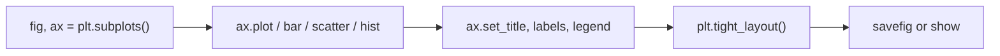

# Matplotlib and Seaborn

**What they are:** Matplotlib draws the chart. Seaborn is a layer on top that
makes statistical charts short to write and good-looking by default.

**Why it matters:** you find problems in data by looking at it. A column of
summary statistics hides a bimodal distribution; a scatter plot shows it in one
second.

```python
import matplotlib.pyplot as plt
import seaborn as sns
```

---

## The shape of every Matplotlib script

```python
import matplotlib.pyplot as plt

items = ["Espresso", "Latte", "V60", "Tea"]
cups = [120, 340, 90, 200]

fig, ax = plt.subplots(figsize=(7, 4))
ax.bar(items, cups, color="#2563eb")
ax.set_title("Cups sold this week")
ax.set_xlabel("Item")
ax.set_ylabel("Cups")
plt.tight_layout()
plt.savefig("cups.png", dpi=150)
plt.show()
```

```text
(a bar chart is drawn: Latte tallest at 340, V60 shortest at 90)
```

Learn this pattern and you can produce any chart:



`fig` is the canvas; `ax` is the plot on it. Always use the `fig, ax` form,
never the bare `plt.plot()` style — the moment you want two charts side by
side, the bare style falls apart.

---

## The four charts that answer most questions

```python
import matplotlib.pyplot as plt
import numpy as np

rng = np.random.default_rng(0)
x = np.arange(30)
y = np.cumsum(rng.normal(size=30))

fig, axes = plt.subplots(2, 2, figsize=(10, 6))

axes[0, 0].plot(x, y)                      # line  -> change over time
axes[0, 1].scatter(rng.normal(size=100), rng.normal(size=100), alpha=0.6)
axes[1, 0].hist(rng.normal(size=500), bins=30)
axes[1, 1].bar(["A", "B", "C"], [12, 25, 7])

axes[0, 0].set_title("Line — trend")
axes[0, 1].set_title("Scatter — relationship")
axes[1, 0].set_title("Histogram — distribution")
axes[1, 1].set_title("Bar — comparison")
plt.tight_layout()
plt.show()
```

| Question | Chart |
|---|---|
| How did it change over time? | line |
| Are these two variables related? | scatter |
| What does this column look like? | histogram |
| Which category is bigger? | bar |
| Where are the outliers? | box plot |

Pie charts answer none of these well. Avoid them.

---

## Seaborn

Seaborn takes a DataFrame and column names, and does the aggregation for you.

```python
import seaborn as sns
import pandas as pd
import matplotlib.pyplot as plt

df = pd.DataFrame({
    "branch": ["Cairo", "Giza", "Cairo", "Giza", "Cairo", "Giza"],
    "item":   ["Latte", "Latte", "V60", "V60", "Tea", "Tea"],
    "amount": [600, 480, 340, 170, 90, 150],
})

sns.set_theme(style="whitegrid")

fig, ax = plt.subplots(figsize=(7, 4))
sns.barplot(data=df, x="item", y="amount", hue="branch", ax=ax)
ax.set_title("Revenue by item and branch")
plt.tight_layout()
plt.show()
```

```text
(grouped bars: two bars per item, one per branch, with a legend)
```

The pattern is always `data=`, `x=`, `y=`, `hue=`. `hue` splits by a category
and adds the legend for free.

The plots worth knowing:

| Function | Shows |
|---|---|
| `sns.histplot` | Distribution of one column |
| `sns.boxplot` | Spread and outliers, per category |
| `sns.scatterplot` | Relationship between two columns |
| `sns.lineplot` | Trend, with confidence band |
| `sns.barplot` | Mean per category, with error bars |
| `sns.heatmap` | A matrix — correlations, confusion matrices |
| `sns.pairplot` | Every column against every other — first look at a dataset |

---

## The correlation heatmap

The single most useful chart at the start of a project:

```python
import seaborn as sns
import pandas as pd
import numpy as np
import matplotlib.pyplot as plt

rng = np.random.default_rng(0)
df = pd.DataFrame({
    "price": rng.normal(60, 15, 200),
    "cups":  rng.normal(200, 50, 200),
})
df["revenue"] = df["price"] * df["cups"] + rng.normal(0, 500, 200)

fig, ax = plt.subplots(figsize=(5, 4))
sns.heatmap(df.corr(), annot=True, cmap="coolwarm", vmin=-1, vmax=1, ax=ax)
ax.set_title("Correlation")
plt.tight_layout()
plt.show()
```

```text
(a 3x3 matrix; revenue correlates strongly with cups and price)
```

`annot=True` writes the numbers in the cells. Without it you are guessing at
colours.

---

## Making a chart readable

Four rules that separate a working chart from a presentable one:

1. **Title says the finding, not the columns.** "Latte drives 40% of revenue"
   beats "amount by item".
2. **Label both axes, with units.**
3. **Start bar charts at zero.** A truncated axis exaggerates the difference,
   and people will notice.
4. **Delete anything that is not information** — 3-D effects, backgrounds,
   gridlines you are not reading against.

---

## Saving for a report

```python
plt.savefig("chart.png", dpi=150, bbox_inches="tight")
```

`dpi=150` or higher, or it will look blurry in a slide. `bbox_inches="tight"`
stops the labels being cut off.

---

## Common mistakes

| Mistake | What happens |
|---|---|
| Forgetting `plt.show()` in a script | Nothing appears |
| Reusing an `ax` without clearing | Charts draw on top of each other |
| `savefig` after `show()` | You save a blank image — save first |
| No `tight_layout()` | Labels overlap the edges |
| Plotting 100k points with `scatter` | It hangs — sample, or use `alpha` and smaller markers |

---

## Exercises

1. Plot a histogram of one numeric column and describe its shape in words.
2. Draw a grouped bar chart of a metric by two categories with `hue`.
3. Build a correlation heatmap and name the two strongest relationships.
4. Take any chart you made and rewrite the title so it states the finding.
