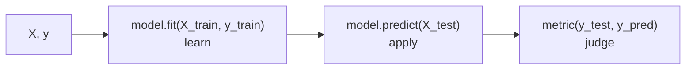

# scikit-learn

**What it is:** classical machine learning with one consistent interface.
Every model — regression, trees, clustering — is used the same way.

**Why you start here:** before any neural network, you need a baseline. A
`LogisticRegression` trained in four lines tells you whether the problem is
even learnable, and often it is good enough to ship.

```python
from sklearn.model_selection import train_test_split
```

---

## The interface: fit, predict, score

Every estimator in the library follows this:



Learn it once, and the hundred models in the library are free.

```python
from sklearn.datasets import load_iris
from sklearn.model_selection import train_test_split
from sklearn.linear_model import LogisticRegression
from sklearn.metrics import accuracy_score

X, y = load_iris(return_X_y=True)

X_train, X_test, y_train, y_test = train_test_split(
    X, y, test_size=0.2, random_state=42, stratify=y
)

model = LogisticRegression(max_iter=200)
model.fit(X_train, y_train)
predictions = model.predict(X_test)

print("accuracy:", accuracy_score(y_test, predictions))
```

```text
accuracy: 0.9666666666666667
```

---

## The split is the whole discipline

```python
X_train, X_test, y_train, y_test = train_test_split(
    X, y, test_size=0.2, random_state=42, stratify=y
)
```

- `test_size=0.2` — one fifth held back and never learned from.
- `random_state=42` — the same split every run, so results are comparable.
- `stratify=y` — keeps the class proportions in both halves. Use it for every
  classification problem.

A model evaluated on data it trained on will look excellent and fail in
production. This is the mistake that ends careers quietly.

---

## Scaling

Models that measure distance or fit coefficients care about units. A column in
EGP and a column in years are not comparable until you scale them.

```python
from sklearn.preprocessing import StandardScaler
import numpy as np

X = np.array([[50_000., 5.], [80_000., 10.], [60_000., 2.]])

scaler = StandardScaler()
X_scaled = scaler.fit_transform(X)
print(X_scaled.round(2))
```

```text
[[-1.07 -0.2 ]
 [ 1.34  1.31]
 [-0.27 -1.11]]
```

**Critical rule:** `fit_transform` on the training set, `transform` only on the
test set. Fitting the scaler on all the data leaks information from the test
set into training, and your reported score becomes fiction.

---

## Pipelines — how to not leak

```python
from sklearn.pipeline import Pipeline
from sklearn.preprocessing import StandardScaler
from sklearn.linear_model import LogisticRegression
from sklearn.datasets import load_iris
from sklearn.model_selection import train_test_split, cross_val_score

X, y = load_iris(return_X_y=True)
X_train, X_test, y_train, y_test = train_test_split(X, y, random_state=42, stratify=y)

pipe = Pipeline([
    ("scale", StandardScaler()),
    ("model", LogisticRegression(max_iter=200)),
])

pipe.fit(X_train, y_train)
print("test accuracy:", round(pipe.score(X_test, y_test), 3))
print("cv mean:", round(cross_val_score(pipe, X_train, y_train, cv=5).mean(), 3))
```

```text
test accuracy: 0.921
cv mean: 0.964
```

A pipeline applies every step in the right order at fit time and at predict
time. Use one for every project — it makes leakage structurally impossible and
turns deployment into saving one object.

---

## Choosing a model

| Problem | Start with | Then try |
|---|---|---|
| Predict a number | `LinearRegression` | `RandomForestRegressor`, `HistGradientBoostingRegressor` |
| Predict a class | `LogisticRegression` | `RandomForestClassifier`, gradient boosting |
| Group without labels | `KMeans` | `DBSCAN` |
| Too many columns | `PCA` | feature selection |

Tabular data, honestly: gradient boosting wins most of the time. Neural
networks are for text, images, and audio.

---

## Metrics — accuracy is not enough

```python
from sklearn.metrics import classification_report, confusion_matrix
import numpy as np

y_true = np.array([0, 0, 0, 0, 0, 0, 0, 0, 1, 1])
y_pred = np.array([0, 0, 0, 0, 0, 0, 0, 0, 0, 0])

print(confusion_matrix(y_true, y_pred))
print(classification_report(y_true, y_pred, zero_division=0))
```

```text
[[8 0]
 [2 0]]
              precision    recall  f1-score   support

           0       0.80      1.00      0.89         8
           1       0.00      0.00      0.00         2

    accuracy                           0.80        10
   macro avg       0.40      0.50      0.44        10
weighted avg       0.64      0.80      0.71        10
```

This model is 80% accurate and completely useless — it never predicts class 1,
which is the class you cared about. If 2% of transactions are fraud, predicting
"not fraud" always scores 98%.

| Metric | Answers |
|---|---|
| Precision | Of what I flagged, how much was right? |
| Recall | Of what was actually there, how much did I catch? |
| F1 | The balance of the two |
| ROC-AUC | How well does it rank, at any threshold? |

Choose based on the cost of being wrong. Missing a cancer diagnosis and
wrongly flagging a transaction are not the same error.

For regression: `mean_absolute_error` (in the units of your target, so a human
can read it), `root_mean_squared_error` (punishes big misses), `r2_score`.

---

## Tuning

```python
from sklearn.model_selection import GridSearchCV
from sklearn.ensemble import RandomForestClassifier
from sklearn.datasets import load_iris

X, y = load_iris(return_X_y=True)

grid = GridSearchCV(
    RandomForestClassifier(random_state=42),
    param_grid={"n_estimators": [50, 200], "max_depth": [3, None]},
    cv=5,
    n_jobs=-1,
)
grid.fit(X, y)
print(grid.best_params_, round(grid.best_score_, 3))
```

```text
{'max_depth': 3, 'n_estimators': 50} 0.967
```

Tune after you have a working baseline and a trustworthy split — not before.
A tuned model on a leaking split is a precisely measured lie.

---

## Saving a model

```python
import joblib

joblib.dump(pipe, "model.joblib")
loaded = joblib.load("model.joblib")
```

Save the whole pipeline, not the bare model. The scaler is part of the model.

---

## Common mistakes

| Mistake | What happens |
|---|---|
| Scaling before splitting | Test data leaks into training; scores are inflated |
| Reporting training accuracy | Meaningless |
| Accuracy on imbalanced data | Hides a useless model |
| No `random_state` | Results change every run |
| Tuning against the test set | The test set stops being a test |

---

## Exercises

1. Load any dataset, split it, and get a `LogisticRegression` baseline.
2. Wrap the scaler and the model in a `Pipeline`; confirm the score is stable.
3. Print a `classification_report` and say which class the model is worst at.
4. Grid-search two hyperparameters and compare against the baseline.
