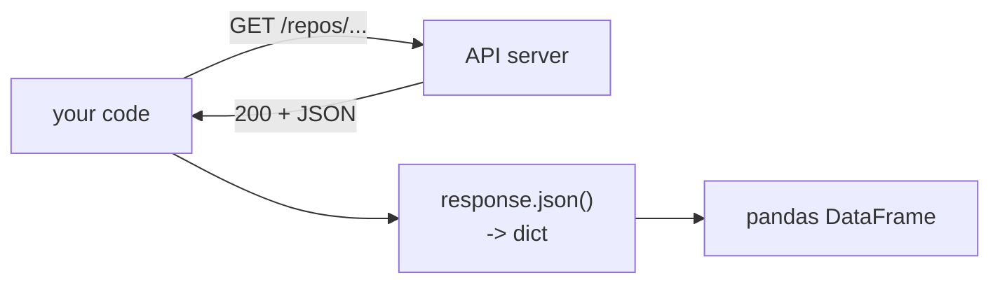

# requests — Getting Data from APIs

**What it is:** HTTP in a few lines. Most external data you will ever use
arrives through an API, and this is how you ask for it.

**Role:** data engineering, first and foremost — ingestion.

```python
import requests
```

> The outputs below are from live endpoints, so your exact values will differ.
> The shapes will not.

---

## A request in four lines

```python
import requests

response = requests.get("https://api.github.com/repos/python/cpython", timeout=10)
response.raise_for_status()
data = response.json()

print(data["name"], data["language"], data["stargazers_count"])
```

```text
cpython Python 62000
```

Line by line:

- `requests.get(url)` sends the request and waits for the answer.
- `timeout=10` — **always pass it**. Without a timeout, a server that never
  answers hangs your program forever. This is the most common production
  failure in ingestion code.
- `raise_for_status()` turns a 404 or 500 into an exception instead of letting
  you parse an error page as if it were data.
- `.json()` parses the response body into Python dicts and lists.



---

## Status codes you must handle

| Code | Means | What to do |
|---|---|---|
| 200 | Fine | Carry on |
| 401 / 403 | Bad or missing credentials | Check the token |
| 404 | Not there | Check the URL |
| 429 | Too many requests | Back off and retry — see below |
| 5xx | Their server broke | Retry with a delay |

```python
import requests

r = requests.get("https://api.github.com/repos/does/not/exist", timeout=10)
print(r.status_code, r.ok)
```

```text
404 False
```

---

## Query parameters and headers

```python
import requests

response = requests.get(
    "https://api.github.com/search/repositories",
    params={"q": "language:python stars:>10000", "per_page": 3},
    headers={"Accept": "application/vnd.github+json"},
    timeout=10,
)

for repo in response.json()["items"]:
    print(f'{repo["full_name"]:<30}{repo["stargazers_count"]:>8}')
```

```text
public-apis/public-apis          300000
donnemartin/system-design-primer 260000
TheAlgorithms/Python             180000
```

Pass `params=` as a dict — never build the URL by string concatenation. The
library encodes spaces and special characters correctly and you will not.

---

## Authentication

```python
import os
import requests

token = os.environ["API_TOKEN"]          # never hard-code this

response = requests.get(
    "https://api.example.com/v1/orders",
    headers={"Authorization": f"Bearer {token}"},
    timeout=10,
)
```

The token goes in an environment variable or a secrets manager. A token
committed to a repository is a token that has been leaked — GitHub scans for
them, and so does everyone else.

---

## POST and sending JSON

```python
import requests

response = requests.post(
    "https://httpbin.org/post",
    json={"item": "Latte", "price": 60},
    timeout=10,
)
print(response.json()["json"])
```

```text
{'item': 'Latte', 'price': 60}
```

`json=` sets the content type and encodes the body. `data=` sends form fields
instead — mixing them up produces a confusing 400.

---

## Pagination — the loop you will write constantly

APIs hand back data in pages. You keep asking until there is nothing left.

```python
import requests

def fetch_all(url, per_page=100, max_pages=10):
    """Collect items across pages, stopping when a page comes back empty."""
    results = []
    for page in range(1, max_pages + 1):
        r = requests.get(url, params={"page": page, "per_page": per_page}, timeout=10)
        r.raise_for_status()
        batch = r.json()
        if not batch:
            break
        results.extend(batch)
    return results

items = fetch_all("https://api.github.com/repos/python/cpython/contributors")
print(len(items))
```

```text
100
```

Note the two stopping conditions: an empty page, and a hard `max_pages` cap.
Without the cap, one API change turns your script into an infinite loop against
someone else's server.

---

## Retries and rate limits

```python
import time
import requests

def get_with_retry(url, attempts=4, **kwargs):
    """GET with exponential backoff on 429 and 5xx."""
    for attempt in range(attempts):
        r = requests.get(url, timeout=10, **kwargs)
        if r.status_code < 400:
            return r
        if r.status_code == 429 or r.status_code >= 500:
            wait = 2 ** attempt
            print(f"status {r.status_code}, retrying in {wait}s")
            time.sleep(wait)
            continue
        r.raise_for_status()
    raise RuntimeError(f"failed after {attempts} attempts: {url}")
```

Wait 1s, then 2s, then 4s. Retrying immediately in a tight loop gets your IP
blocked, and deservedly.

---

## Straight into pandas

```python
import requests
import pandas as pd

data = requests.get("https://api.github.com/repos/pandas-dev/pandas/issues",
                    params={"per_page": 5}, timeout=10).json()

df = pd.json_normalize(data)[["number", "title", "state"]]
print(df.shape)
```

```text
(5, 3)
```

`pd.json_normalize` flattens nested JSON — `user.login` becomes a column. It is
the bridge between an API and a table.

---

## Sessions

```python
import requests

with requests.Session() as session:
    session.headers.update({"Authorization": "Bearer ..."})
    for page in range(3):
        r = session.get("https://api.example.com/items", params={"page": page}, timeout=10)
```

A session reuses the TCP connection and keeps your headers. For anything past
a handful of requests, it is noticeably faster.

---

## Common mistakes

| Mistake | What happens |
|---|---|
| No `timeout` | The script hangs forever on a silent server |
| No `raise_for_status()` | You parse an error page as data |
| Building URLs with `+` | Broken encoding on spaces and symbols |
| Hard-coded tokens | A leaked credential in git history |
| Retrying with no delay | Rate-limited, then blocked |
| Requesting one page and assuming that is everything | Silently partial data |

---

## Exercises

1. Fetch any public API and print three fields from the response.
2. Handle a 404 without crashing, printing a clear message.
3. Write a paginated fetch with a page cap and turn the result into a DataFrame.
4. Add exponential backoff and prove it works by pointing it at a 500 endpoint.
