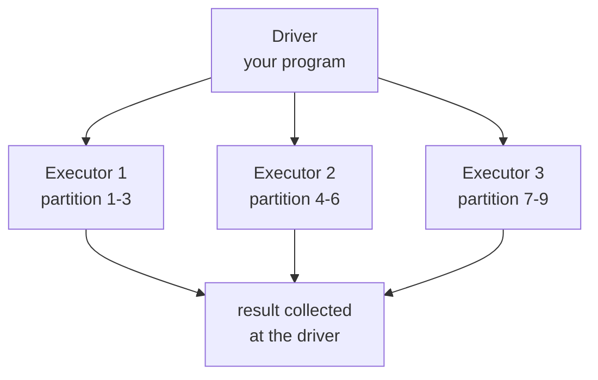

# PySpark

**What it is:** pandas-like operations over data spread across many machines.

**When you need it:** when the data does not fit in memory. Not before. A
100 MB CSV in Spark is slower than the same file in pandas, and far harder to
debug.

```python
from pyspark.sql import SparkSession
```

---

## The idea



Your data is split into partitions. Each executor works on its own partitions,
in parallel, on its own machine. You write one query; Spark plans how to spread
it.

---

## Lazy evaluation

This is the part that confuses people coming from pandas.

```python
from pyspark.sql import SparkSession
from pyspark.sql import functions as F

spark = SparkSession.builder.appName("course").getOrCreate()

df = spark.read.parquet("events/")          # nothing has been read yet
clean = df.filter(F.col("amount") > 0)      # still nothing
totals = clean.groupBy("item").agg(F.sum("amount").alias("total"))   # still nothing

totals.show(5)                              # NOW everything runs
```

```text
+--------+-------+
|    item|  total|
+--------+-------+
|   Latte|12400.0|
|     V60| 8300.0|
|Espresso| 5100.0|
+--------+-------+
```

**Transformations** (`filter`, `select`, `groupBy`, `join`, `withColumn`) build
a plan. **Actions** (`show`, `count`, `collect`, `write`) run it.

Spark optimises the whole chain before executing, so it can push your filter
down to the file read and skip most of the data entirely. That is why lazy
evaluation is a feature, not an annoyance.

---

## The operations

```python
from pyspark.sql import functions as F

df.select("item", "amount")
df.filter((F.col("amount") > 50) & (F.col("branch") == "Cairo"))
df.withColumn("with_tax", F.col("amount") * 1.14)
df.withColumnRenamed("amount", "revenue")
df.drop("internal_id")
df.dropDuplicates(["order_id"])
df.na.fill({"amount": 0})
df.orderBy(F.col("amount").desc())

df.groupBy("branch", "item").agg(
    F.sum("amount").alias("total"),
    F.countDistinct("order_id").alias("orders"),
    F.avg("amount").alias("average"),
)

orders.join(items, on="item_id", how="left")
```

If you know pandas, you already know what these do. The names differ slightly;
the concepts do not.

---

## Reading and writing

```python
df = spark.read.parquet("s3://bucket/events/")
df = spark.read.option("header", True).option("inferSchema", True).csv("data.csv")

df.write.mode("overwrite").partitionBy("year", "month").parquet("output/")
```

Define the schema explicitly for anything that runs on a schedule —
`inferSchema` reads the file twice and guesses, and a day where one column
happens to be all digits will silently change its type.

```python
from pyspark.sql.types import StructType, StructField, StringType, DoubleType

schema = StructType([
    StructField("item", StringType(), nullable=False),
    StructField("amount", DoubleType(), nullable=True),
])

df = spark.read.schema(schema).csv("data.csv", header=True)
```

---

## Actions, and the dangerous one

```python
df.show(20)          # print some rows
df.count()           # number of rows
df.take(5)           # first 5 rows to the driver
df.write.parquet(…)  # save

df.collect()         # EVERY row to the driver's memory
```

`collect()` on a large DataFrame crashes the driver. If the result is small —
an aggregation, a lookup table — it is fine. If you are not certain it is
small, use `take()` or `limit()`.

---

## The shuffle

```python
df.groupBy("user_id").count()      # data moves between machines
df.join(other, on="user_id")       # data moves between machines
df.filter(...)                     # no movement
```

Grouping and joining require every row with the same key to end up on the same
machine. That movement across the network — the *shuffle* — is where Spark jobs
spend their time and where they fail.

Reduce it by filtering before joining, by broadcasting a small table, and by
not grouping on something with a billion distinct values:

```python
from pyspark.sql.functions import broadcast

big.join(broadcast(small_lookup), on="item_id", how="left")
```

`broadcast` sends the small table to every executor instead of shuffling the
big one. When one side fits in memory, this is often a 10× win.

---

## Back to pandas

```python
small = totals.limit(1000).toPandas()
```

Use Spark to cut a hundred million rows down to something that fits in memory,
then finish in pandas where plotting and modelling live.

---

## When to use what

| Data size | Tool |
|---|---|
| Up to a few GB | pandas |
| A few GB, one machine, many cores | Polars or DuckDB |
| Tens of GB and up, or already on a cluster | Spark |

Choosing Spark for 500 MB is not future-proofing. It is a slower pipeline and
a harder debugging session, today.

---

## Common mistakes

| Mistake | What happens |
|---|---|
| `collect()` on a big DataFrame | Driver runs out of memory and dies |
| Expecting eager execution | "Nothing happened" — you never called an action |
| `inferSchema` in production | Types change between runs |
| Python UDFs everywhere | Serialisation kills performance — use `F.` functions |
| Joining before filtering | Shuffling rows you were about to throw away |
| Spark for small data | All of the overhead, none of the benefit |

---

## Exercises

1. Start a local `SparkSession` and read a CSV with an explicit schema.
2. Chain three transformations, then explain why nothing printed until `show()`.
3. Write a `groupBy().agg()` producing total, count, and average per category.
4. Join a large and a small DataFrame, then again with `broadcast`. Compare
   the run time.
