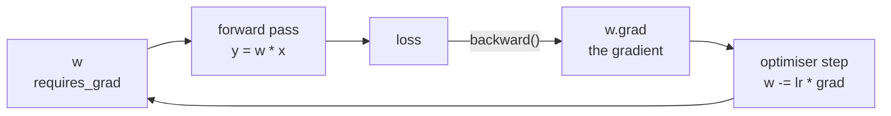

# PyTorch

**What it is:** NumPy that runs on a GPU and computes derivatives for you.
That second part is what makes training neural networks possible.

**Role:** AI engineer. Everything modern — language models, vision, audio — is
built on this or on something very like it.

```python
import torch
import torch.nn as nn
```

---

## Tensors

A tensor is an array with two extra abilities: it can live on a GPU, and it can
remember how it was computed.

```python
import torch

x = torch.tensor([[1., 2.], [3., 4.]])

print(x.shape, x.dtype, x.device)
print(x @ x)
print(x.mean(), x.sum(dim=0))
```

```text
torch.Size([2, 2]) torch.float32 cpu
tensor([[ 7., 10.],
        [15., 22.]])
tensor(2.5000) tensor([4., 6.])
```

If you know NumPy, you know 80% of this API. The names match almost everywhere.

```python
import torch
import numpy as np

a = np.array([1.0, 2.0, 3.0])
t = torch.from_numpy(a)
back = t.numpy()
print(t, back)
```

```text
tensor([1., 2., 3.], dtype=torch.float64) [1. 2. 3.]
```

Moving to the GPU:

```python
device = "cuda" if torch.cuda.is_available() else "cpu"
x = x.to(device)
```

Write that line, not `.cuda()`. The same script then runs on your laptop and on
a server with a GPU.

---

## Autograd — the actual magic

```python
import torch

w = torch.tensor([2.0], requires_grad=True)
x = torch.tensor([3.0])

y = w * x          # forward
loss = (y - 10) ** 2

loss.backward()    # backward
print(loss.item(), w.grad)
```

```text
16.0 tensor([-24.])
```

PyTorch recorded every operation that touched `w`, then applied the chain rule
backwards to tell you how the loss changes if `w` changes. That number,
`-24`, is the only thing an optimiser needs.



That loop — forward, loss, backward, step — is the entirety of training. Every
model in every paper is that, repeated.

---

## Building a model

```python
import torch
import torch.nn as nn

model = nn.Sequential(
    nn.Linear(4, 16),
    nn.ReLU(),
    nn.Dropout(0.2),
    nn.Linear(16, 3),
)

print(model)
print(sum(p.numel() for p in model.parameters()), "parameters")
```

```text
Sequential(
  (0): Linear(in_features=4, out_features=16, bias=True)
  (1): ReLU()
  (2): Dropout(p=0.2, inplace=False)
  (3): Linear(in_features=16, out_features=3, bias=True)
)
131 parameters
```

For anything with structure, write a class:

```python
import torch.nn as nn

class Classifier(nn.Module):
    def __init__(self, n_features, n_classes, hidden=64):
        super().__init__()
        self.net = nn.Sequential(
            nn.Linear(n_features, hidden),
            nn.ReLU(),
            nn.Linear(hidden, n_classes),
        )

    def forward(self, x):
        return self.net(x)
```

You define `forward`. You never call it directly — call `model(x)`, which runs
hooks PyTorch needs.

---

## The training loop

```python
import torch
import torch.nn as nn
from torch.utils.data import TensorDataset, DataLoader

X = torch.randn(200, 4)
y = (X.sum(dim=1) > 0).long()

loader = DataLoader(TensorDataset(X, y), batch_size=32, shuffle=True)

model = nn.Sequential(nn.Linear(4, 16), nn.ReLU(), nn.Linear(16, 2))
loss_fn = nn.CrossEntropyLoss()
optimiser = torch.optim.Adam(model.parameters(), lr=1e-3)

for epoch in range(5):
    model.train()
    total = 0.0
    for batch_x, batch_y in loader:
        optimiser.zero_grad()              # 1. clear old gradients
        output = model(batch_x)            # 2. forward
        loss = loss_fn(output, batch_y)    # 3. how wrong
        loss.backward()                    # 4. gradients
        optimiser.step()                   # 5. update weights
        total += loss.item()
    print(f"epoch {epoch+1}  loss {total/len(loader):.4f}")
```

```text
epoch 1  loss 0.7012
epoch 2  loss 0.6733
epoch 3  loss 0.6489
epoch 4  loss 0.6255
epoch 5  loss 0.6031
```

Memorise those five lines in order. Every PyTorch training script you will ever
read is a variation on them.

**`zero_grad()` is not optional.** PyTorch accumulates gradients by default.
Skip it and every batch adds to the last one, the updates grow, and the loss
goes to `nan` while you wonder what is wrong with your learning rate.

---

## Evaluating

```python
model.eval()
with torch.no_grad():
    logits = model(X)
    predictions = logits.argmax(dim=1)
    accuracy = (predictions == y).float().mean()
print(f"accuracy {accuracy:.3f}")
```

```text
accuracy 0.720
```

Two switches, both required:

- `model.eval()` turns off dropout and switches batch norm to its running
  statistics. Forgetting it makes your evaluation randomly worse.
- `torch.no_grad()` stops PyTorch recording the graph — faster, and much less
  memory.

---

## Saving

```python
torch.save(model.state_dict(), "model.pt")

model = Classifier(4, 3)
model.load_state_dict(torch.load("model.pt"))
model.eval()
```

Save the `state_dict` (the weights), not the whole object. Pickling the object
ties the file to your exact class definition and file layout.

---

## Loss and optimiser, chosen

| Task | Final layer | Loss |
|---|---|---|
| Binary classification | 1 output | `BCEWithLogitsLoss` |
| Multi-class | `n_classes` outputs, no softmax | `CrossEntropyLoss` |
| Regression | 1 output | `MSELoss` or `L1Loss` |

`CrossEntropyLoss` applies the softmax itself. Adding your own softmax before
it trains a worse model and gives no error.

Optimiser: use `Adam` with `lr=1e-3` and only look further if it fails.

---

## Common mistakes

| Mistake | What happens |
|---|---|
| Missing `optimiser.zero_grad()` | Gradients accumulate, loss diverges to `nan` |
| Softmax before `CrossEntropyLoss` | Silently worse training |
| No `model.eval()` at test time | Dropout still active, scores drop |
| No `torch.no_grad()` in evaluation | Memory grows until it crashes |
| Data on CPU, model on GPU | `RuntimeError: expected all tensors on the same device` |
| Shape mismatch | Print `.shape` at every step — it is always the shapes |

---

## Exercises

1. Create two tensors and compute a matrix product; print shapes at each step.
2. Use `requires_grad` to differentiate `y = 3x² + 2x` at `x = 4` by hand and
   with autograd. Compare.
3. Train the loop above for 20 epochs and plot the loss.
4. Add `model.eval()` and `no_grad()` evaluation; report accuracy.
