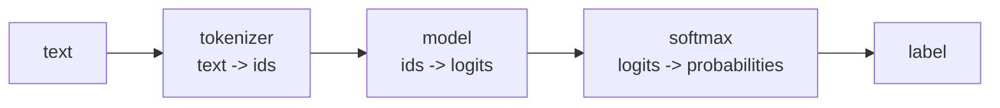

# transformers (Hugging Face)

**What it is:** thousands of pretrained models, and one API to run them.

**Why it matters:** training a language model from scratch costs millions. You
download one that already works and adapt it. This library is how.

```python
from transformers import pipeline
```

---

## The fastest path: pipeline

```python
from transformers import pipeline

classifier = pipeline("sentiment-analysis")
print(classifier("The coffee here is excellent, I will come back"))
```

```text
[{'label': 'POSITIVE', 'score': 0.9998}]
```

The first run downloads the model (a few hundred MB) and caches it. After that
it is local.

```python
from transformers import pipeline

summariser = pipeline("summarization", model="sshleifer/distilbart-cnn-12-6")
ner = pipeline("ner", grouped_entities=True)
qa = pipeline("question-answering")
embedder = pipeline("feature-extraction", model="sentence-transformers/all-MiniLM-L6-v2")
```

Common tasks: `sentiment-analysis`, `text-classification`, `ner`,
`question-answering`, `summarization`, `translation`, `fill-mask`,
`text-generation`, `feature-extraction`, `zero-shot-classification`.

`zero-shot-classification` is worth singling out — it classifies into labels
you invent at call time, with no training at all:

```python
from transformers import pipeline

clf = pipeline("zero-shot-classification")
result = clf("The wifi keeps dropping every ten minutes",
             candidate_labels=["billing", "network", "hardware"])
print(result["labels"][0], round(result["scores"][0], 3))
```

```text
network 0.913
```

For a prototype, that is a working classifier in three lines and zero labelled
data.

---

## Underneath: tokenizer and model

```python
from transformers import AutoTokenizer, AutoModelForSequenceClassification
import torch

name = "distilbert-base-uncased-finetuned-sst-2-english"
tokenizer = AutoTokenizer.from_pretrained(name)
model = AutoModelForSequenceClassification.from_pretrained(name)

inputs = tokenizer("The coffee is excellent", return_tensors="pt")
print(inputs["input_ids"])

with torch.no_grad():
    logits = model(**inputs).logits

probabilities = logits.softmax(dim=-1)
print(model.config.id2label[int(probabilities.argmax())])
```

```text
tensor([[ 101, 1996, 4157, 2003, 6581,  102]])
POSITIVE
```



The `101` and `102` are the special start and end tokens. The model never sees
text — only integers.

**The tokenizer and the model must match.** A tokenizer from one checkpoint
with weights from another produces confident nonsense, with no error.

---

## Batching and padding

```python
from transformers import AutoTokenizer

tokenizer = AutoTokenizer.from_pretrained("distilbert-base-uncased")

batch = tokenizer(
    ["Short one", "A noticeably longer sentence to tokenize"],
    padding=True,
    truncation=True,
    max_length=128,
    return_tensors="pt",
)
print(batch["input_ids"].shape)
print(batch["attention_mask"])
```

```text
torch.Size([2, 9])
tensor([[1, 1, 1, 1, 0, 0, 0, 0, 0],
        [1, 1, 1, 1, 1, 1, 1, 1, 1]])
```

Every sequence in a batch must be the same length, so short ones are padded.
The `attention_mask` tells the model which positions are real — pass it
through, or the model will read the padding as content.

`truncation=True` is what stops a long document raising an error. Know what
your `max_length` is throwing away.

---

## Embeddings, and why you care

An embedding turns text into a vector whose distance means similarity. It is
the foundation of search, recommendation, and RAG.

```python
from transformers import AutoTokenizer, AutoModel
import torch

name = "sentence-transformers/all-MiniLM-L6-v2"
tokenizer = AutoTokenizer.from_pretrained(name)
model = AutoModel.from_pretrained(name)

texts = ["strong black coffee", "espresso, no milk", "a red sports car"]
batch = tokenizer(texts, padding=True, truncation=True, return_tensors="pt")

with torch.no_grad():
    output = model(**batch).last_hidden_state

mask = batch["attention_mask"].unsqueeze(-1)
embeddings = (output * mask).sum(1) / mask.sum(1)        # mean pooling
embeddings = torch.nn.functional.normalize(embeddings, dim=1)

similarity = embeddings @ embeddings.T
print(similarity.round(decimals=2))
```

```text
tensor([[1.00, 0.73, 0.06],
        [0.73, 1.00, 0.04],
        [0.06, 0.04, 1.00]])
```

The two coffee sentences share no words, and the model still scores them as
close. That is the difference between keyword search and semantic search —
and it is what Project 2 asks you to build.

---

## Fine-tuning, briefly

```python
from transformers import AutoModelForSequenceClassification, TrainingArguments, Trainer

model = AutoModelForSequenceClassification.from_pretrained(
    "distilbert-base-uncased", num_labels=3
)

args = TrainingArguments(
    output_dir="out",
    learning_rate=2e-5,
    per_device_train_batch_size=16,
    num_train_epochs=3,
    eval_strategy="epoch",
)

trainer = Trainer(
    model=model,
    args=args,
    train_dataset=train_ds,
    eval_dataset=eval_ds,
    compute_metrics=compute_metrics,
)
trainer.train()
```

Learning rates for fine-tuning are small — `2e-5`, not `1e-3`. You are nudging
a trained model, not teaching one from nothing. Too high a rate erases what it
already knows, which is called catastrophic forgetting and looks exactly like a
broken script.

Before fine-tuning, try: a better prompt, zero-shot, or frozen embeddings plus
a `LogisticRegression`. They are free, take an afternoon, and are often within
a point or two.

---

## Practical notes

```python
import torch
from transformers import pipeline

pipe = pipeline("sentiment-analysis",
                device=0 if torch.cuda.is_available() else -1)
```

- Models cache in `~/.cache/huggingface`. It gets large — check it before you
  run out of disk.
- Pin the model name *and* revision in production. Checkpoints get updated.
- Read the model card on huggingface.co before using one: licence, training
  data, and the languages it actually supports.
- Most English models handle Arabic badly. For Arabic, look at `arabertv2`,
  `CAMeLBERT`, or a multilingual checkpoint — and evaluate it yourself.

---

## Common mistakes

| Mistake | What happens |
|---|---|
| Mismatched tokenizer and model | Confident nonsense, no error |
| Dropping `attention_mask` | The model attends to padding |
| No `truncation=True` | Crash on the first long document |
| Fine-tuning at `1e-3` | The model forgets everything it knew |
| No `torch.no_grad()` for inference | Slow, and memory climbs |
| Assuming English behaviour transfers to Arabic | Quietly poor results |

---

## Exercises

1. Run a sentiment pipeline over ten sentences of your own; find one it gets
   wrong and explain why.
2. Use `zero-shot-classification` with three labels you invent.
3. Embed five sentences and print the similarity matrix. Do the pairs you
   expected score highest?
4. Take embeddings from a frozen model, train `LogisticRegression` on them, and
   compare against the zero-shot result.
