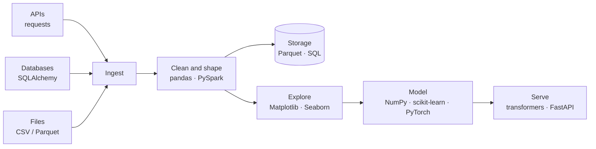

# Libraries

Python by itself is a small language. What makes it the language of data and AI
is the ecosystem around it. This section covers the libraries you are actually
expected to know, grouped by the job you are applying for.

You do not need all of them. You need the ones on your path, deeply.

---

## Where each library sits



---

## By role

### Data Scientist — *find the answer in the data*

| Library | What you use it for |
|---|---|
| [NumPy](01-numpy.md) | Numeric arrays, vectorised maths |
| [pandas](02-pandas.md) | Tables: load, clean, group, join |
| [Matplotlib / Seaborn](03-visualisation.md) | Seeing the data and explaining it |
| [scikit-learn](04-scikit-learn.md) | Classical models, splitting, metrics |

### Data Engineer — *make the data arrive, reliably*

| Library | What you use it for |
|---|---|
| [requests](05-apis-and-requests.md) | Pulling data from APIs |
| [SQLAlchemy / Parquet](06-sql-and-storage.md) | Databases and columnar files |
| [PySpark](07-pyspark.md) | Data too large for one machine |
| pandas | Still the workhorse for anything that fits in memory |

### AI Engineer — *build and ship the model*

| Library | What you use it for |
|---|---|
| [PyTorch](08-pytorch.md) | Tensors, autograd, training loops |
| [transformers](09-transformers.md) | Pretrained models, tokenizers, fine-tuning |
| NumPy, pandas | Everything before the model, which is most of the work |
| scikit-learn | Baselines and metrics — always start here |

---

## How to read these files

Each one gives you: what the library is for, the ten or so functions that carry
90% of real use, a runnable example with its output, and the mistakes that cost
people an afternoon.

They are references, not tutorials. Read once end to end, then come back.

---

## Install

```bash
pip install -r ../../requirements.txt
```

PyTorch and transformers are large. Skip them until you reach file 08.
