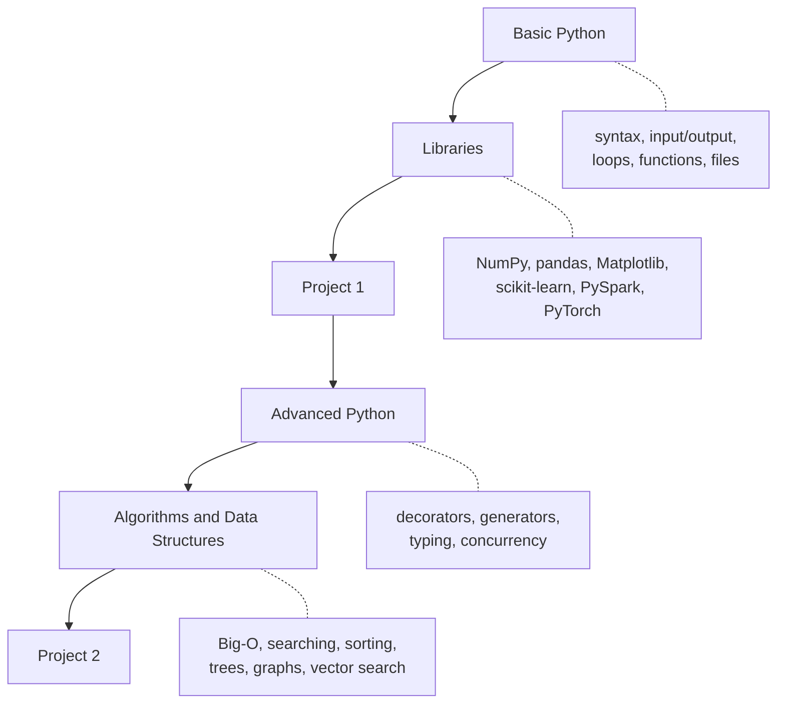

# Python for AI — Tayel AI Labs

A two-track Python course. Track 1 takes a complete beginner to writing real
programs and using the libraries the industry actually runs on. Track 2 turns
that into engineering: advanced functions, algorithms, and the data structures
an AI engineer meets in production.

Every lesson exists twice: a **`.md`** file you can read straight on GitHub, and
a **`.ipynb`** notebook with the same code so you can run it and change it.
The notebooks are generated from the markdown, so the two never drift apart.

---

## Course map



---

## Structure

| Folder | What is inside |
|---|---|
| [`Basic-Python/lessons/`](Basic-Python/lessons/) | 11 lessons, from `print()` to file handling and classes |
| [`Basic-Python/libraries/`](Basic-Python/libraries/) | The core libraries per role: data scientist, data engineer, AI engineer |
| [`Basic-Python/Project-1/`](Basic-Python/Project-1/) | First project — a full data analysis, end to end |
| [`Advanced-Python/lessons/`](Advanced-Python/lessons/) | Advanced functions, Big-O, searching, sorting, data structures |
| [`Advanced-Python/Project-2/`](Advanced-Python/Project-2/) | Second project — build a retrieval engine from scratch |
| [`tools/`](tools/) | The script that builds the notebooks from the markdown |

---

## How to use this course

1. Read the `.md` lesson first. Do not copy the code — read the explanation.
2. Open the matching `.ipynb` and run every cell.
3. Break something on purpose. Change a number, delete a line, read the error.
4. Do the exercises at the end of the lesson before moving on.

A lesson you only read is a lesson you did not learn.

---

## Setup

You need Python 3.10 or newer.

```bash
python3 --version
python3 -m venv .venv
source .venv/bin/activate      # Windows: .venv\Scripts\activate
pip install -r requirements.txt
```

Nothing in Track 1's first eleven lessons needs an installed library — they run
on a plain Python install. The `requirements.txt` matters from the libraries
section onward.

---

## Regenerating the notebooks

Edit the markdown, never the notebook. Then:

```bash
python3 tools/build_notebooks.py
```

Every `.md` lesson is rewritten into a `.ipynb` next to it: prose becomes
markdown cells, each `python` block becomes a runnable code cell.
