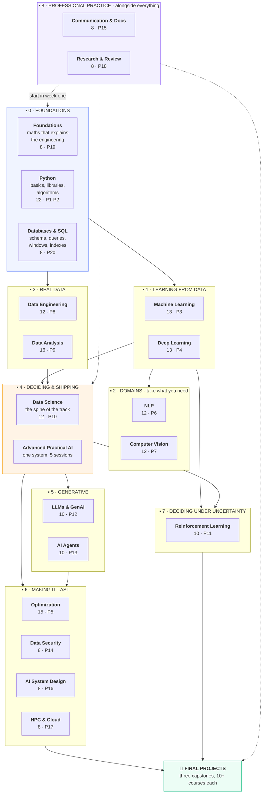
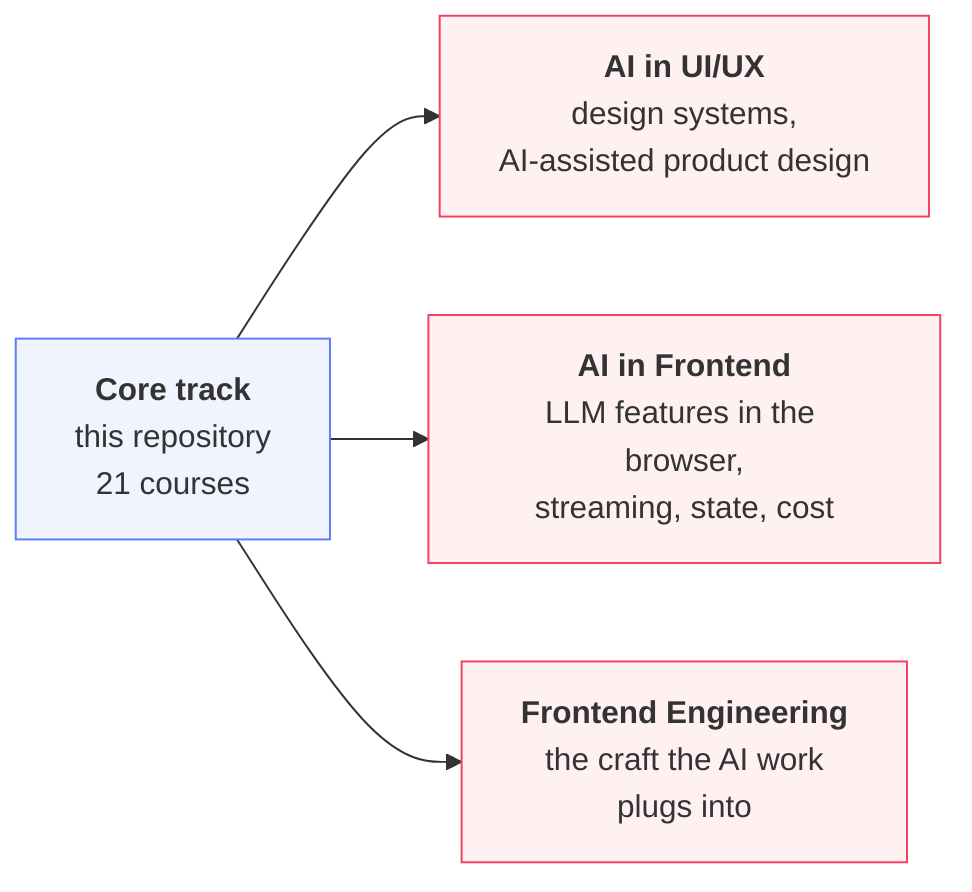

<div align="center">

# Welcome to the AI Courses Library

### Tayel AI Labs

**Twenty-one courses · twenty projects · three capstones · 222 notebooks**

*From `print("hello")` to a deployed, monitored, explainable AI system.*

**No GPU. No paid API. No cloud account.**
Every lesson runs on a laptop, and **every printed output is a real run.**

[**Start here →**](CURRICULUM.md) · [Pick your level](LEVELS.md) · [Shared datasets](DATASETS.md) · [Capstones](Final-Projects/)

</div>

---

## What this is

A complete, self-contained curriculum for becoming an AI engineer — not a
reading list. Each course is markdown lessons with a generated notebook beside
them, a `requirements.txt`, and a project that is the assessment.

The thing that makes it different is a rule we hold without exception:

> **Every number in every lesson came from running the code.**
> When the run contradicted the draft, the prose changed — not the number.

That is why the lessons are full of results that contradict the tidy version of
the theory: the accurate model that was worthless, the "efficient" architecture
that was four times slower, the fairness constraint that cost nothing. None of
those were guessable. They were measured.

---

## Choose your starting point

<table>
<tr>
<td width="33%" valign="top">

### I am new
Start with [**Foundations**](Foundations/) if you want to understand first, or
[**Python**](Python/) if you want to build first.

Then follow [`CURRICULUM.md`](CURRICULUM.md).

</td>
<td width="33%" valign="top">

### I train models already
Go straight to [**Data-Science**](Data-Science/). It is the spine of the track,
and it is where "I trained a model" becomes "I know what it is worth".

</td>
<td width="33%" valign="top">

### I ship models already
Read [**Data-Security**](Data-Security-for-AI/) and
[**AI-System-Design**](AI-System-Design/), then do a
[**capstone**](Final-Projects/).

</td>
</tr>
</table>

[`LEVELS.md`](LEVELS.md) has the full beginner / intermediate / senior routes,
with explicit skip lists.

---

## The roadmap

Nine blocks. Follow them top to bottom; each assumes the one above.



**The short version.** Foundations or Python → Machine Learning → Deep Learning
→ **Data Engineering and Data Analysis** (the two most-skipped courses, and the
reason most models never leave a notebook) → **Data Science** (where the
track's argument lives) → Advanced Practical AI. Take the domain and
"making it last" courses when a project needs them, and start Communication in
week one whatever your level.

---

## Specialisations

**Separate repositories, same organisation.** These are *applied* tracks: they
assume the core curriculum above and go deep on one surface. They are not part
of the numbered progression and can be taken in any order once you have
Data-Science behind you.



| Specialisation | Repository | Prerequisites from here |
|---|---|---|
| **AI in UI/UX** | [`AI-in-UIUX`](https://github.com/Tayel-Ai-Labs-Courses/AI-in-UIUX) | [Communication](Communication-and-Documentation/) 01-04 |
| **AI in Frontend** | *(same organisation)* | [LLM & GenAI](LLM-and-GenAI/) 09-10, [AI-System-Design](AI-System-Design/) 03 |
| **Frontend Engineering** | *(same organisation)* | none from here |

**Why they are separate.** The core track is about making a model that is
correct, cheap and safe. A specialisation is about the surface it meets —
design, a browser, a mobile app — and it has its own tools, its own failure
modes and its own audience. Mixing them into one progression would make both
worse.

**The handshake between them** is
[AI-System-Design lesson 03](AI-System-Design/lessons/03-interfaces.md): the
ten-line contract, the response fields (`band`, `degraded`, `model_version`),
and the list of every UI state a consumer must build. That lesson is written
*for* the frontend and mobile teams, and it is where the two sides of the
organisation's curriculum meet.

---

## The courses

| # | Course | Lessons | Project | After it, you can |
|---|---|---|---|---|
| — | [`Foundations/`](Foundations/) | 8 | 19 | Recognise the four maths ideas behind every decision |
| 1 | [`Python/`](Python/) | 22 | 1, 2 | Write real Python; use pandas, NumPy, sklearn, matplotlib |
| — | [`Databases-and-SQL/`](Databases-and-SQL/) | 8 | 20 | Design a schema and get data out correctly and fast |
| 2 | [`Machine-Learning/`](Machine-Learning/) | 13 | 3 | Train and validate a model without fooling yourself |
| 3 | [`Deep-Learning/`](Deep-Learning/) | 13 | 4 | Build and train neural networks in PyTorch |
| 4 | [`Optimization/`](Optimization/) | 15 | 5 | Make a model smaller, faster, cheaper — local and on-device |
| 5 | [`NLP/`](NLP/) | 12 | 6 | Text from TF-IDF to transformers, including Arabic |
| 6 | [`Computer-Vision/`](Computer-Vision/) | 12 | 7 | Classical CV, CNNs, detection, segmentation |
| 7 | [`Data-Engineering/`](Data-Engineering/) | 12 | 8 | Build pipelines that run unattended and fail loudly |
| 8 | [`Data-Analysis/`](Data-Analysis/) | 16 | 9 | Answer a question defensibly, and know when you cannot |
| 9 | [`Data-Science/`](Data-Science/) | 12 | 10 | Turn a business problem into a shipped, monitored decision |
| 10 | [`Advanced-Practical-AI/`](Advanced-Practical-AI/) | 5 sessions | the system | Build one reliable, explainable system end to end |
| 11 | [`Reinforcement-Learning/`](Reinforcement-Learning/) | 10 | 11 | Decide under uncertainty, and know when not to |
| 12 | [`LLM-and-GenAI/`](LLM-and-GenAI/) | 10 | 12 | Build, evaluate and ship an LLM feature that pays for itself |
| 13 | [`AI-Agents/`](AI-Agents/) | 10 | 13 | Build an agent whose guarantees do not depend on the model |
| 14 | [`Data-Security-for-AI/`](Data-Security-for-AI/) | 8 | 14 | Attack a model, measure what leaks, and fix it |
| 15 | [`Communication-and-Documentation/`](Communication-and-Documentation/) | 8 | 15 | Make the work readable, runnable and actionable |
| 16 | [`AI-System-Design/`](AI-System-Design/) | 8 | 16 | Draw the system and prove the latency before building |
| 17 | [`HPC-and-Cloud/`](HPC-and-Cloud/) | 8 | 17 | Fit the model, rent the right GPU, predict the bill |
| 18 | [`Research-and-Review/`](Research-and-Review/) | 8 | 18 | Read papers sceptically, reproduce, review |

---

## After the courses

**[`Final-Projects/`](Final-Projects/)** — three capstones. Do **one**.

| Capstone | The hard part | Pulls from |
|---|---|---|
| [**A — The Decision System**](Final-Projects/A-decision-system.md) | Deciding correctly on business data | 12 courses |
| [**B — The Assistant**](Final-Projects/B-the-assistant.md) | Reliable text generation and retrieval | 11 courses |
| [**C — The Efficient Model**](Final-Projects/C-efficient-model.md) | Cost, latency, devices | 10 courses |

They grade three things the numbered projects do not: whether you can **cut
scope** correctly, whether the work survives **contact with a real person**, and
whether your verdict honestly allows **"do not ship this"**.

---

## How to work through a course

```text
1. Read the course README            what it assumes, what it delivers
2. Set up the environment            python3 -m venv .venv && pip install -r requirements.txt
3. Open lesson 01 as a notebook      lessons/01-*.ipynb, beside the .md
4. Run every cell, in order          the outputs are real; if yours differ, find out why
5. Do the exercises                   4-5 per lesson. They are the actual learning
6. Move to the next lesson            lessons share files in /tmp, so order matters
7. Do the project                     it is the assessment, and it is not optional
```

**Read the markdown, run the notebook.** The `.md` is the source; the `.ipynb`
is generated from it. **The exercises are the course** — a student who reads
twenty-one courses and does no exercises has watched, not learned.

---

## Seven results this track argues from

Each one is reproducible by opening the notebook and running it.

1. **A model can tie a do-nothing baseline on accuracy and still be worth
   41,699 EGP/month.** Accuracy is not the decision.
   ([Data-Science 01](Data-Science/lessons/01-what-data-science-is.md))
2. **One leaky column moves ROC-AUC from 0.667 to 0.946.** A suspiciously good
   result is a bug report.
   ([Data-Science 03](Data-Science/lessons/03-the-data-you-have.md))
3. **The 0.5 threshold earned 1,083 EGP where 0.15 earned 47,313.** The
   threshold is a business parameter.
   ([Data-Science 06](Data-Science/lessons/06-evaluating-the-decision.md))
4. **Poisoning 1% of training rows gives an attacker 98.2% control, and costs
   0.003 accuracy.** The dangerous failure is invisible in every metric.
   ([Data-Security 04](Data-Security-for-AI/lessons/04-poisoning.md))
5. **Ten variants of a method make an identical method "win" 90.8% of the
   time.** Most published improvements are unevaluable.
   ([Research 03](Research-and-Review/lessons/03-what-the-numbers-hide.md))
6. **EfficientNet-B0 has a fifth of ResNet-50's parameters and is four times
   slower.** Benchmarks do not transfer across hardware.
   ([Optimization 15](Optimization/lessons/15-edge-and-on-device.md))
7. **Identical code across 20 seeds scored between 37 and 346.** One run is
   never a result.
   ([RL 09](Reinforcement-Learning/lessons/09-evaluating-agents.md))

The through-line: **the measurement is the work.**

---

## Setup

Each course has its own `requirements.txt`. Nothing needs a GPU.

```bash
cd Data-Science            # or any other course
python3 -m venv .venv
source .venv/bin/activate
pip install -r requirements.txt
jupyter lab
```

| You will need | For |
|---|---|
| Python 3.11+ | Everything |
| Nothing else | Databases-and-SQL, Reinforcement-Learning 01-06, Foundations |
| pandas, NumPy, scikit-learn | Python, ML, Data-Engineering, Analysis, Science, Security |
| PyTorch | Deep-Learning, Optimization, NLP, CV, LLM, HPC, RL 07-08 |

---

## Working on this repository

Lessons are written in markdown. The notebooks are generated from them:

```bash
python3 tools/build_notebooks.py
```

Edit the `.md`, never the `.ipynb` — a rebuild overwrites the notebook. The one
exception is [`Advanced-Practical-AI/`](Advanced-Practical-AI/), whose notebooks
are hand-written source.

Two checks run on every push, via [`.github/workflows/check.yml`](.github/workflows/check.yml):

```bash
python3 tools/build_notebooks.py --check   # notebooks match their markdown
python3 tools/check_links.py               # no broken relative links
```

### The standard every lesson is held to

1. Every code block **runs**, in order, top to bottom.
2. Every printed output is **pasted from a real run**, never written by hand.
3. When the run contradicted the draft, **the prose changed, not the number.**
4. Machine-dependent output (timings, unseeded runs) is **labelled** as such.
5. Every lesson ends with a **common-mistakes table and exercises**.
6. Every claim has a number, and every number has a source.

---

<div align="center">

**Tayel AI Labs** · [`CURRICULUM.md`](CURRICULUM.md) · [`LEVELS.md`](LEVELS.md) · [`DATASETS.md`](DATASETS.md)

</div>
