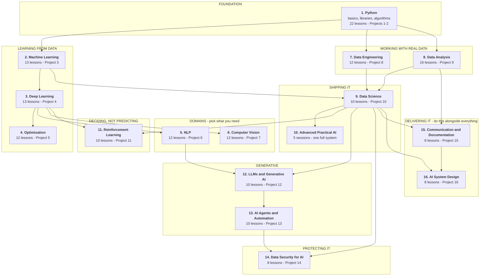

# Advanced AI — Tayel AI Labs

Seventeen courses and sixteen projects, from `print("hello")` to a deployed,
monitored, explainable AI system. Every lesson is markdown with a generated
notebook beside it, **every printed output is a real run**, and nothing needs a
GPU or a paid API.

---

## The road map

Follow it top to bottom. Each stage assumes the one above it.



**The short version.** Do 1-2-3 in order. Then do 7 and 8 — most people skip
them and it is the reason their models never leave a notebook. Then 9, which is
where the track's argument lives. Then 10, which does the whole thing once on
messy data. Take 4, 5, 6 when a project needs them, and 11 when your problem is
about *choosing* rather than predicting.

---

**Start here:**
[`CURRICULUM.md`](CURRICULUM.md) — everything in order, including where the
later lessons slot in, and what is still missing.
[`LEVELS.md`](LEVELS.md) — where to begin as a beginner, an intermediate or a
senior, and what to skip.

## The courses

| # | Course | Lessons | Project | You can, afterwards |
|---|---|---|---|---|
| 1 | [`Python/`](Python/) | 22 | 1, 2 | Write and structure real Python; use pandas, NumPy, sklearn, matplotlib |
| 2 | [`Machine-Learning/`](Machine-Learning/) | 13 | 3 | Train, validate and interpret a model without fooling yourself |
| 3 | [`Deep-Learning/`](Deep-Learning/) | 13 | 4 | Build and train neural networks in PyTorch, for images and text |
| 4 | [`Optimization/`](Optimization/) | 12 | 5 | Make a model smaller, faster and cheaper, and prove it |
| 5 | [`NLP/`](NLP/) | 12 | 6 | Go from TF-IDF to transformers, including Arabic |
| 6 | [`Computer-Vision/`](Computer-Vision/) | 12 | 7 | Classical CV, CNNs, detection and segmentation |
| 7 | [`Data-Engineering/`](Data-Engineering/) | 12 | 8 | Build pipelines that run unattended and fail loudly |
| 8 | [`Data-Analysis/`](Data-Analysis/) | 16 | 9 | Answer a question defensibly, and know when you cannot |
| 9 | [`Data-Science/`](Data-Science/) | 10 | 10 | Turn a business problem into a shipped, monitored decision |
| 10 | [`Advanced-Practical-AI/`](Advanced-Practical-AI/) | 5 sessions | the system | Build one reliable, explainable system end to end |
| 11 | [`Reinforcement-Learning/`](Reinforcement-Learning/) | 10 | 11 | Decide under uncertainty, and know when not to |
| 12 | [`LLM-and-GenAI/`](LLM-and-GenAI/) | 10 | 12 | Build, evaluate and ship an LLM feature that pays for itself |
| 13 | [`AI-Agents/`](AI-Agents/) | 10 | 13 | Build an agent whose guarantees do not depend on the model |
| 14 | [`Data-Security-for-AI/`](Data-Security-for-AI/) | 8 | 14 | Attack a model, measure what leaks, and fix it |
| 15 | [`Communication-and-Documentation/`](Communication-and-Documentation/) | 8 | 15 | Make the other courses' work readable, runnable and actionable |
| 16 | [`AI-System-Design/`](AI-System-Design/) | 8 | 16 | Draw the system, write the contract, and prove the latency before building |

---

## How to work through a course, step by step

The same seven steps every time.

```text
1. Read the course README            what it assumes, what it delivers
2. Set up the environment            python3 -m venv .venv && pip install -r requirements.txt
3. Open lesson 01 as a notebook      lessons/01-*.ipynb, beside the .md
4. Run every cell, in order          the printed outputs are real; if yours differ, find out why
5. Do the exercises                  each lesson ends with 4-5; they are the actual learning
6. Move to the next lesson           lessons share files in /tmp, so order matters
7. Do the project                    it is the assessment, and it is not optional
```

**Read the markdown, run the notebook.** They are the same content: the `.md`
is the source, the `.ipynb` is generated from it. Edit the `.md` if you are
contributing.

**The exercises are the course.** The lessons show you a measured result; the
exercises make you produce one. A student who reads eleven courses and does no
exercises has watched, not learned.

**The projects are where it becomes yours.** Each one demands a written plan
before any code, a baseline you measured rather than assumed, and a
recommendation you would defend to a person who can say no.

---

## What this track argues

Six results, each from a lesson, each reproducible by running the notebook:

1. **A model can tie a do-nothing baseline on accuracy and still be worth
   41,699 EGP/month.** Accuracy is not the decision.
   ([Data-Science 01](Data-Science/lessons/01-what-data-science-is.md))
2. **One leaky column moves ROC-AUC from 0.667 to 0.946.** A suspiciously good
   result is a bug report.
   ([Data-Science 03](Data-Science/lessons/03-the-data-you-have.md))
3. **The 0.5 threshold earned 1,083 EGP where 0.15 earned 47,313.** The
   threshold is a business parameter.
   ([Data-Science 06](Data-Science/lessons/06-evaluating-the-decision.md))
4. **Four generations of retention offers drop the measured churn rate from
   13.4% to 9.1%, while a 10% holdout stays flat at 18.29%.** Acting on a model
   corrupts the metric before it corrupts the model.
   ([Data-Science 10](Data-Science/lessons/10-limits-and-fairness.md))
5. **Remove one frozen copy of a network and its value estimates reach 23,000x
   the physically possible maximum.**
   ([RL 07](Reinforcement-Learning/lessons/07-function-approximation.md))
6. **Identical code across 20 seeds scores between 37 and 346.** One run is
   never a result.
   ([RL 09](Reinforcement-Learning/lessons/09-evaluating-agents.md))

The through-line: **the measurement is the work.** Nearly every useful result in
these lessons came from running the code and finding the tidy expectation was
wrong — the engineered features that did nothing, the random forest that lost to
logistic regression, the drift alarm that should not have triggered a retrain,
the fairness constraint that cost nothing, the physics gap that never appeared.

---

## Setup

Each course has its own `requirements.txt`. Nothing needs a GPU.

```bash
cd Data-Science            # or any other course
python3 -m venv .venv
source .venv/bin/activate
pip install -r requirements.txt
jupyter lab
```

| You will need | For |
|---|---|
| Python 3.11+ | Everything |
| pandas, NumPy, scikit-learn | Courses 1, 2, 7, 8, 9, 10 |
| PyTorch | Courses 3, 4, 5, 6, and RL lessons 07-08 |
| Nothing else | Reinforcement Learning 01-06, 09-10 |

---

## Working on this repository

Lessons are written in markdown. The notebooks are generated from them:

```bash
python3 tools/build_notebooks.py
```

Edit the `.md`, never the `.ipynb` — a rebuild overwrites the notebook. The one
exception is [`Advanced-Practical-AI/`](Advanced-Practical-AI/), whose notebooks
are hand-written source and are not touched by the builder.

Two checks run on every push, via [`.github/workflows/check.yml`](.github/workflows/check.yml):

```bash
python3 tools/build_notebooks.py --check   # notebooks match their markdown
python3 tools/check_links.py               # no broken relative links
```

Both are standard library only. If the first one fails, you edited a `.md`
without rebuilding — run the builder and push again.

### The standard for a lesson

1. Every code block **runs**, in order, top to bottom.
2. Every printed output is **pasted from a real run**, never written by hand.
3. When the run contradicts the draft, **the prose changes, not the number.**
4. Machine-dependent output (timings, unseeded runs) is labelled as such.
5. Every lesson ends with a common-mistakes table and exercises.
