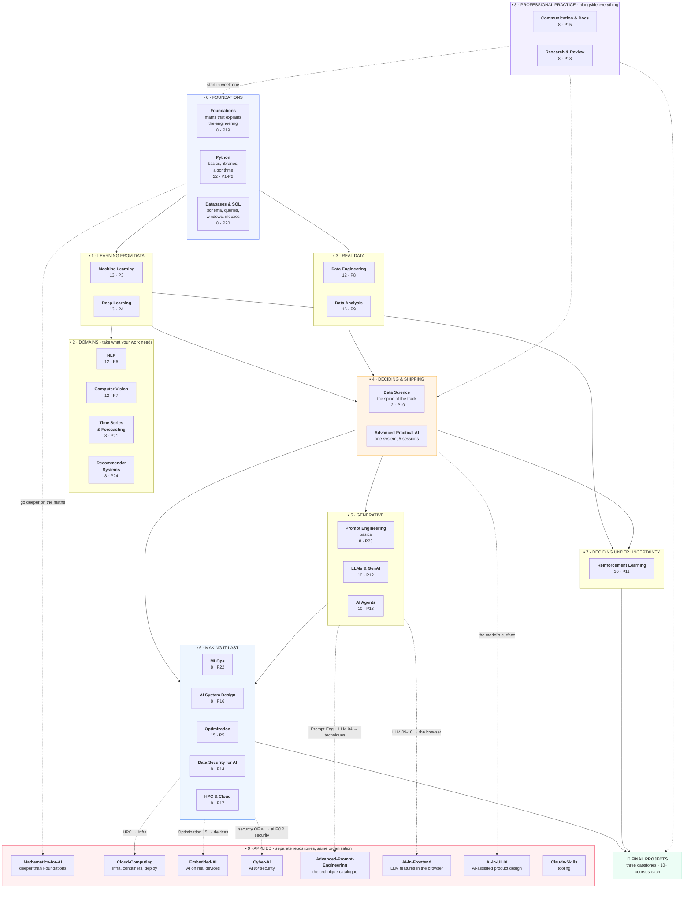

<div align="center">

# The AI Engineering Curriculum

### Tayel AI Labs

**25 courses · 24 projects · 3 capstones · 264 notebooks · 245 lessons + 5 workshop sessions**

*From `print("hello")` to a deployed, monitored, explainable AI system.*

**No GPU. No paid API. No cloud account.**
Every lesson runs on a laptop, and **every printed output is a real run.**

[**The roadmap →**](#the-unified-roadmap) · [**Start here**](CURRICULUM.md) · [Pick your level](LEVELS.md) · [All 25 courses](#the-25-courses) · [Shared datasets](DATASETS.md) · [Capstones](Final-Projects/)

</div>

---

## What this is

A complete, self-contained curriculum for becoming an AI engineer — not a
reading list. Each course is markdown lessons with a generated notebook beside
them, a `requirements.txt`, and a project that is the assessment.

This repository is the **core track**. Around it, the same organisation
publishes **eight applied repositories** — maths, cloud, embedded, security,
frontend, UI/UX, prompting, tooling. [The unified roadmap](#the-unified-roadmap)
below places every one of them in a single order, says what it assumes from
here, and is honest about where two of them overlap.

The thing that makes all of it different is a rule we hold without exception:

> **Every number in every lesson came from running the code.**
> When the run contradicted the draft, the prose changed — not the number.

That is why the lessons are full of results that contradict the tidy version of
the theory: the accurate model that was worthless, the "efficient" architecture
that was four times slower, the fairness constraint that cost nothing, the
safest deployment strategy that turned out to be the most expensive. None of
those were guessable. They were measured.

---

## Choose your starting point

<table>
<tr>
<td width="33%" valign="top">

### I am new
Start with [**Foundations**](Foundations/) if you want to understand first, or
[**Python**](Python/) if you want to build first.

Then follow [`CURRICULUM.md`](CURRICULUM.md) block by block.

</td>
<td width="33%" valign="top">

### I train models already
Go straight to [**Data-Science**](Data-Science/). It is the spine of the track,
and it is where "I trained a model" becomes "I know what it is worth".

Then [**MLOps**](MLOps/).

</td>
<td width="33%" valign="top">

### I ship models already
Read [**MLOps**](MLOps/),
[**Data-Security**](Data-Security-for-AI/) and
[**AI-System-Design**](AI-System-Design/), then do a
[**capstone**](Final-Projects/).

</td>
</tr>
</table>

[`LEVELS.md`](LEVELS.md) has the full beginner / intermediate / senior routes,
with explicit skip lists and a skills-coverage breakdown.

---

## The unified roadmap

**One map, every course in the organisation.** Nine numbered blocks in this
repository, then the applied repositories that build on them. Follow the blocks
top to bottom; each assumes the one above. The dashed lines are the ones you can
take in parallel.



**The short version.** Foundations or Python → Machine Learning → Deep Learning
→ **Data Engineering and Data Analysis** (the two most-skipped courses, and the
reason most models never leave a notebook) → **Data Science** (where the track's
argument lives) → **MLOps** (where it survives Monday) → a capstone. Take the
domain courses when a project needs one, start Communication in week one
whatever your level, and take an applied repository when you know which surface
you are building for.

### The one-line version of each block

| Block | What you can do after it | The question it answers |
|---|---|---|
| **0 · Foundations** | Write Python, query a database, read the maths | *Can I express the idea at all?* |
| **1 · Learning from data** | Train and validate a model honestly | *Does it learn?* |
| **2 · Domains** | Work with text, images, or time | *Does my data have structure the general method ignores?* |
| **3 · Real data** | Build pipelines, answer questions defensibly | *Where does the data come from, and is it true?* |
| **4 · Deciding & shipping** | Turn a problem into a shipped decision | *Is the model worth anything?* |
| **5 · Generative** | Build an LLM feature or an agent that holds | *Can I rely on something non-deterministic?* |
| **6 · Making it last** | Package, gate, deploy, serve, monitor, secure, shrink | *Will it still work on Monday?* |
| **7 · Under uncertainty** | Decide sequentially, and know when not to | *What if there is no labelled dataset?* |
| **8 · Professional practice** | Write it up, read papers sceptically | *Can anyone else use this?* |
| **9 · Applied** | One surface, deeply | *Who is this for?* |

---

## Applied repositories

**Separate repositories in [the same organisation](https://github.com/Tayel-Ai-Labs-Courses).**
They are not part of the numbered progression and can be taken in any order
once you have the prerequisite from here. Each row says exactly what to read
first, and — where it exists — **the overlap, stated honestly, so you do not
study the same thing twice.**

| Repository | What it is | Read first, from here | Overlap with this track |
|---|---|---|---|
| [**Mathematics-for-AI**](https://github.com/Tayel-Ai-Labs-Courses/Mathematics-for-AI) | The maths behind AI and ML, with code examples | nothing | **Yes, deliberate.** [`Foundations/`](Foundations/) is the 8-lesson compressed version, written to explain *engineering decisions*. This repository is the fuller treatment. Take **either**; take both only if you want the depth. |
| [**Cloud-Computing**](https://github.com/Tayel-Ai-Labs-Courses/Cloud-Computing) | Cloud infrastructure, containerization, deployment | [HPC-and-Cloud](HPC-and-Cloud/) 05-08, [MLOps](MLOps/) 02 | **Partial.** HPC-and-Cloud covers *will it fit and what will it cost*; this covers the infrastructure itself. MLOps deliberately stops before Kubernetes and Terraform — they are here. |
| [**Embedded-AI**](https://github.com/Tayel-Ai-Labs-Courses/Embedded-AI) | AI on embedded systems and edge devices | [Optimization](Optimization/) 10-15 | **Partial.** [Optimization 15](Optimization/lessons/15-edge-and-on-device.md) measures quantisation, pruning and on-device latency. This repository is the hardware, the toolchains and the boards. |
| [**Cyber-Ai**](https://github.com/Tayel-Ai-Labs-Courses/Cyber-Ai) | AI *for* cybersecurity — threat detection, network analysis | [Machine-Learning](Machine-Learning/), [Data-Science](Data-Science/) 06 | **None — and the names mislead.** [`Data-Security-for-AI/`](Data-Security-for-AI/) is the security **of** a model (poisoning, extraction, membership inference). `Cyber-Ai` is using models **for** security. Different subject, both worth doing. |
| [**Advanced-Prompt-Engineering**](https://github.com/Tayel-Ai-Labs-Courses/Advanced-Prompt-Engineering) | Prompt techniques and templates | [Prompt-Engineering](Prompt-Engineering/), [LLM-and-GenAI](LLM-and-GenAI/) 04 | **Deliberate, three depths.** [`Prompt-Engineering/`](Prompt-Engineering/) is how to *write* one, [LLM 04](LLM-and-GenAI/lessons/04-prompting.md) is how to know one is *better*, and this repository is the catalogue. Do them in that order — the catalogue is only useful once you can tell a win from noise. |
| [**AI-in-Frontend**](https://github.com/Tayel-Ai-Labs-Courses/AI-in-Frontend) | AI in frontend development — streaming, state, cost | [LLM-and-GenAI](LLM-and-GenAI/) 09-10, [AI-System-Design](AI-System-Design/) 03 | **None.** The handshake is the response contract in [AI-System-Design 03](AI-System-Design/lessons/03-interfaces.md). |
| [**AI-in-UIUX**](https://github.com/Tayel-Ai-Labs-Courses/AI-in-UIUX) | AI for UX and UI design | [Communication](Communication-and-Documentation/) 01-04 | **None.** Communication 01-04 is how to present a model's output to a human; this is how to design around it. |
| [**Claude-Skills**](https://github.com/Tayel-Ai-Labs-Courses/Claude-Skills) | Guide to Claude AI skills | [AI-Agents](AI-Agents/) 01-05 | **None.** Tooling. Useful alongside anything. |

**Why they are separate repositories.** The core track is about making a model
that is correct, cheap and safe. An applied repository is about the surface it
meets — a browser, a board, a design system, a security operations centre — and
each has its own tools, its own failure modes and its own audience. Merging them
into one progression would make both worse, which is why the roadmap above
*links* them rather than absorbing them.

---

## The 25 courses

Every course is equivalent in structure: lessons as `.md` + generated `.ipynb`,
a `requirements.txt`, a common-mistakes table and exercises per lesson, and one
project that is the assessment.

| # | Course | Lessons | Project | After it, you can |
|---|---|---|---|---|
| 1 | [`Foundations/`](Foundations/) | 8 | [19](Foundations/Project-19/) | Recognise the four maths ideas behind every decision |
| 2 | [`Python/`](Python/) | 12 + 10 libs | [1](Python/Basic-Python/Project-1/), [2](Python/Advanced-Python/Project-2/) | Write real Python; use pandas, NumPy, sklearn, matplotlib |
| 3 | [`Databases-and-SQL/`](Databases-and-SQL/) | 8 | [20](Databases-and-SQL/Project-20/) | Design a schema and get data out correctly and fast |
| 4 | [`Machine-Learning/`](Machine-Learning/) | 13 | [3](Machine-Learning/Project-3/) | Train and validate a model without fooling yourself |
| 5 | [`Deep-Learning/`](Deep-Learning/) | 13 | [4](Deep-Learning/Project-4/) | Build and train neural networks in PyTorch |
| 6 | [`NLP/`](NLP/) | 12 | [6](NLP/Project-6/) | Text from TF-IDF to transformers, including Arabic |
| 7 | [`Computer-Vision/`](Computer-Vision/) | 12 | [7](Computer-Vision/Project-7/) | Classical CV, CNNs, detection, segmentation |
| 8 | [`Time-Series-and-Forecasting/`](Time-Series-and-Forecasting/) | 8 | [21](Time-Series-and-Forecasting/Project-21/) | Forecast without lying to yourself about the split |
| 9 | [`Recommender-Systems/`](Recommender-Systems/) | 8 | [24](Recommender-Systems/Project-24/) | Choose ten items, and know what that does to your catalogue |
| 10 | [`Data-Engineering/`](Data-Engineering/) | 12 | [8](Data-Engineering/Project-8/) | Build pipelines that run unattended and fail loudly |
| 11 | [`Data-Analysis/`](Data-Analysis/) | 16 | [9](Data-Analysis/Project-9/) | Answer a question defensibly, and know when you cannot |
| 12 | [`Data-Science/`](Data-Science/) | 12 | [10](Data-Science/Project-10/) | Turn a business problem into a shipped, monitored decision |
| 13 | [`Advanced-Practical-AI/`](Advanced-Practical-AI/) | 5 sessions | the system | Build one reliable, explainable system end to end |
| 14 | [`Reinforcement-Learning/`](Reinforcement-Learning/) | 10 | [11](Reinforcement-Learning/Project-11/) | Decide under uncertainty, and know when not to |
| 15 | [`Prompt-Engineering/`](Prompt-Engineering/) | 8 | [23](Prompt-Engineering/Project-23/) | Write a prompt that parses, costs what you expect, and survives hostile text |
| 16 | [`LLM-and-GenAI/`](LLM-and-GenAI/) | 10 | [12](LLM-and-GenAI/Project-12/) | Build, evaluate and ship an LLM feature that pays for itself |
| 17 | [`AI-Agents/`](AI-Agents/) | 10 | [13](AI-Agents/Project-13/) | Build an agent whose guarantees do not depend on the model |
| 18 | [`MLOps/`](MLOps/) | 8 | [22](MLOps/Project-22/) | Package, gate, deploy, serve and monitor a model — priced |
| 19 | [`AI-System-Design/`](AI-System-Design/) | 8 | [16](AI-System-Design/Project-16/) | Draw the system and prove the latency before building |
| 20 | [`Optimization/`](Optimization/) | 15 | [5](Optimization/Project-5/) | Make a model smaller, faster, cheaper — local and on-device |
| 21 | [`Data-Security-for-AI/`](Data-Security-for-AI/) | 8 | [14](Data-Security-for-AI/Project-14/) | Attack a model, measure what leaks, and fix it |
| 22 | [`HPC-and-Cloud/`](HPC-and-Cloud/) | 8 | [17](HPC-and-Cloud/Project-17/) | Fit the model, rent the right GPU, predict the bill |
| 23 | [`Communication-and-Documentation/`](Communication-and-Documentation/) | 8 | [15](Communication-and-Documentation/Project-15/) | Make the work readable, runnable and actionable |
| 24 | [`Research-and-Review/`](Research-and-Review/) | 8 | [18](Research-and-Review/Project-18/) | Read papers sceptically, reproduce, review |
| 25 | [`Final-Projects/`](Final-Projects/) | 3 capstones | one of them | Cut scope, survive a real user, and say "do not ship" |

The **course number** is the recommended reading order. The **project number**
is historical — it is the order the projects were written, and it is kept stable
so links and references do not rot. [`CURRICULUM.md`](CURRICULUM.md) has the
full table both ways.

---

## After the courses

**[`Final-Projects/`](Final-Projects/)** — three capstones. Do **one**.

| Capstone | The hard part | Pulls from |
|---|---|---|
| [**A — The Decision System**](Final-Projects/A-decision-system.md) | Deciding correctly on business data | 12 courses |
| [**B — The Assistant**](Final-Projects/B-the-assistant.md) | Reliable text generation and retrieval | 11 courses |
| [**C — The Efficient Model**](Final-Projects/C-efficient-model.md) | Cost, latency, devices | 10 courses |

They grade three things the numbered projects do not: whether you can **cut
scope** correctly, whether the work survives **contact with a real person**, and
whether your verdict honestly allows **"do not ship this"**.

---

## How to work through a course

```text
1. Read the course README            what it assumes, what it delivers
2. Set up the environment            python3 -m venv .venv && pip install -r requirements.txt
3. Open lesson 01 as a notebook      lessons/01-*.ipynb, beside the .md
4. Run every cell, in order          the outputs are real; if yours differ, find out why
5. Do the exercises                  4-6 per lesson. They are the actual learning
6. Move to the next lesson           lessons share files in /tmp, so order matters
7. Do the project                    it is the assessment, and it is not optional
```

**Read the markdown, run the notebook.** The `.md` is the source; the `.ipynb`
is generated from it. **The exercises are the course** — a student who reads
twenty-five courses and does no exercises has watched, not learned.

---

## Eleven results this curriculum argues from

Each one is reproducible by opening the notebook and running it.

1. **A model can tie a do-nothing baseline on accuracy and still be worth
   41,699 EGP/month.** Accuracy is not the decision.
   ([Data-Science 01](Data-Science/lessons/01-what-data-science-is.md))
2. **One leaky column moves ROC-AUC from 0.667 to 0.946.** A suspiciously good
   result is a bug report.
   ([Data-Science 03](Data-Science/lessons/03-the-data-you-have.md))
3. **The 0.5 threshold earned 1,083 EGP where 0.15 earned 47,313.** The
   threshold is a business parameter.
   ([Data-Science 06](Data-Science/lessons/06-evaluating-the-decision.md))
4. **A shuffled split scores MAE 85.3 where an honest time-based split scores
   107.7 — and an 8-fold backtest turns a 9% win into 0.5%.** Most forecasting
   results are evaluation bugs.
   ([Time-Series 02](Time-Series-and-Forecasting/lessons/02-evaluating.md))
5. **Swapping two feature columns at serving time takes AUC from 0.9001 to
   0.2135 — worse than random.** The model is fine; the plumbing is not.
   ([MLOps 07](MLOps/lessons/07-monitoring.md))
6. **The safest deployment strategy — shadow for a week — is the most
   expensive option at 201,600 EGP.** Caution has a price too.
   ([MLOps 05](MLOps/lessons/05-deployment.md))
7. **Three reasonable-looking prompts returned 0 parseable answers out of 12;
   one worked example returned 12 of 12.** Show the format, do not describe it.
   ([Prompt-Engineering 02](Prompt-Engineering/lessons/02-the-output-contract.md))
8. **Poisoning 1% of training rows gives an attacker 98.2% control, and costs
   0.003 accuracy.** The dangerous failure is invisible in every metric.
   ([Data-Security 04](Data-Security-for-AI/lessons/04-poisoning.md))
9. **22.4% of customers in the test period have no history — and they are
   49.1% of the orders.** Every recommender metric computed before that is
   about half the traffic.
   ([Recommender-Systems 05](Recommender-Systems/lessons/05-cold-start.md))
10. **EfficientNet-B0 has a fifth of ResNet-50's parameters and is four times
   slower.** Benchmarks do not transfer across hardware.
   ([Optimization 15](Optimization/lessons/15-edge-and-on-device.md))
11. **Identical code across 20 seeds scored between 37 and 346.** One run is
   never a result.
    ([RL 09](Reinforcement-Learning/lessons/09-evaluating-agents.md))

The through-line: **the measurement is the work.**

---

## Setup

Each course has its own `requirements.txt`. Nothing needs a GPU.

```bash
cd Data-Science            # or any other course
python3 -m venv .venv
source .venv/bin/activate
pip install -r requirements.txt
jupyter lab
```

| You will need | For |
|---|---|
| Python 3.11+ | Everything |
| Nothing else | Databases-and-SQL, Foundations, Reinforcement-Learning 01-06 |
| pandas, NumPy, scikit-learn, SciPy | Python, ML, Data-Engineering, Analysis, Science, Security, Time-Series, MLOps, Recommender-Systems |
| PyTorch | Deep-Learning, Optimization, NLP, CV, Prompt-Engineering, LLM, HPC, RL 07-08 |

---

## Working on this repository

Lessons are written in markdown. The notebooks are generated from them:

```bash
python3 tools/build_notebooks.py
```

Edit the `.md`, never the `.ipynb` — a rebuild overwrites the notebook. The one
exception is [`Advanced-Practical-AI/`](Advanced-Practical-AI/), whose notebooks
are hand-written source.

Two checks run on every push, via [`.github/workflows/check.yml`](.github/workflows/check.yml):

```bash
python3 tools/build_notebooks.py --check   # notebooks match their markdown
python3 tools/check_links.py               # no broken relative links
```

### The standard every lesson is held to

1. Every code block **runs**, in order, top to bottom.
2. Every printed output is **pasted from a real run**, never written by hand.
3. When the run contradicted the draft, **the prose changed, not the number.**
4. Machine-dependent output (timings, unseeded runs) is **labelled** as such.
5. Every lesson ends with a **common-mistakes table and exercises**.
6. Every claim has a number, and every number has a source.

---

<div align="center">

**Tayel AI Labs** · [`CURRICULUM.md`](CURRICULUM.md) · [`LEVELS.md`](LEVELS.md) · [`DATASETS.md`](DATASETS.md) · [All repositories](https://github.com/Tayel-Ai-Labs-Courses)

</div>
