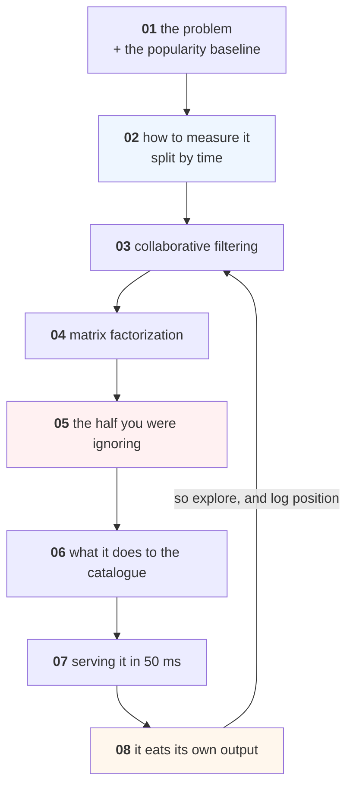

# Recommender Systems

Choosing which ten products to show, out of three hundred — and finding out
what that choice does to your catalogue, your new customers and your next
training set.

Everything runs on a laptop in seconds with NumPy, pandas and SciPy. The data
is a Cairo coffee chain's order history, **generated by code inside
[lesson 01](lessons/01-what-a-recommender-is.md)** and reproducible from a
seed: 18,760 orders, 2,000 customers, 300 products, with the long tail and the
late-joining customers that make the problem real.

**No downloads, no GPU, no accounts.**

---

## Lessons

| # | Lesson | The measured finding |
|---|---|---|
| 01 | [What a Recommender Is](lessons/01-what-a-recommender-is.md) | Showing everyone the same 10 products gets **23.2%** of next orders right — 7x random |
| 02 | [Evaluating a Recommender](lessons/02-evaluating.md) | A random split inflates recall by **42%**; the best RMSE model **cannot rank anybody** |
| 03 | [Collaborative Filtering](lessons/03-collaborative-filtering.md) | Item-item: **0.3963** against popularity's 0.2324 — and still two thirds of each list is wrong |
| 04 | [Matrix Factorization](lessons/04-matrix-factorization.md) | ALS **lost** on accuracy (0.3194) and reached **25% more of the catalogue** |
| 05 | [Cold Start](lessons/05-cold-start.md) | 22.4% of test customers have no history — and they are **49.1% of the orders** every earlier lesson silently dropped |
| 06 | [Beyond Accuracy](lessons/06-beyond-accuracy.md) | Half the catalogue is 11.9% of orders and gets **0.6% of recommendations** |
| 07 | [Serving](lessons/07-serving.md) | Ranking only the top 100 candidates: **100.5%** of the recall at a third of the compute |
| 08 | [The Feedback Loop](lessons/08-the-feedback-loop.md) | The tail's share of orders **halves in one round** of the model training on its own output |

Every lesson is also a notebook: `lessons/NN-name.ipynb`, generated from the
markdown by `tools/build_notebooks.py`.

---

## The shape of the course



Lessons 03 and 04 are the algorithms, and they are the short part. **Lesson 05
is the turn**: it reveals that everything measured before it was computed on
half the traffic. Lessons 06-08 are why recommenders are a systems problem
rather than a modelling one.

---

## The three numbers to leave with

```text
0.2324   what popularity gets, free, for everyone including new customers
49.1%    the share of orders from customers a collaborative model cannot serve
 0.6%    the share of recommendations reaching half your catalogue
```

A recommender project that cannot beat the first, after accounting for the
second, without causing the third, has not succeeded — however good its
offline metric looks.

---

## Project

**[Project 24 — Ten Products](Project-24/)** — build one on real data,
including for the customers it cannot serve.

---

## Prerequisites

| You need | From |
|---|---|
| pandas, NumPy, sparse matrices | [Python](../Python/) |
| Train/test discipline, baselines | [Machine-Learning](../Machine-Learning/) 01-06 |
| Why a time-based split matters | [Time-Series 02](../Time-Series-and-Forecasting/lessons/02-evaluating.md) |
| Pricing a decision, not a metric | [Data-Science 06](../Data-Science/lessons/06-evaluating-the-decision.md) |

You do **not** need Deep-Learning. Nothing here is a neural network, and the
best model in the course is four lines of linear algebra.

---

## What this course does not cover

- **Neural recommenders** (two-tower, sequence models, transformers for
  recommendation). They matter at a scale where the problems in lessons 05-08
  matter more, which is why those get the space. The evaluation discipline here
  transfers unchanged.
- **Approximate nearest neighbours** as a technology — [lesson 07](lessons/07-serving.md)
  covers where it sits; [LLM 05](../LLM-and-GenAI/lessons/05-embeddings-and-search.md)
  builds one.
- **Bandits properly** — [Reinforcement-Learning 02](../Reinforcement-Learning/lessons/02-bandits.md).
- **A/B testing** — [Data-Analysis Advanced 03](../Data-Analysis/Advanced/lessons/03-ab-testing.md).

---

## Setup

```bash
pip install -r requirements.txt
```

Every lesson runs in under a minute on a laptop CPU.
