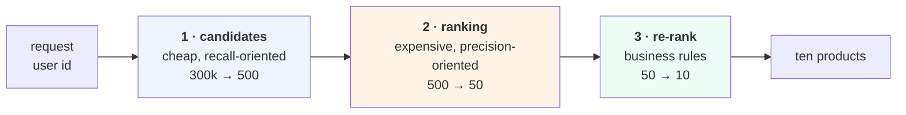

# Lesson 07 — Serving

**Goal:** return ten products in under 50 ms, for a catalogue you cannot score
one item at a time.

## What you will learn

- The two-stage architecture everything real uses
- Candidate generation, measured: a third of the compute, all of the recall
- What to precompute and when
- The serving checklist

---

## The problem

Scoring every product for every request does not scale. 300 products is
nothing; 300,000 is a normal catalogue, and at 50 ms you cannot touch them all.

The universal answer is **two stages**:



Each stage has a different job, and confusing them is the usual design error:

**Stage 1 optimises recall.** Anything it drops is gone forever, so it must be
generous and must be cheap. Popularity, the user's recent categories,
co-occurrence lists, an ANN lookup on embeddings — typically several sources
unioned together.

**Stage 2 optimises precision.** It can afford a real model on 500 items where
it could not on 300,000.

**Stage 3 applies what the model does not know**: out of stock, already
ordered, age-restricted, the diversity knob from
[lesson 06](06-beyond-accuracy.md), the slot you are paid to fill.

---

## Setup

```python
import numpy as np, pandas as pd
from scipy.sparse import csr_matrix

def build(seed=0, n_users=2000, n_items=300, days=180):
    rng = np.random.default_rng(seed)
    K = 5
    U = rng.normal(size=(n_users, K)); V = rng.normal(size=(n_items, K))
    pop = rng.pareto(1.1, n_items) + 1; pop = pop / pop.sum()
    activity = rng.pareto(1.3, n_users) + 1
    n_events = (activity / activity.sum() * 60_000).astype(int) + 2
    signup = np.sort(rng.integers(0, days, size=n_users))
    signup[:int(n_users * 0.55)] = rng.integers(0, 40, size=int(n_users * 0.55))
    rows = []
    for u in range(n_users):
        score = U[u] @ V.T
        p = np.exp(score - score.max()) * pop; p = p / p.sum()
        k = min(n_events[u], 120)
        picks = rng.choice(n_items, size=k, p=p, replace=True)
        ts = np.clip(np.sort(rng.integers(signup[u], days + 1, size=k)), 0, days - 1)
        rows += [(u, int(i), int(t)) for i, t in zip(picks, ts)]
    return pd.DataFrame(rows, columns=["user", "item", "day"]).drop_duplicates(
        ["user", "item"]).reset_index(drop=True)

N = 300
df = build()
tr, te = df[df.day < 150], df[df.day >= 150]
te = te[te.user.isin(set(tr.user))]
NU = df.user.max() + 1
X = csr_matrix((np.ones(len(tr)), (tr.user, tr.item)), shape=(NU, N))
seen = {u: set(g) for u, g in tr.groupby("user").item}
truth = {u: set(g) for u, g in te.groupby("user").item}
pop = np.asarray(X.sum(0)).ravel()

def evaluate(score_fn, k=10):
    """recall@k, NDCG@k, and what fraction of the catalogue is ever shown."""
    hits = tot = 0; shown = set(); ndcg = 0.0; nu = 0
    for u, want in truth.items():
        s = score_fn(u).astype(float).copy()
        for i in seen.get(u, ()):
            s[i] = -np.inf
        top = np.argsort(-s)[:k]
        shown.update(top.tolist())
        hits += len(set(top.tolist()) & want); tot += min(len(want), k)
        dcg = sum(1/np.log2(r+2) for r, i in enumerate(top) if i in want)
        idcg = sum(1/np.log2(r+2) for r in range(min(len(want), k)))
        ndcg += dcg/idcg; nu += 1
    return hits/tot, ndcg/nu, len(shown)/N
```

```python
norms = np.sqrt(np.asarray(X.multiply(X).sum(0)).ravel()) + 1e-9
S = (X.T @ X).toarray() / np.outer(norms, norms); np.fill_diagonal(S, 0)
Xd = X.toarray()

def recall(score_fn, k=10):
    hits = tot = 0
    for u in truth:
        s = score_fn(u).astype(float).copy()
        for i in seen.get(u, ()):
            s[i] = -np.inf
        top = np.argsort(-s)[:k]
        hits += len(set(top.tolist()) & truth[u]); tot += min(len(truth[u]), k)
    return hits / tot
```

---

## What candidate generation costs you

```python
full = lambda u: Xd[u] @ S

def two_stage(ncand):
    def f(u):
        cand = np.argsort(-pop)[:ncand]        # stage 1: cheap shortlist
        s = np.full(N, -np.inf)
        s[cand] = Xd[u] @ S[:, cand]           # stage 2: score only those
        return s
    return f

base = recall(full)
print(f"{'candidates ranked':<22}{'recall@10':>11}{'% of full':>11}{'score ops/user':>16}")
print(f"{'all 300':<22}{base:>11.4f}{100.0:>10.1f}%{N*N:>16,}")
for nc in [150, 100, 50, 25]:
    r = recall(two_stage(nc))
    print(f"{f'top {nc} by popularity':<22}{r:>11.4f}{100*r/base:>10.1f}%{N*nc:>16,}")
```

```text
candidates ranked       recall@10  % of full  score ops/user
all 300                    0.3963     100.0%          90,000
top 150 by popularity      0.3974     100.3%          45,000
top 100 by popularity      0.3983     100.5%          30,000
top 50 by popularity       0.3793      95.7%          15,000
top 25 by popularity       0.3123      78.8%           7,500
```

**Ranking only the top 100 candidates gives 100.5% of the full recall at a
third of the compute.** Not 95% — slightly *more*, because the popularity
shortlist removes long-tail items whose similarity scores are noisy, and that
noise was occasionally beating a real recommendation.

Then the curve falls off a cliff: 50 candidates keeps 95.7%, 25 keeps 78.8%.

Three things to take away:

**There is a knee, and you must find yours.** Between 100 and 50 this system
goes from free to expensive. Sweep it; do not copy someone else's 500.

**Candidate generation is not only an optimisation.** It changed the answer
for the better here, and it is also where you enforce hard rules cheaply — out
of stock never enters the shortlist, so stage 2 never has to know about it.

**A popularity shortlist caps your coverage.** Using only popularity for stage
1 means the tail can never be recommended, which is exactly
[lesson 06](06-beyond-accuracy.md)'s 0.6%. Real systems union several
generators for this reason — popularity, co-occurrence with the user's recent
items, their categories, and a small random or exploratory source.

---

## What to precompute

```text
NIGHTLY          item-item similarity S         it changes slowly
                 ALS factors P, Q               a full retrain
                 popularity lists, per segment

ON WRITE         the user's recent-items list   append on each order

PER REQUEST      candidate union                a few lookups
                 scoring 100-500 candidates     one small matrix multiply
                 business rules and re-rank      cheap

NEVER            recomputing S                  that is nightly work
```

The pattern: **everything that depends only on items is precomputed;
everything that depends on this user's latest action is cheap.**

And since the output is a list of ten per user, for many products you can go
further and **precompute the lists themselves** overnight, serving a key-value
lookup. A dictionary read has no latency problem at all
([MLOps 06](../../MLOps/lessons/06-serving.md) measured what happens when you
need a model in the request path: a 40 ms model answers in 598 ms at 95%
utilisation). Precompute when recommendations do not need to react within the
session; score live when they do.

---

## The checklist

- [ ] Two stages, with the candidate count chosen from **your** knee
- [ ] Several candidate sources unioned, not popularity alone
- [ ] `S` or the factors rebuilt on a schedule, never per request
- [ ] Seen, out-of-stock and ineligible items filtered **in stage 1**
- [ ] p95 and p99 measured, not the mean ([MLOps 06](../../MLOps/lessons/06-serving.md))
- [ ] A **fallback**: segment popularity, then global popularity, always something
- [ ] The list is never empty — ever
- [ ] Model version and candidate source logged with every list
- [ ] Every recommendation logged with its **position** ([lesson 08](08-the-feedback-loop.md))

The last one is not a serving detail. **It is the only thing that makes
tomorrow's evaluation possible**, and it is the item teams discover they
skipped six months too late.

---

## Common mistakes

| Mistake | Why it hurts |
|---|---|
| Scoring the whole catalogue per request | Does not scale past a toy |
| Candidate count copied from a paper | The knee here was between 100 and 50 |
| Popularity as the only candidate source | Caps coverage at the head forever |
| Filtering ineligible items in stage 3 | You paid to score things you cannot show |
| Recomputing similarities per request | Nightly work in the request path |
| No fallback | An empty list is worse than a boring one |
| Not logging the position of each item shown | Tomorrow's evaluation is impossible |
| Optimising the model when the queue is the problem | [MLOps 06](../../MLOps/lessons/06-serving.md) |

---

## Exercises

1. Find your candidate-count knee. Plot recall against candidates.
2. Add a second candidate source and measure coverage before and after.
3. Measure p50/p95/p99 of your recommendation endpoint.
4. Move one business rule from stage 3 into stage 1. What does it save?
5. Precompute lists overnight for one segment and compare latency.
6. Check that your logs record the position of every item shown. If not, fix
   that today.

---

**Next:** [Lesson 08 — The Feedback Loop](08-the-feedback-loop.md)
