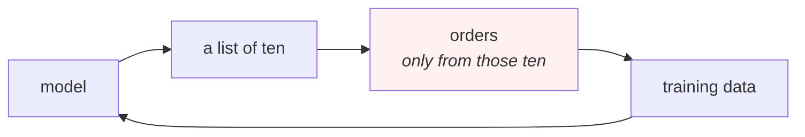

# Lesson 08 — The Feedback Loop

**Goal:** understand that a recommender changes the data it will be trained on
tomorrow, and build so that is survivable.

## What you will learn

- The loop, simulated: the tail's share of orders halves in one round
- Position bias, and why your click data is about your UI
- Why offline and online results disagree
- What to log, and the one slot to give away

---

## The loop

Every other model in this library predicts something it does not influence. A
forecast does not change demand; a churn score does not change the customer.
**A recommender changes what happens next, and then learns from it.**



The red box is the problem. Customers can only order what they were shown, so
**your training data is a record of your own past recommendations**, not of
what people wanted.

---

## Setup

```python
import numpy as np, pandas as pd
from scipy.sparse import csr_matrix

def build(seed=0, n_users=2000, n_items=300, days=180):
    rng = np.random.default_rng(seed)
    K = 5
    U = rng.normal(size=(n_users, K)); V = rng.normal(size=(n_items, K))
    pop = rng.pareto(1.1, n_items) + 1; pop = pop / pop.sum()
    activity = rng.pareto(1.3, n_users) + 1
    n_events = (activity / activity.sum() * 60_000).astype(int) + 2
    signup = np.sort(rng.integers(0, days, size=n_users))
    signup[:int(n_users * 0.55)] = rng.integers(0, 40, size=int(n_users * 0.55))
    rows = []
    for u in range(n_users):
        score = U[u] @ V.T
        p = np.exp(score - score.max()) * pop; p = p / p.sum()
        k = min(n_events[u], 120)
        picks = rng.choice(n_items, size=k, p=p, replace=True)
        ts = np.clip(np.sort(rng.integers(signup[u], days + 1, size=k)), 0, days - 1)
        rows += [(u, int(i), int(t)) for i, t in zip(picks, ts)]
    return pd.DataFrame(rows, columns=["user", "item", "day"]).drop_duplicates(
        ["user", "item"]).reset_index(drop=True)

N = 300
df = build()
tr, te = df[df.day < 150], df[df.day >= 150]
te = te[te.user.isin(set(tr.user))]
NU = df.user.max() + 1
X = csr_matrix((np.ones(len(tr)), (tr.user, tr.item)), shape=(NU, N))
seen = {u: set(g) for u, g in tr.groupby("user").item}
truth = {u: set(g) for u, g in te.groupby("user").item}
pop = np.asarray(X.sum(0)).ravel()

def evaluate(score_fn, k=10):
    """recall@k, NDCG@k, and what fraction of the catalogue is ever shown."""
    hits = tot = 0; shown = set(); ndcg = 0.0; nu = 0
    for u, want in truth.items():
        s = score_fn(u).astype(float).copy()
        for i in seen.get(u, ()):
            s[i] = -np.inf
        top = np.argsort(-s)[:k]
        shown.update(top.tolist())
        hits += len(set(top.tolist()) & want); tot += min(len(want), k)
        dcg = sum(1/np.log2(r+2) for r, i in enumerate(top) if i in want)
        idcg = sum(1/np.log2(r+2) for r in range(min(len(want), k)))
        ndcg += dcg/idcg; nu += 1
    return hits/tot, ndcg/nu, len(shown)/N
```

---

## Six rounds of a model eating its own output

```python
rng = np.random.default_rng(0)
Xd = X.toarray()
Xl = Xd.copy()
tail = np.argsort(-Xd.sum(0))[150:]        # the 150 least-ordered products

print(f"{'round':>6}{'catalogue recommended':>24}{'tail share of orders':>22}")
for rnd in range(6):
    nn = np.sqrt((Xl*Xl).sum(0)) + 1e-9
    Sl = (Xl.T @ Xl) / np.outer(nn, nn); np.fill_diagonal(Sl, 0)
    shown = set(); new_orders = np.zeros(N)
    for u in range(0, NU, 2):
        s = Xl[u] @ Sl
        s[Xl[u] > 0] = -np.inf
        top = np.argsort(-s)[:10]
        shown.update(top.tolist())
        w = 1/np.arange(1, 11); w = w/w.sum()      # position bias: slot 1 wins
        pick = top[rng.choice(10, p=w)]
        Xl[u, pick] = 1; new_orders[pick] += 1
    print(f"{rnd:>6}{len(shown)/N:>23.1%}{new_orders[tail].sum()/new_orders.sum():>21.1%}")
print("\neach round the model is retrained on orders its own list produced.")
```

```text
 round   catalogue recommended  tail share of orders
     0                  48.0%                10.3%
     1                  55.3%                 5.3%
     2                  64.7%                 5.4%
     3                  65.3%                 5.1%
     4                  63.0%                 5.0%
     5                  56.0%                 4.8%

each round the model is retrained on orders its own list produced.
```

**The tail's share of orders halves in a single round — 10.3% to 5.3% — and
keeps sliding to 4.8%.** Nothing about customer taste changed; the simulated
customers want exactly what they wanted at round 0. Only the model's exposure
changed.

The coverage column is the subtler one. It **rises** at first (48% → 65%) as
the model works through the catalogue, then **falls back** to 56% as it
concentrates. Coverage alone would have told you the system was improving for
three rounds, while the tail was already collapsing. **Watch the share of
orders, not only the share of the catalogue shown.**

Two structural facts behind this:

**Position bias is doing half the work.** The simulation gives slot 1 about
3.4x the chance of slot 10 (`1/rank`, normalised), which is conservative
compared with real UIs. So the top of your list becomes popular *because it is
at the top*, and then the model learns it is popular.

**A click is a joint event.** The customer clicked **given that you showed it
in position 3**. Training on clicks as if they were preferences bakes your
layout into your model.

---

## Why offline and online disagree

The most common experience in this field: a model wins offline by 15% and does
nothing in the A/B test. Four reasons, all visible in this course:

| Reason | Where it was measured |
|---|---|
| The offline split was random | [Lesson 02](02-evaluating.md): 42% inflation |
| Cold users were filtered out | [Lesson 05](05-cold-start.md): 49.1% of orders |
| Offline data came from the old model's exposure | This lesson |
| The metric is not the business outcome | [Data-Science 06](../../Data-Science/lessons/06-evaluating-the-decision.md) |

The third is the one specific to recommenders and the hardest to fix. Your
test set only contains interactions with items the **previous** system chose to
show, so a new model that would have recommended something better gets no
credit for it — it looks like a miss.

**Offline evaluation can therefore only rank models that behave like the one
that collected the data.** Treat it as a filter that stops bad ideas reaching
an A/B test, never as the decision. The decision is online, and
[MLOps 05](../../MLOps/lessons/05-deployment.md) has the arithmetic for how
long that takes and what the exposure costs.

---

## What to log

```text
EVERY IMPRESSION   user, item, POSITION, timestamp, model version,
                   candidate source, and whether it was clicked/ordered
EVERY REQUEST      the full list shown, not just what was taken
PERIODICALLY       the exposure distribution (lesson 06's three bands)
                   the tail's share of orders — the number that moved here
```

The two that are nearly always missing:

**Position.** Without it you cannot correct for position bias, and every
counterfactual estimate you attempt later is impossible rather than merely
hard.

**The items that were shown and not taken.** A log of orders alone cannot
distinguish "did not want it" from "never saw it" — the exact ambiguity
[lesson 01](01-what-a-recommender-is.md) started with, now self-inflicted.

---

## The one slot

The practical defence against the loop is cheap: **give one of your ten slots
to something the model is uncertain about.**

```text
9 slots    exploit — the best the model knows
1 slot     explore — an item with few impressions for this user

costs      roughly a tenth of your recall, measurably
buys       exposure for the tail, unbiased data for tomorrow's training,
           and the ability to discover that a product is good
```

This is [Reinforcement-Learning 02](../../Reinforcement-Learning/lessons/02-bandits.md)
applied to a list, and it is the same trade that course prices. The key point
is that **the cost is immediate and measurable while the benefit is delayed and
diffuse**, which is why it gets cut — and why the tail share above keeps
falling in every system where it was cut.

Pair it with a **coverage floor** ([lesson 06](06-beyond-accuracy.md)) and a
periodic check of the three exposure bands, and the loop stops tightening.

---

## Common mistakes

| Mistake | Why it hurts |
|---|---|
| Training on clicks as if they were preferences | You are modelling your own layout |
| Not logging position | Position bias becomes uncorrectable |
| Logging only what was taken | "Did not want" and "never saw" merge |
| Trusting an offline win | The data came from the old model's exposure |
| Monitoring coverage but not tail share of orders | Coverage rose while the tail collapsed |
| No exploration slot | The loop tightens every retrain |
| Retraining frequently with no exploration | Faster retraining makes it worse, not better |

---

## Exercises

1. Run the simulation for 20 rounds. Where does the tail share settle?
2. Add an exploration slot and re-run. What does it cost, and what does it
   save?
3. Change the position-bias weights to `1/rank**2`. How much faster does it
   collapse?
4. Check your own logs: do they record position? Items shown but not taken?
5. Plot your tail's share of orders over the last six months.
6. Take one offline win from your history and compare it to its A/B result.

---

## Where to go next

| Next | Why |
|---|---|
| [Project 24](../Project-24/) | Build one, honestly, including the cold half |
| [Reinforcement-Learning](../../Reinforcement-Learning/) | Bandits are the principled version of the explore slot |
| [MLOps](../../MLOps/) | Serving, monitoring and the gate for all of this |
| [Data-Science 06](../../Data-Science/lessons/06-evaluating-the-decision.md) | What a list is actually worth |
| [AI-in-UIUX](https://github.com/Tayel-Ai-Labs-Courses/AI-in-UIUX) | Position bias is a design problem too |
