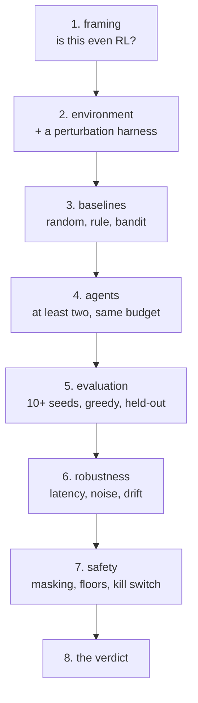

# Project 11 — An Agent, and an Honest Verdict

**Do this after the ten lessons.**

Build an RL agent for a problem you choose, evaluate it the way lesson 09
demands, and write the recommendation. As in Project 10, **"do not deploy" is a
passing answer** — and on an RL project it is the most common correct one.

---

## The shape



---

## Requirements

### 1. Framing: is this RL?

Walk lesson 01's flowchart in writing and answer:

- What is the decision, how often is it made, and who owns it?
- **Does the action change what happens next?** If not, this is a bandit, and
  the project is a bandit project — which is allowed, and is the honest answer
  for most business problems.
- What is the reward, in units someone outside the project recognises?
- Can you simulate it, or is every exploratory action a real consequence?

If the answer to the last question is "real consequence", you must either build
a simulator or take the offline route in requirement 5.

### 2. The environment, and the harness

- An environment you implemented, or one you wrapped with your own
  `reset()` / `step()`
- **A perturbation harness** (lesson 10): switches for actuator/decision delay,
  observation noise, a systematic sensor bias, and at least one parameter of the
  dynamics
- Fixed, recorded seeds for training and a **disjoint** set for evaluation
- A written statement of what your simulator gets wrong

### 3. Three baselines, measured

| Baseline | Required |
|---|---|
| Random policy | Yes |
| A hand-written rule a domain expert would accept | **Yes** |
| A bandit that ignores state transitions | Yes |

If the bandit matches your RL agent, say so prominently. That finding is worth
more than a working agent, and it is the one most often buried.

### 4. At least two agents, at the same budget

- Two of: tabular Q-learning or SARSA, DQN, REINFORCE, actor-critic
- **The same environment-step budget for each**, stated in the results table
- Everything through one training entry point with a seed argument
- For any value-based agent, report `max Q` against `1/(1-gamma) * r_max`. A
  value above the ceiling is a divergence report, not a result (lesson 07)

### 5. Evaluation, the lesson 09 protocol

- **At least 10 seeds** per agent
- **Greedy evaluation on held-out environment seeds**, separate from training
  reward, with both reported
- Median and full range, never the maximum alone
- A bootstrap interval on the mean, and an explicit sentence about whether the
  two agents' intervals overlap
- The budget: episodes, environment steps, and wall-clock time

If you took the offline route: importance-sampled value estimates **with the
effective sample size**, and the propensities you logged to compute them.

### 6. Robustness

Run the perturbation harness across at least five conditions and report the
table. Then:

- Name the condition that hurt most, and say whether you predicted it
- Name any condition that **helped**, and resist the urge to explain it away
- Train one agent with domain randomisation and compare across the same table

A robustness table with no surprise in it usually means the perturbations were
too small.

### 7. Safety

- **Action masking** for anything catastrophic, in the environment, not the
  reward
- An exploration floor and cap, with every exploratory action logged
- What the deployed policy does when it sees a state outside anything it trained
  on
- A kill switch, and evidence you tested it
- If exploration would touch real people, the holdout and the review step that
  make that acceptable — or the sentence explaining why you did not deploy

### 8. The verdict

One page, business language, opening with the recommendation.

```text
RECOMMENDATION    Deploy / Simulate further / Use the bandit / Stop
AGAINST BASELINE  What the rule and the bandit scored, on the same evaluation
EXPECTED VALUE    Per period, in money or the unit the owner cares about
CONFIDENCE        The interval across seeds, stated as a range
WHERE IT BREAKS   The worst robustness condition, with the number
SAFETY            What is masked, what is logged, who can stop it
WHAT WOULD CHANGE THIS   The measurement that would reverse the decision
```

---

## Deliverables

```text
project-11/
├── VERDICT.md             the one page — the primary deliverable
├── framing.md             committed before any agent code
├── README.md              how to reproduce, in order
├── src/
│   ├── env.py             reset/step, plus the perturbation switches
│   ├── baselines.py       random, rule, bandit
│   ├── agents/            one file per agent
│   ├── train.py           takes a seed, writes a run record
│   └── evaluate.py        greedy, held-out seeds, bootstrap intervals
├── runs/*.json            one record per training run (Data-Science lesson 07)
├── reports/
│   ├── results.md         the main table: agents x seeds x budget
│   ├── robustness.md      the perturbation table
│   └── safety.md          masking, floors, kill switch, the test
└── notebooks/
    └── exploration.ipynb  how you decided the reward and the state
```

---

## Marking

| Weight | Criterion |
|---|---|
| 10% | Framing, including an honest answer to "is this a bandit?" |
| 10% | Environment with a perturbation harness and disjoint seed sets |
| 15% | Three baselines measured, including a rule an expert accepts |
| 15% | Two agents at an equal, stated budget |
| 20% | Lesson 09 evaluation: 10+ seeds, greedy, held-out, intervals |
| 15% | Robustness table, with the surprise identified |
| 10% | Safety: masking, floors, out-of-distribution behaviour, kill switch |
| 5% | The verdict page, with "stop" genuinely available |

Automatic deductions: one seed; best-of-N reported as the result; training
reward reported as performance; agents compared at different budgets; a
value-based agent with no `max Q` ceiling check; catastrophic actions handled by
reward shaping instead of masking; no rule baseline; a robustness table with no
latency condition.

---

## Milestones

| Day | Done by end of day |
|---|---|
| 1 | Framing committed. Environment and `step()` working |
| 2 | Perturbation harness. Three baselines measured |
| 3 | First agent learning; run records written |
| 4 | Second agent at the same budget |
| 5 | Evaluation across 10+ seeds, with intervals |
| 6 | Robustness table and domain randomisation |
| 7 | Safety, verdict page, present it |

---

## Before you submit

- [ ] `framing.md` answers "does my action change what happens next?"
- [ ] The rule baseline is implemented and measured, not described
- [ ] Both agents ran at the same environment-step budget, and it is stated
- [ ] At least 10 seeds per agent
- [ ] Training reward and greedy evaluation are both reported, separately
- [ ] Evaluation seeds are disjoint from training seeds
- [ ] The interval is reported, and you say whether the agents' intervals overlap
- [ ] `max Q` is compared against `1/(1-gamma) * r_max`
- [ ] The robustness table includes a latency condition
- [ ] Catastrophic actions are masked, not penalised
- [ ] `VERDICT.md` opens with the recommendation, and "stop" was available
