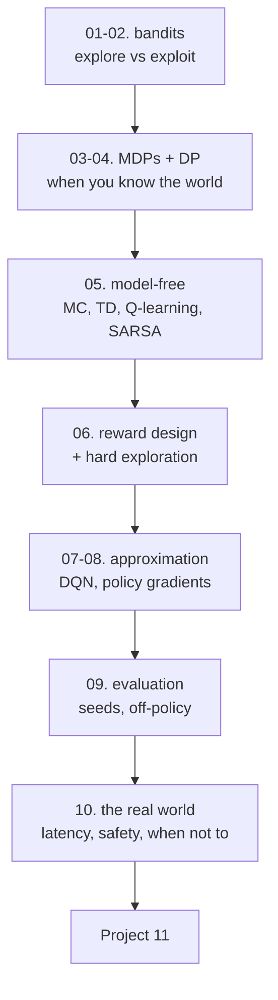

# Reinforcement Learning — Tayel AI Labs

The eleventh course. Every other course in this track learns from a dataset
somebody else collected. Here the agent's own choices decide what data exists,
and that one change breaks most of the habits the rest of the track taught you.

**Prerequisites**

- [`../Python`](../Python) — both tracks
- [`../Machine-Learning`](../Machine-Learning)
- [`../Deep-Learning`](../Deep-Learning) — for lessons 07-08 only
- [`../Data-Science`](../Data-Science) — lesson 09 here reuses its ideas about
  evaluation, and lesson 10 its holdout

**No RL library.** Every environment — the bandit, the grid, the cliff, the
combination lock, CartPole — is fifty lines of NumPy in the lesson that uses
it. You will know exactly what the agent can and cannot see.

---

## The path



## Lessons

| # | Lesson | The measured result |
|---|---|---|
| 01 | [What RL Is](lessons/01-what-rl-is.md) | Greedy on logged data picks the wrong offer 1 run in 6 |
| 02 | [Bandits](lessons/02-bandits.md) | Pure greedy locks onto the **worst** arm in 100% of runs |
| 03 | [MDPs](lessons/03-mdps.md) | A cell nearer the goal is worth less than one further away |
| 04 | [Dynamic Programming](lessons/04-dynamic-programming.md) | At -2.00 per step, the optimal action is to jump in the pit |
| 05 | [Learning Without a Model](lessons/05-model-free.md) | Q-learning finds the optimal path and earns half of SARSA's reward |
| 06 | [Reward and Exploration](lessons/06-reward-and-exploration.md) | A naive progress bonus: 0% of episodes ever finish |
| 07 | [Function Approximation](lessons/07-function-approximation.md) | No target network: Q values 23,000x the possible maximum |
| 08 | [Policy Gradients](lessons/08-policy-gradients.md) | A one-scalar baseline cuts across-seed spread 5x |
| 09 | [Evaluating Agents](lessons/09-evaluating-agents.md) | Identical code, 20 seeds: 37 to 346 |
| 10 | [RL in the Real World](lessons/10-rl-in-the-real-world.md) | 40ms of lag costs more than quintupling the pole's mass |

## Then

- **[`Project-11/`](Project-11/)** — an agent, evaluated honestly, with a
  recommendation that is allowed to be "do not deploy"

---

## Setup

```bash
python3 -m venv .venv
source .venv/bin/activate
pip install -r requirements.txt
```

Lessons 01-06 and 09-10 need only NumPy. Lessons 07 and 08 add PyTorch and are
the only ones that take minutes rather than seconds to run.

---

## Shared environments

Lesson 03 writes `gridworld.py` to `/tmp`, lesson 05 writes `cliff.py`, and
lesson 07 writes `cartpole.py`. Later lessons import them from there, so **run
the lessons in order** — or re-run the one block that writes the file.

---

## Four things this course will show you with numbers

1. **The simplest method usually wins.** Thompson sampling over tuned UCB
   (lesson 02), value iteration over policy iteration (04), optimistic
   initialisation over count-based curiosity (06), a scalar baseline over a
   learned critic (08).
2. **The reward is the specification, and the agent will read it literally.**
   Three step costs produce a careful agent, a reckless one, and one that jumps
   in the pit (lesson 04).
3. **One run is not a result.** The same code across 20 seeds spans 37 to 346
   (lesson 09).
4. **The failure is rarely where the textbook says.** The physics gap did
   nothing; two steps of actuator delay halved performance (lesson 10).
