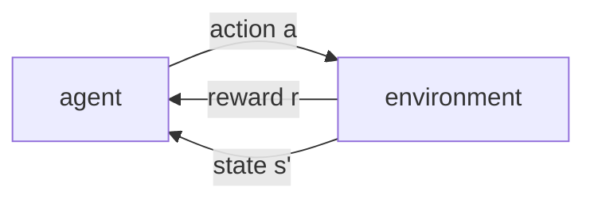
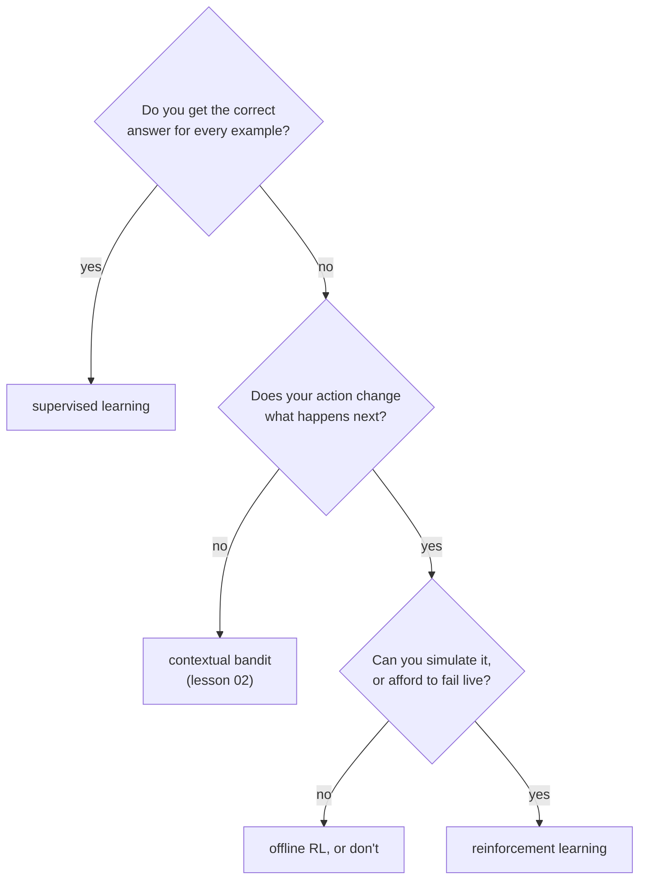

# Lesson 01 — What Reinforcement Learning Is

**Goal:** understand the one thing that makes RL different from everything
else in this track — that your choices decide what data you get.

## What you will learn

- The agent-environment loop
- Why a supervised model on logged decisions is not enough
- Exploration and exploitation, measured
- When RL is the wrong tool

---

## The loop



That is the whole field. An agent picks an action, the world answers with a
reward and a new situation, and the agent has to get better at picking.

```python
import numpy as np

class SlotMachines:
    """Three offers. Each pays 1 with a fixed probability we do not know."""
    def __init__(self, probabilities, seed=0):
        self.probabilities = np.asarray(probabilities, dtype=float)
        self.rng = np.random.default_rng(seed)

    def step(self, action):
        return float(self.rng.random() < self.probabilities[action])

env = SlotMachines([0.30, 0.55, 0.45], seed=0)
total = 0.0
for t in range(5):
    action = 1
    reward = env.step(action)
    total += reward
    print(f"t={t}  action={action}  reward={reward:.0f}  total={total:.0f}")
```

```text
t=0  action=1  reward=0  total=0
t=1  action=1  reward=1  total=1
t=2  action=1  reward=1  total=2
t=3  action=1  reward=1  total=3
t=4  action=1  reward=0  total=3
```

Three things are already different from supervised learning:

1. **There is no label.** There is a reward, and it is noisy — the same action
   gave 0 and then 1.
2. **You only see the reward for the action you took.** Nobody tells you what
   offer 0 would have paid. This is *bandit feedback*, and it is the reason the
   rest of this lesson exists.
3. **The data depends on the policy.** Keep choosing action 1 and you will
   never learn anything about the other two.

---

## Why a supervised model on logged data is not enough

The obvious idea: the company already has a year of logs. Fit a model on them,
predict the reward per offer, pick the best. Here is what that produces when
the old system mostly showed one offer.

```python
def collect_logs(env, policy, n, rng):
    rows = []
    for _ in range(n):
        a = policy(rng)
        rows.append((a, env.step(a)))
    return rows

rng = np.random.default_rng(1)
env = SlotMachines([0.30, 0.55, 0.45], seed=2)
logs = collect_logs(
    env, lambda rng: 0 if rng.random() < 0.9 else rng.integers(0, 3), 2_000, rng)

counts = np.zeros(3)
wins = np.zeros(3)
for a, r in logs:
    counts[a] += 1
    wins[a] += r
rates = np.divide(wins, counts, out=np.zeros(3), where=counts > 0)

print(f"{'offer':>6}{'shown':>8}{'observed rate':>16}{'true rate':>12}")
for a in range(3):
    print(f"{a:>6}{int(counts[a]):>8}{rates[a]:>16.3f}{env.probabilities[a]:>12.2f}")
print(f"\nsupervised model would pick offer {int(np.argmax(rates))}"
      f" (best is {int(np.argmax(env.probabilities))})")
print("standard errors:",
      " ".join(f"{s:.3f}" for s in np.sqrt(rates * (1 - rates) / np.maximum(counts, 1))))
```

```text
 offer   shown   observed rate   true rate
     0    1864           0.322        0.30
     1      64           0.484        0.55
     2      72           0.347        0.45

supervised model would pick offer 1 (best is 1)
standard errors: 0.011 0.062 0.056
```

It got the right answer. Do not be comforted by that — look at the standard
errors.

Offer 0 was shown 1,864 times and its rate is known to +/-0.011. The two offers
that matter were shown **64 and 72 times**, and their rates are known to
+/-0.06. The observed gap between them, 0.484 against 0.347, is about two
standard errors of a difference — one lucky run away from reversing.

```python
picks = []
for seed in range(500):
    rng = np.random.default_rng(seed)
    env_s = SlotMachines([0.30, 0.55, 0.45], seed=seed + 1000)
    counts = np.zeros(3)
    wins = np.zeros(3)
    for _ in range(2_000):
        a = 0 if rng.random() < 0.9 else int(rng.integers(0, 3))
        r = env_s.step(a)
        counts[a] += 1
        wins[a] += r
    rates = np.divide(wins, counts, out=np.zeros(3), where=counts > 0)
    picks.append(int(np.argmax(rates)))

picks = np.array(picks)
for a in range(3):
    print(f"offer {a} chosen in {(picks == a).mean():>6.1%} of 500 replays "
          f"(true rate {[0.30, 0.55, 0.45][a]:.2f})")
```

```text
offer 0 chosen in   0.0% of 500 replays (true rate 0.30)
offer 1 chosen in  83.6% of 500 replays (true rate 0.55)
offer 2 chosen in  16.4% of 500 replays (true rate 0.45)
```

**The logged-data approach picks the wrong offer one run in six**, with 2,000
rows of data. Not because the model is bad — the model is a mean — but because
**the old policy decided which data exists**, and it spent 93% of the budget
measuring the worst offer to four decimal places.

This is the difference in one sentence: in supervised learning the dataset is
given; in RL **the dataset is a consequence of your decisions**, and collecting
the right one is part of the problem.

---

## Exploration costs something, and so does not exploring

```python
def run_greedy_forever(probabilities, warmup, steps, seed):
    env = SlotMachines(probabilities, seed=seed)
    counts = np.zeros(3)
    wins = np.zeros(3)
    total = 0.0
    for t in range(steps):
        if t < warmup:
            a = t % 3                      # round-robin exploration
        else:
            rates = np.divide(wins, counts, out=np.zeros(3), where=counts > 0)
            a = int(np.argmax(rates))      # then greedy, forever
        r = env.step(a)
        total += r
        counts[a] += 1
        wins[a] += r
    return total, counts

for warmup in (3, 30, 300):
    totals, locked = [], []
    for seed in range(200):
        total, counts = run_greedy_forever([0.30, 0.55, 0.45], warmup, 1_000, seed)
        totals.append(total)
        locked.append(int(np.argmax(counts)))
    best = sum(1 for a in locked if a == 1)
    print(f"warmup {warmup:>4} pulls each: mean reward {np.mean(totals):>7.1f}"
          f"  locked onto the best offer {best / 200:>6.1%} of runs")
print("always-best ceiling: 550.0    always-worst floor: 300.0")
```

```text
warmup    3 pulls each: mean reward   453.7  locked onto the best offer  46.0% of runs
warmup   30 pulls each: mean reward   520.4  locked onto the best offer  76.0% of runs
warmup  300 pulls each: mean reward   512.9  locked onto the best offer  98.0% of runs
always-best ceiling: 550.0    always-worst floor: 300.0
```

This little table is the whole tension of the field.

**Too little exploration is a disaster.** Three pulls each, then commit forever:
the agent locks onto the best offer **46% of the time** — worse than a coin
flip between the top two — and earns 453.7 against a ceiling of 550.

**Too much exploration is also worse.** 300 pulls each identifies the best
offer 98% of the time, and earns **less** than the 30-pull agent (512.9 against
520.4), because it spent almost a third of its budget on offers it had already
ruled out.

The middle setting wins on reward while being wrong about the best offer a
quarter of the time. **Identifying the best action and earning the most reward
are different objectives**, and which one you want is a business question. If
this is a one-week campaign, maximise reward. If you are choosing a permanent
default, identify correctly and accept the cost.

Lesson 02 is about spending that budget better than round-robin.

---

## Is RL even the right tool?

Most problems people bring to RL are not RL problems. Work down this list and
stop at the first "yes".



| Problem | Right tool | Why |
|---|---|---|
| Which customers will churn | Supervised | The label arrives for everyone |
| Which of 3 offers to show now | **Bandit** | Feedback only for the shown offer; no lasting effect |
| Which offer, given this customer | **Contextual bandit** | Same, plus a state |
| Order of pages in a 6-step onboarding | **RL** | Step 1 changes who is still there at step 4 |
| Robot arm, game, traffic control | **RL** | Long chains of consequence |
| Anything where a failed action costs a life or a licence | Not RL, or offline RL | Exploration means acting badly on purpose |

That last row is not a footnote. **Exploration is deliberately taking actions
you believe are worse**, to learn. In a slot machine that costs a few coins. In
pricing, lending or medicine, it costs real people, and it is the reason most
serious RL happens in a simulator.

---

## Common mistakes

| Mistake | Why it hurts |
|---|---|
| Fitting a supervised model on logged decisions and deploying the argmax | The old policy chose the data; one run in six picks the wrong action |
| No exploration at all | Locks onto the wrong action 54% of the time here |
| Exploration forever | Identified the best offer 98% of the time and still earned less |
| Using RL where a bandit would do | Ten times the machinery for a problem with no state |
| Exploring in production on real people | Exploration is choosing a known-worse action on purpose |
| Reporting one run | Every number in this lesson is a mean over 200-500 runs; lesson 09 explains why |

---

## Exercises

1. Change the probabilities to `[0.50, 0.55, 0.45]`. Rerun the warmup table.
   Which warmup wins now, and why did the answer move?
2. In the logged-data experiment, change the old policy to show each offer
   equally often. How many of the 500 replays now pick correctly, and what does
   that tell you about the value of randomisation in a *production* system?
3. Compute the regret of each warmup setting: `1000 * 0.55 - mean_reward`.
   Which setting minimises it?
4. Write down a decision at your own work and walk the flowchart. Be honest
   about whether your action changes what happens next.

---

**Next:** [Lesson 02 — Bandits and the Explore/Exploit Trade-off](02-bandits.md)
