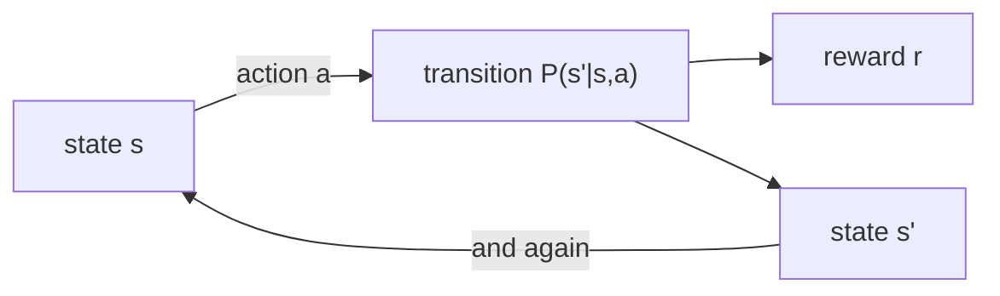

# Lesson 03 — Markov Decision Processes

**Goal:** describe a problem where actions have consequences, and compute how
good a policy is.

## What you will learn

- The five parts of an MDP
- Why stochastic transitions change everything
- Policy evaluation: the value of a policy, computed
- Discounting, and what gamma actually buys you

---

## From bandits to MDPs

In lesson 02 every pull was independent. Now the action moves you somewhere,
and where you are decides what you can do next.



An **MDP** is five things: states `S`, actions `A`, transition probabilities
`P(s'|s,a)`, rewards `R`, and a discount `gamma`. "Markov" means the future
depends only on the current state, not on how you got there — if that is false
for your problem, your state is missing something.

---

## The environment

The classic 4x3 grid. The agent starts bottom-left, +1 is top-right, the -1 pit
sits directly below it, and there is a wall in the middle. Actions succeed 80%
of the time and slip sideways 10% each way.

Lessons 04, 05 and 06 reuse it, so it goes into a module on disk rather
than being retyped:

```python
from pathlib import Path

GRIDWORLD = r'''
import numpy as np

ACTIONS = ["up", "down", "left", "right"]
DELTA = {"up": (-1, 0), "down": (1, 0), "left": (0, -1), "right": (0, 1)}
PERPENDICULAR = {"up": ["left", "right"], "down": ["left", "right"],
                 "left": ["up", "down"], "right": ["up", "down"]}

class GridWorld:
    """Russell & Norvig's 4x3 grid. Actions slip sideways 20% of the time."""
    def __init__(self, step_reward=-0.04, slip=0.2):
        self.rows, self.cols = 3, 4
        self.walls = {(1, 1)}
        self.terminals = {(0, 3): +1.0, (1, 3): -1.0}
        self.start = (2, 0)
        self.step_reward = step_reward
        self.slip = slip
        self.states = [(r, c) for r in range(self.rows) for c in range(self.cols)
                       if (r, c) not in self.walls]

    def move(self, state, action):
        dr, dc = DELTA[action]
        nxt = (state[0] + dr, state[1] + dc)
        if (nxt in self.walls or not (0 <= nxt[0] < self.rows)
                or not (0 <= nxt[1] < self.cols)):
            return state
        return nxt

    def transitions(self, state, action):
        """[(probability, next_state, reward)] for one (state, action)."""
        if state in self.terminals:
            return [(1.0, state, 0.0)]
        out = []
        for a, p in [(action, 1 - self.slip)] + [
                (perp, self.slip / 2) for perp in PERPENDICULAR[action]]:
            nxt = self.move(state, a)
            reward = self.terminals.get(nxt, self.step_reward)
            out.append((p, nxt, reward))
        return out

def show(grid, values=None, policy=None):
    arrows = {"up": "^", "down": "v", "left": "<", "right": ">"}
    lines = []
    for r in range(grid.rows):
        cells = []
        for c in range(grid.cols):
            s = (r, c)
            if s in grid.walls:
                cells.append("#####" if values is not None else " # ")
            elif s in grid.terminals and policy is not None and values is None:
                cells.append(f" {'+1' if grid.terminals[s] > 0 else '-1'} ")
            elif values is not None:
                cells.append(f"{values[s]:+.3f}")
            else:
                cells.append(f" {arrows[policy[s]]} ")
        lines.append(" ".join(cells))
    return "\n".join(lines)
'''

Path("/tmp/gridworld.py").write_text(GRIDWORLD)
print("written")
```

```text
written
```

```python
import sys
sys.path.insert(0, "/tmp")
from gridworld import GridWorld, ACTIONS, show

grid = GridWorld()
print(f"states: {len(grid.states)}   actions: {ACTIONS}")
print(f"start: {grid.start}   terminals: {grid.terminals}   wall: {sorted(grid.walls)}")
print("\ntransitions from (2,0) taking 'up':")
for p, nxt, r in grid.transitions((2, 0), "up"):
    print(f"  p={p:.1f} -> {nxt}  reward {r:+.2f}")
```

```text
states: 11   actions: ['up', 'down', 'left', 'right']
start: (2, 0)   terminals: {(0, 3): 1.0, (1, 3): -1.0}   wall: [(1, 1)]

transitions from (2,0) taking 'up':
  p=0.8 -> (1, 0)  reward -0.04
  p=0.1 -> (2, 0)  reward -0.04
  p=0.1 -> (2, 1)  reward -0.04
```

Read the 0.1 that leads back to `(2, 0)`. Trying to move up against the left
wall slips into the wall and stays put — and still pays the -0.04 step cost.
**Actions can fail, and failing is not free.**

```python
print("transitions from (2,2) taking 'up':")
for p, nxt, r in grid.transitions((2, 2), "up"):
    print(f"  p={p:.1f} -> {nxt}  reward {r:+.2f}")
```

```text
transitions from (2,2) taking 'up':
  p=0.8 -> (1, 2)  reward -0.04
  p=0.1 -> (2, 1)  reward -0.04
  p=0.1 -> (2, 3)  reward -0.04
```

This is the cell that makes the whole puzzle interesting. Moving up from
`(2, 2)` has a 10% chance of sliding right into the column below the pit. Any
policy that walks the agent along the right-hand side is gambling every step,
and the value function will price that gamble for you.

---

## Policy evaluation

A **policy** maps every state to an action. Its **value function** `V(s)` is
the expected discounted return from `s` if you follow it forever. The Bellman
equation says the value of a state is the immediate reward plus the discounted
value of where you land:

```text
V(s) = sum over s'  P(s'|s, pi(s)) * [ R(s, pi(s), s') + gamma * V(s') ]
```

Sweep that assignment over every state until nothing changes.

```python
def evaluate(grid, policy, gamma=1.0, theta=1e-8):
    V = {s: 0.0 for s in grid.states}
    sweeps = 0
    while True:
        delta = 0.0
        for s in grid.states:
            if s in grid.terminals:
                continue
            v = sum(p * (r + gamma * V[nxt])
                    for p, nxt, r in grid.transitions(s, policy[s]))
            delta = max(delta, abs(v - V[s]))
            V[s] = v
        sweeps += 1
        if delta < theta:
            return V, sweeps

always_up = {s: "up" for s in grid.states}
V, sweeps = evaluate(grid, always_up)
print(f"policy 'always up', {sweeps} sweeps")
print(show(grid, values=V))
print(f"\nvalue of the start state {grid.start}: {V[grid.start]:+.3f}")
```

```text
policy 'always up', 692 sweeps
-1.360 -0.960 -0.160 +0.000
-1.410 ##### -0.293 +0.000
-1.426 -1.156 -0.485 -0.952

value of the start state (2, 0): -1.426
```

Every value is negative. "Always up" walks into the ceiling and stays there,
paying -0.04 per step until a slip eventually carries it somewhere — from
`(2, 0)` it costs **-1.426** on average, about 35 wasted steps.

**692 sweeps.** With `gamma = 1.0` and a policy that mostly never terminates,
the values creep down slowly and the algorithm has to grind. Remember that
number: lesson 04 gets the *optimal* policy in 23 sweeps.

---

## A policy someone might write by hand

```python
manual = {s: "right" for s in grid.states}
manual[(2, 0)] = "up"
manual[(1, 0)] = "up"
manual[(0, 0)] = "right"
manual[(2, 1)] = "left"
manual[(2, 2)] = "up"
manual[(2, 3)] = "left"
manual[(1, 2)] = "up"

V2, _ = evaluate(grid, manual)
print(show(grid, policy=manual))
print()
print(show(grid, values=V2))
print(f"\nvalue of the start state: {V2[grid.start]:+.3f} "
      f"(always-up was {V[grid.start]:+.3f})")
```

```text
 >   >   >   +1
 ^   #   ^   -1
 ^   <   ^   <

+0.852 +0.908 +0.958 +0.000
+0.802 ##### +0.700 +0.000
+0.745 +0.695 +0.631 +0.410

value of the start state: +0.745 (always-up was -1.426)
```

Now the numbers mean something. Read the value grid as *"how much do I expect
to walk away with from here"*:

- `+0.958` next to the goal — almost the full +1, minus the step or two left.
- `+0.700` at `(1, 2)`, the cell beside the pit. Lower than `+0.802` at
  `(1, 0)`, which is **further from the goal**. The value function has priced
  the 10% slip into -1, and decided that being close to the goal but next to
  the pit is worse than being far from both.
- `+0.410` at `(2, 3)`, directly below the pit — the most dangerous cell in the
  grid that is not the pit itself.

That ordering is the reason to compute values instead of eyeballing distances.

---

## Discounting

```python
for gamma in (0.5, 0.9, 0.99, 1.0):
    Vg, _ = evaluate(grid, manual, gamma=gamma)
    horizon = "inf" if gamma == 1.0 else f"{1 / (1 - gamma):.0f}"
    print(f"gamma={gamma:<5} start value {Vg[grid.start]:+.3f}   "
          f"effective horizon ~{horizon} steps")
```

```text
gamma=0.5   start value -0.046   effective horizon ~2 steps
gamma=0.9   start value +0.369   effective horizon ~10 steps
gamma=0.99  start value +0.698   effective horizon ~100 steps
gamma=1.0   start value +0.745   effective horizon ~inf steps
```

`gamma` is how far ahead the agent cares, and `1/(1-gamma)` is roughly how many
steps that is.

At **gamma=0.5** the start state is worth **-0.046** — negative. The goal is
five or six steps away, and after five steps of halving, a +1 is worth 0.03.
The agent can see the step costs and cannot see the prize.

Three reasons `gamma` exists, in order of honesty:

1. **The future really is worth less.** Money next year, a customer who might
   leave anyway.
2. **It keeps the maths finite** when episodes never end.
3. **It stabilises learning.** A smaller gamma is an easier problem, and this
   is the usual reason in practice, even when people quote reason 1.

`gamma` is not a neutral knob. It is part of the problem definition, and
changing it changes which policy is optimal — lesson 04 shows exactly where the
arrows flip.

---

## Common mistakes

| Mistake | Why it hurts |
|---|---|
| A state that is not Markov | The agent needs history you did not give it; nothing converges |
| Assuming actions succeed | The 10% slip is what makes the pit column dangerous |
| Reading distance instead of value | `(1, 2)` is nearer the goal and worth less than `(1, 0)` |
| Picking gamma by habit | gamma=0.5 makes the goal invisible from the start state |
| Forgetting the step cost | -0.04 x 35 steps is the entire "always up" result |
| Evaluating with gamma=1 on a non-terminating policy | 692 sweeps, and no guarantee of convergence in general |

---

## Exercises

1. Set `slip=0.0` and re-evaluate the manual policy. Which cell's value changes
   most, and why is it not the start state?
2. Build the policy that always moves `right`. Evaluate it, and explain the
   value at `(2, 3)` in one sentence.
3. At `gamma=0.9`, find the gamma (to two decimals) at which the start value
   crosses zero. What does that number mean in steps?
4. Add a second pit at `(2, 2)` with reward -1. Re-evaluate the manual policy.
   Does the start value fall by more or less than 1? Explain.

---

**Next:** [Lesson 04 — Dynamic Programming](04-dynamic-programming.md)
