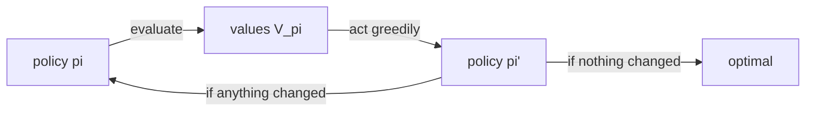

# Lesson 04 — Dynamic Programming

**Goal:** compute the optimal policy when you know how the world works, and
see how badly the reward you chose decides what "optimal" means.

## What you will learn

- Policy iteration, and why it converges so fast in policy space
- Value iteration, and why it is usually the one you write
- The discount changing the arrows on the map
- Reward design: three step costs, three different agents

---

## Setup

```python
import sys
sys.path.insert(0, "/tmp")            # written by lesson 03
from gridworld import GridWorld, ACTIONS, show

def evaluate(grid, policy, gamma=1.0, theta=1e-8):
    V = {s: 0.0 for s in grid.states}
    sweeps = 0
    while True:
        delta = 0.0
        for s in grid.states:
            if s in grid.terminals:
                continue
            v = sum(p * (r + gamma * V[n])
                    for p, n, r in grid.transitions(s, policy[s]))
            delta = max(delta, abs(v - V[s]))
            V[s] = v
        sweeps += 1
        if delta < theta:
            return V, sweeps

def greedy(grid, V, gamma):
    """One step of lookahead: the best action in each state, given V."""
    policy = {}
    for s in grid.states:
        if s in grid.terminals:
            policy[s] = "up"
            continue
        q = {a: sum(p * (r + gamma * V[n]) for p, n, r in grid.transitions(s, a))
             for a in ACTIONS}
        policy[s] = max(q, key=q.get)
    return policy

grid = GridWorld()
print("ready:", len(grid.states), "states")
```

```text
ready: 11 states
```

---

## Policy iteration

Alternate two steps: evaluate the current policy exactly, then replace it with
the greedy policy for those values. Repeat until the policy stops changing.



```python
def policy_iteration(grid, gamma=1.0):
    policy = {s: "up" for s in grid.states}
    total_sweeps = 0
    for iteration in range(1, 100):
        V, sweeps = evaluate(grid, policy, gamma)
        total_sweeps += sweeps
        new = greedy(grid, V, gamma)
        changed = sum(1 for s in grid.states
                      if s not in grid.terminals and new[s] != policy[s])
        print(f"  iteration {iteration}: {sweeps:>4} eval sweeps, "
              f"{changed} action(s) changed, start value {V[grid.start]:+.3f}")
        if changed == 0:
            return policy, V, iteration, total_sweeps
        policy = new

policy, V, iters, sweeps = policy_iteration(grid)
print(f"converged after {iters} iterations, {sweeps} total sweeps")
print(show(grid, policy=policy))
print()
print(show(grid, values=V))
```

```text
  iteration 1:  692 eval sweeps, 6 action(s) changed, start value -1.426
  iteration 2:   21 eval sweeps, 1 action(s) changed, start value +0.548
  iteration 3:   21 eval sweeps, 1 action(s) changed, start value +0.731
  iteration 4:   23 eval sweeps, 1 action(s) changed, start value +0.745
  iteration 5:   23 eval sweeps, 0 action(s) changed, start value +0.745
converged after 5 iterations, 780 total sweeps
 >   >   >   +1
 ^   #   ^   -1
 ^   <   <   <

+0.852 +0.908 +0.958 +0.000
+0.802 ##### +0.700 +0.000
+0.745 +0.695 +0.651 +0.428
```

**Five iterations.** Policy iteration converges in very few steps because there
are only finitely many policies and each iteration strictly improves — that is
a theorem, and here it lands after four real improvements.

Look at the bottom row of the final policy: `^ < < <`. The agent standing at
`(2, 3)`, directly under the pit, walks **left, away from the goal**. It is one
cell from the +1 and refuses to go up, because "up" from there has a 10% slip
into the -1. The long way round is worth more, and the value function said so
before any intuition did.

Now look at the cost. **780 sweeps**, and 692 of them were spent evaluating the
useless starting policy to eight decimal places — before improving it once.

---

## Value iteration

Do not evaluate any policy properly. Take the best action's value in one sweep
and repeat:

```text
V(s) <- max over a  sum over s'  P(s'|s,a) [ R + gamma * V(s') ]
```

```python
def value_iteration(grid, gamma=1.0, theta=1e-8):
    V = {s: 0.0 for s in grid.states}
    sweeps = 0
    while True:
        delta = 0.0
        for s in grid.states:
            if s in grid.terminals:
                continue
            v = max(sum(p * (r + gamma * V[n]) for p, n, r in grid.transitions(s, a))
                    for a in ACTIONS)
            delta = max(delta, abs(v - V[s]))
            V[s] = v
        sweeps += 1
        if delta < theta:
            return V, greedy(grid, V, gamma), sweeps

Vv, pv, sw = value_iteration(grid)
print(f"value iteration: {sw} sweeps (policy iteration used {sweeps})")
print("same policy as policy iteration:",
      all(pv[s] == policy[s] for s in grid.states if s not in grid.terminals))
print(f"max value difference: {max(abs(Vv[s] - V[s]) for s in grid.states):.2e}")
```

```text
value iteration: 23 sweeps (policy iteration used 780)
same policy as policy iteration: True
max value difference: 1.10e-10
```

**23 sweeps against 780** — identical policy, values agreeing to 1e-10.

The difference is one word: `max` instead of `policy[s]`. Value iteration never
commits to a policy it has to evaluate, so it never wastes 692 sweeps
perfecting the value of a bad one.

| | Policy iteration | Value iteration |
|---|---|---|
| Iterations | Very few (5) | More (23) |
| Work per iteration | A full evaluation | One sweep |
| Total work here | 780 sweeps | 23 sweeps |
| Gives you | An exact `V` for each policy | Only the optimal `V` |
| Write this one when | You want the intermediate policies | **Almost always** |

Both need something you will rarely have: `grid.transitions(s, a)` — the full
model of the world. That is the assumption lesson 05 removes, and everything
after it is about what you do when the `transitions` method does not exist.

---

## The discount changes the map

```python
for gamma in (0.5, 0.9, 0.99, 1.0):
    Vg, pg, _ = value_iteration(grid, gamma=gamma)
    print(f"\ngamma = {gamma}   start value {Vg[grid.start]:+.3f}")
    print(show(grid, policy=pg))
```

```text

gamma = 0.5   start value -0.044
 >   >   >   +1
 ^   #   ^   -1
 ^   >   ^   v

gamma = 0.9   start value +0.374
 >   >   >   +1
 ^   #   ^   -1
 ^   >   ^   <

gamma = 0.99   start value +0.698
 >   >   >   +1
 ^   #   ^   -1
 ^   <   ^   <

gamma = 1.0   start value +0.745
 >   >   >   +1
 ^   #   ^   -1
 ^   <   <   <
```

Watch the bottom-right corner across the four maps. At `gamma = 0.5` the agent
at `(2, 3)` chooses **down** — into a wall, staying put — because at that
discount nothing more than two steps away is worth walking toward. By
`gamma = 0.99` it walks left, taking the long safe route.

The same environment, the same algorithm, four different optimal policies. **A
discount is not a hyperparameter you tune for convergence speed; it is a
statement about how much the future matters**, and it silently decides what
your agent considers correct behaviour.

---

## Reward design decides everything

```python
for step in (-0.04, -0.2, -2.0, +0.05):
    g = GridWorld(step_reward=step)
    Vg, pg, _ = value_iteration(g, gamma=1.0 if step < 0 else 0.99)
    print(f"\nstep reward {step:+.2f}   start value {Vg[g.start]:+.3f}")
    print(show(g, policy=pg))
```

```text

step reward -0.04   start value +0.745
 >   >   >   +1
 ^   #   ^   -1
 ^   <   <   <

step reward -0.20   start value -0.127
 >   >   >   +1
 ^   #   ^   -1
 ^   >   ^   <

step reward -2.00   start value -8.815
 >   >   >   +1
 ^   #   >   -1
 >   >   >   ^

step reward +0.05   start value +5.000
 v   >   <   +1
 v   #   <   -1
 >   >   v   v
```

Four agents, one environment, four different personalities — and nobody changed
the algorithm.

**-0.04: careful.** Walks the long way to avoid the pit.

**-0.20: hurried.** The detour now costs more than the risk, so at `(2, 1)` it
turns right and takes the fast, dangerous lane.

**-2.00: suicidal.** Look at `(1, 2)`, the cell beside the pit: the arrow points
**right, into the -1**. When every step costs 2, dying immediately for -1 beats
walking three more steps for +1. The agent is behaving optimally, and the
behaviour is a catastrophe.

**+0.05: immortal and useless.** Every arrow points away from both terminals.
Start value **+5.000**, which is exactly `0.05 / (1 - 0.99)` — the value of
wandering forever collecting the living bonus. Making the agent "happy to be
alive" taught it never to finish the task.

This is **reward hacking**, and it is not a curiosity — it is the single most
common way real RL projects fail. The agent does not do what you meant; it does
what you paid for. Two habits follow:

1. **Look at the policy, not only the return.** The +0.05 agent has the highest
   score in the table by a factor of six.
2. **Check the extremes of your reward.** If any legal behaviour produces
   unbounded reward without solving the task, the agent will find it, and it
   will find it faster than you will.

---

## Common mistakes

| Mistake | Why it hurts |
|---|---|
| Evaluating the initial policy to convergence | 692 of 780 sweeps, thrown away |
| Writing policy iteration by default | Value iteration got the same answer in 3% of the work |
| Treating gamma as a solver setting | Four discounts gave four different optimal policies |
| A per-step penalty chosen by feel | At -2.00 the optimal policy is to jump in the pit |
| Any positive reward for doing nothing | +5.000 for walking in circles forever |
| Judging an agent by its return | The worst agent here has the highest score |
| Assuming you have `transitions()` | You almost never do — lesson 05 |

---

## Exercises

1. Start policy iteration from the optimal policy. How many sweeps now? What
   does that tell you about where its cost really lives?
2. Find, to 0.01, the step reward at which the arrow at `(2, 1)` flips from
   `left` to `right`. That number is the price of safety in this grid.
3. Set `slip=0.0` and rerun the four discounts. Which maps change, and why does
   the bottom-right corner stop mattering?
4. Add a third terminal worth +0.3 at `(2, 0)` — a small, safe, immediate
   prize. At which gamma does the agent stop going for the +1?
5. Stop value iteration after 5 sweeps and extract the greedy policy. Is it
   already optimal? What does that suggest about the 1e-8 threshold?

---

**Next:** [Lesson 05 — Learning Without a Model](05-model-free.md)
