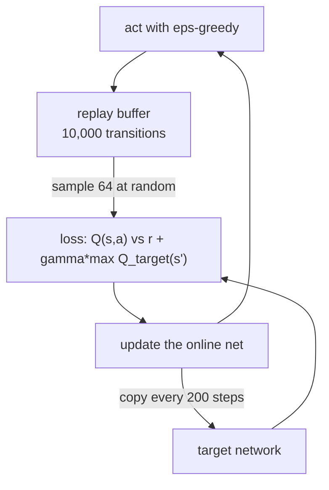

# Lesson 07 — Function Approximation

**Goal:** handle a state space you cannot put in a table, and meet the way deep
RL fails.

## What you will learn

- Why a table stops working
- Discretisation, which is better than it sounds
- DQN: replay, a target network, and what each one is for
- Divergence, measured: Q values 23,000 times larger than possible

---

## A state you have never seen before

CartPole: balance a pole on a cart by pushing left or right. The state is four
floating-point numbers.

```python
from pathlib import Path

CARTPOLE = r'''
import numpy as np

class CartPole:
    """Classic cart-pole. State: [x, x_dot, theta, theta_dot]. Two actions."""
    gravity, mass_cart, mass_pole, length = 9.8, 1.0, 0.1, 0.5
    force_mag, tau = 10.0, 0.02
    x_limit, theta_limit = 2.4, 12 * np.pi / 180

    def __init__(self, seed=0):
        self.rng = np.random.default_rng(seed)
        self.state = None

    def reset(self):
        self.state = self.rng.uniform(-0.05, 0.05, 4)
        return self.state.copy()

    def step(self, action):
        x, x_dot, theta, theta_dot = self.state
        force = self.force_mag if action == 1 else -self.force_mag
        cos, sin = np.cos(theta), np.sin(theta)
        total_mass = self.mass_cart + self.mass_pole
        pole_mass_length = self.mass_pole * self.length
        temp = (force + pole_mass_length * theta_dot ** 2 * sin) / total_mass
        theta_acc = ((self.gravity * sin - cos * temp)
                     / (self.length * (4.0 / 3.0 - self.mass_pole * cos ** 2 / total_mass)))
        x_acc = temp - pole_mass_length * theta_acc * cos / total_mass
        x += self.tau * x_dot
        x_dot += self.tau * x_acc
        theta += self.tau * theta_dot
        theta_dot += self.tau * theta_acc
        self.state = np.array([x, x_dot, theta, theta_dot])
        done = bool(abs(x) > self.x_limit or abs(theta) > self.theta_limit)
        return self.state.copy(), 1.0, done
'''

Path("/tmp/cartpole.py").write_text(CARTPOLE)
import sys
sys.path.insert(0, "/tmp")
from cartpole import CartPole
print("written")
```

```text
written
```

```python
import numpy as np

env = CartPole(seed=1)
rng = np.random.default_rng(1)
seen, visits = set(), 0
for ep in range(200):
    s = env.reset()
    seen.add(tuple(np.round(s, 3)))
    visits += 1
    for _ in range(500):
        s, r, done = env.step(int(rng.integers(2)))
        seen.add(tuple(np.round(s, 3)))
        visits += 1
        if done:
            break

print(f"{visits:,} states visited in 200 random episodes")
print(f"{len(seen):,} of them distinct, rounded to 3 decimal places")
print(f"states seen more than once: {visits - len(seen)}")
```

```text
4,411 states visited in 200 random episodes
4,411 of them distinct, rounded to 3 decimal places
states seen more than once: 0
```

**Not one state was ever visited twice**, even rounded to three decimals. Every
algorithm in lessons 03-06 keyed a dictionary on the state. Here that dictionary
would have one entry per visit and would never be read again: the agent could
never learn anything, because learning requires returning to a situation.

So the agent needs to **generalise** — to treat nearby states as similar. There
are two ways.

---

## Discretisation: the boring one that works

Cut each dimension into bins and use the bin indices as the state.

```python
BINS = [np.linspace(-2.4, 2.4, 4), np.linspace(-3, 3, 6),
        np.linspace(-0.21, 0.21, 12), np.linspace(-3, 3, 12)]

def discretise(s):
    return tuple(int(np.digitize(v, b)) for v, b in zip(s, BINS))

print("bins per dimension:", [len(b) + 1 for b in BINS],
      " -> table size", np.prod([len(b) + 1 for b in BINS]) * 2)

def run_tabular(episodes=3_000, alpha=0.1, gamma=0.99, seed=0):
    env = CartPole(seed=seed)
    rng = np.random.default_rng(seed)
    Q, lengths = {}, []
    for ep in range(episodes):
        eps = max(0.02, 1.0 - ep / (episodes * 0.5))
        s = discretise(env.reset())
        steps = 0
        for _ in range(500):
            q = Q.setdefault(s, np.zeros(2))
            a = int(rng.integers(2)) if rng.random() < eps else int(np.argmax(q))
            nxt_raw, r, done = env.step(a)
            nxt = discretise(nxt_raw)
            qn = Q.setdefault(nxt, np.zeros(2))
            Q[s][a] += alpha * (r + gamma * (0.0 if done else qn.max()) - Q[s][a])
            s = nxt
            steps += 1
            if done:
                break
        lengths.append(steps)
    return Q, np.array(lengths)

res = [run_tabular(seed=s) for s in range(5)]
finals = np.array([r[1][-100:].mean() for r in res])
print(f"mean episode length, last 100: {finals.mean():.1f} +/- {finals.std():.1f}")
print(f"states actually visited: {np.mean([len(r[0]) for r in res]):.0f}")
```

```text
bins per dimension: [5, 7, 13, 13]  -> table size 11830
mean episode length, last 100: 173.4 +/- 20.2
states actually visited: 598
```

**173 steps against 22.6 for a random policy** — seven times better, from a
dictionary and one `np.digitize`.

Two numbers deserve attention. The table *could* hold 11,830 entries; the agent
visited **598**. Almost all of the grid is physically unreachable — a cart at
the far left moving hard left at a steep angle does not exist. Curse of
dimensionality is about the space you must represent, not the space you visit.

And the bins are not uniform: 13 for the pole angle, 5 for the cart position.
That choice is domain knowledge — the angle is what you must control precisely —
and it is doing more work here than any algorithm in this lesson.

| | Discretisation | Neural network |
|---|---|---|
| Effort | An afternoon | A week |
| Needs tuning | Bin edges | Everything |
| Fails by | Bins too coarse to distinguish, or too fine to fill | Diverging (below) |
| Scales to images | No | Yes |
| **Try it first** | **Yes** | No |

---

## DQN

Replace the table with a network `Q(s) -> [q_left, q_right]`. Three additions
make it stable, and they are the entire idea:



- **Replay buffer** — sampling old transitions at random breaks the correlation
  between consecutive steps, which otherwise makes each gradient step undo the
  last.
- **Target network** — a frozen copy used to compute the target, so the thing
  you are chasing holds still.
- **eps-greedy** — lesson 02, still required.

```python
import torch
import torch.nn as nn

def mlp():
    return nn.Sequential(nn.Linear(4, 64), nn.ReLU(),
                         nn.Linear(64, 64), nn.ReLU(), nn.Linear(64, 2))

def dqn(use_target=True, episodes=300, gamma=0.99, lr=1e-3, batch=64,
        buffer_size=10_000, target_every=200, seed=0):
    torch.manual_seed(seed)
    env = CartPole(seed=seed)
    rng = np.random.default_rng(seed)
    net = mlp()
    target = mlp()
    target.load_state_dict(net.state_dict())
    opt = torch.optim.Adam(net.parameters(), lr=lr)

    buf_s = np.zeros((buffer_size, 4), np.float32)
    buf_a = np.zeros(buffer_size, np.int64)
    buf_r = np.zeros(buffer_size, np.float32)
    buf_n = np.zeros((buffer_size, 4), np.float32)
    buf_d = np.zeros(buffer_size, np.float32)
    ptr = size = step_count = 0
    lengths, qmax = [], []

    for ep in range(episodes):
        s = env.reset().astype(np.float32)
        eps = max(0.05, 1.0 - ep / (episodes * 0.5))
        steps = 0
        for _ in range(500):
            if rng.random() < eps:
                a = int(rng.integers(2))
            else:
                with torch.no_grad():
                    a = int(net(torch.from_numpy(s)).argmax())
            nxt, r, done = env.step(a)
            nxt = nxt.astype(np.float32)
            buf_s[ptr], buf_a[ptr] = s, a
            buf_r[ptr], buf_n[ptr], buf_d[ptr] = r, nxt, float(done)
            ptr = (ptr + 1) % buffer_size
            size = min(size + 1, buffer_size)
            s = nxt
            steps += 1
            step_count += 1

            if size >= batch:
                idx = rng.integers(0, size, batch)
                bs, ba = torch.from_numpy(buf_s[idx]), torch.from_numpy(buf_a[idx])
                br, bn = torch.from_numpy(buf_r[idx]), torch.from_numpy(buf_n[idx])
                bd = torch.from_numpy(buf_d[idx])
                with torch.no_grad():
                    bootstrap = (target if use_target else net)(bn).max(1).values
                    y = br + gamma * (1 - bd) * bootstrap
                q = net(bs).gather(1, ba.unsqueeze(1)).squeeze(1)
                loss = nn.functional.smooth_l1_loss(q, y)
                opt.zero_grad()
                loss.backward()
                opt.step()

            if use_target and step_count % target_every == 0:
                target.load_state_dict(net.state_dict())
            if done:
                break
        lengths.append(steps)
        with torch.no_grad():
            qmax.append(float(net(torch.from_numpy(s)).max()))
    return np.array(lengths), np.array(qmax)

for use_target in (True, False):
    rows = [dqn(use_target=use_target, seed=s) for s in range(3)]
    L = np.array([r[0][-50:].mean() for r in rows])
    Qm = np.array([r[1][-50:].mean() for r in rows])
    label = "with target net" if use_target else "no target net"
    print(f"{label:<18} last-50 length {L.mean():>7.1f} +/- {L.std():>5.1f}   "
          f"mean max-Q {Qm.mean():>12.1f}")
print("largest Q that is physically possible (gamma=0.99, r=1):", round(1 / (1 - 0.99), 1))
```

```text
with target net    last-50 length    85.8 +/-  10.0   mean max-Q         63.0
no target net      last-50 length     9.5 +/-   0.1   mean max-Q    2336660.3
largest Q that is physically possible (gamma=0.99, r=1): 100.0
```

**Remove the target network and the Q values reach 2.3 million.**

The maximum achievable return is `1/(1-0.99) = 100`. A value of 2,336,660 is
not a slightly wrong estimate; it is **23,000 times larger than anything the
environment can pay**. The agent survives 9.5 steps — worse than the random
policy's 22.6.

This is the **deadly triad**: bootstrapping, off-policy learning and function
approximation together have no convergence guarantee. Concretely, without a
frozen target, raising `Q(s,a)` also raises `max Q(s')` in the target it is
being fitted to, so the network chases a number it is pushing up. Positive
feedback, and it runs away in a few thousand steps.

The diagnostic to remember: **compare your Q values against the maximum
possible return.** `1/(1-gamma)` times the largest per-step reward is a hard
ceiling. If your agent reports values above it, nothing else you measure means
anything, and no amount of hyperparameter tuning will fix it.

And note the honest comparison: DQN reached **85.8** steps after 300 episodes;
the bin table reached **173.4** after 3,000. Neural approximation did not make
this problem easier — it made it representable without hand-chosen bins, at the
price of a failure mode that a dictionary does not have. **Function
approximation buys scale, not accuracy.**

---

## Common mistakes

| Mistake | Why it hurts |
|---|---|
| A dictionary keyed on continuous state | Zero of 4,411 states was ever seen twice |
| Skipping discretisation "because deep RL" | The table hit 173 steps; the network 86 |
| Uniform bins everywhere | The pole angle needs 13; the cart position needs 5 |
| No replay buffer | Consecutive samples are correlated; each update undoes the last |
| No target network | Q values 23,000x the theoretical ceiling |
| Judging progress by episode length only | Length looked bad; max-Q said *why* |
| Not knowing `1/(1-gamma)` for your problem | You cannot tell divergence from learning |

---

## Exercises

1. Cut the angle bins from 13 to 3 and retrain the table. How far does
   performance fall, and which dimension did you just stop being able to see?
2. Log `max Q` every 10 episodes in the no-target run and find the episode at
   which it exceeds 100. How long does divergence take?
3. Set `target_every=1`. That is equivalent to having no target network — check
   that the numbers agree, and explain why.
4. Train the DQN for 1,500 episodes instead of 300. Does it pass the table's
   173 steps? How much compute did that cost relative to the table's 20 seconds?
5. Add Gaussian noise to the observed state before both agents see it. Which
   degrades more gracefully, and why?

---

**Next:** [Lesson 08 — Policy Gradients](08-policy-gradients.md)
