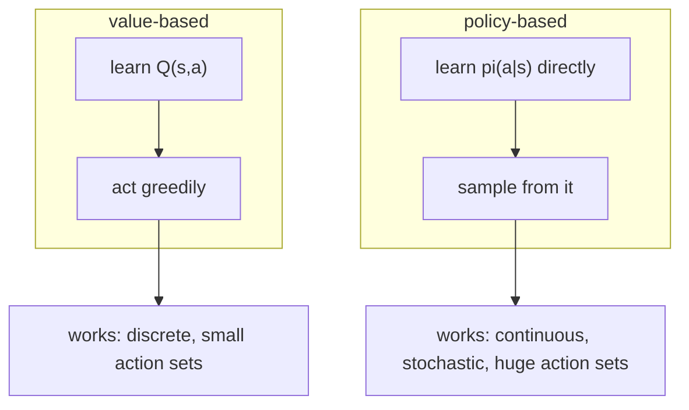
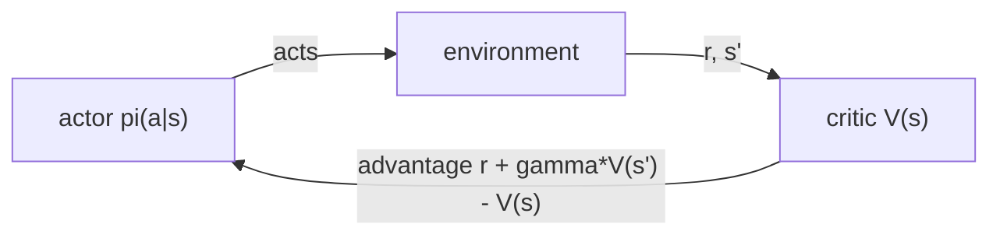

# Lesson 08 — Policy Gradients

**Goal:** learn the policy directly instead of learning values and acting
greedily — and cut the variance that makes it work.

## What you will learn

- Why you would skip the value function
- REINFORCE, derived in three lines
- Baselines, and the variance they remove
- Actor-critic in one sentence

---

## Two families

Everything so far learned `Q(s, a)` and acted greedily. That has three
problems: it needs a `max` over actions (awkward with a continuous steering
angle), it produces a deterministic policy (useless when the best play is a
mixture), and a tiny change in Q can flip the policy completely.



| | Value-based (DQN) | Policy-based (REINFORCE) |
|---|---|---|
| Output | A number per action | A probability per action |
| Continuous actions | Painful | Natural |
| Stochastic policies | Cannot represent | Native |
| Sample efficiency | Better (replay) | Worse (on-policy) |
| Stability | Can diverge (lesson 07) | Noisy but rarely explodes |

---

## REINFORCE

You want to maximise expected return `J(theta)`. The policy gradient theorem
gives an estimator you can compute from sampled episodes:

```text
grad J  =  E[ sum over t  grad log pi(a_t | s_t) * G_t ]
```

In words: **push up the log-probability of every action taken, in proportion to
the return that followed it.** Good episodes make all their actions more likely;
bad episodes make all of theirs less likely. No model, no value function, no
max.

```python
import sys
sys.path.insert(0, "/tmp")            # cartpole.py, from lesson 07
import numpy as np
import torch
import torch.nn as nn
from cartpole import CartPole

torch.set_num_threads(2)

def policy_net():
    return nn.Sequential(nn.Linear(4, 64), nn.ReLU(), nn.Linear(64, 2))

def reinforce(baseline="none", episodes=600, gamma=0.99, lr=1e-2, seed=0):
    torch.manual_seed(seed)
    env = CartPole(seed=seed)
    net = policy_net()
    opt = torch.optim.Adam(net.parameters(), lr=lr)
    value = nn.Sequential(nn.Linear(4, 64), nn.ReLU(), nn.Linear(64, 1))
    vopt = torch.optim.Adam(value.parameters(), lr=1e-2)
    lengths, gradnorms, running = [], [], 0.0

    for ep in range(episodes):
        s = env.reset().astype(np.float32)
        logps, rewards, states = [], [], []
        for _ in range(500):
            st = torch.from_numpy(s)
            dist = torch.distributions.Categorical(logits=net(st))
            a = dist.sample()                     # sample, never argmax
            logps.append(dist.log_prob(a))
            states.append(st)
            s, r, done = env.step(int(a))
            s = s.astype(np.float32)
            rewards.append(r)
            if done:
                break

        G, returns = 0.0, []
        for r in reversed(rewards):
            G = r + gamma * G
            returns.append(G)
        returns = torch.tensor(list(reversed(returns)), dtype=torch.float32)

        if baseline == "none":
            adv = returns
        elif baseline == "mean":
            running = 0.9 * running + 0.1 * float(returns.mean())
            adv = returns - running
        else:                                     # learned value function
            v = value(torch.stack(states)).squeeze(1)
            adv = returns - v.detach()
            vloss = nn.functional.mse_loss(v, returns)
            vopt.zero_grad()
            vloss.backward()
            vopt.step()

        loss = -(torch.stack(logps) * adv).sum()  # minus: we ascend
        opt.zero_grad()
        loss.backward()
        gradnorms.append(float(torch.sqrt(
            sum((p.grad ** 2).sum() for p in net.parameters()))))
        opt.step()
        lengths.append(len(rewards))
    return np.array(lengths), np.array(gradnorms)

print("defined")
```

```text
defined
```

Two lines carry the whole method. `a = dist.sample()` — the policy *is* the
distribution, and exploration is built in rather than bolted on with epsilon.
And `loss = -(logps * adv).sum()` — the minus sign, because optimisers descend
and the theorem ascends.

---

## The baseline

Subtracting any function of the state from the return leaves the gradient
unbiased — the subtracted term has expectation zero — while changing the
variance a great deal. Without it, in CartPole every return is positive, so
**every action ever taken gets pushed up**, and learning happens only through
the differences between large positive numbers.

```python
print(f"{'variant':<22}{'last-100 length':>17}{'across seeds':>14}{'grad norm':>12}")
for baseline in ("none", "mean", "value"):
    rows = [reinforce(baseline, seed=s) for s in range(4)]
    L = np.array([r[0][-100:].mean() for r in rows])
    G = np.array([r[1][-100:].mean() for r in rows])
    print(f"{'REINFORCE + ' + baseline:<22}{L.mean():>17.1f}"
          f"{L.std():>14.1f}{G.mean():>12.1f}")
```

```text
variant                 last-100 length  across seeds   grad norm
REINFORCE + none                  322.8         127.2      2540.1
REINFORCE + mean                  469.3          36.5      1100.8
REINFORCE + value                 478.1          25.3       918.0
```

Read the middle column first — it is the one that matters.

**Without a baseline the spread across seeds is 127.2 steps** on a mean of
322.8. Four runs of identical code produced wildly different agents. With a
running-mean baseline the spread falls to **36.5**, and with a learned value
function to **25.3** — a **five-fold reduction in the variance between runs**,
from subtracting a number.

The gradient norm column explains it: 2540 without, 918 with. The raw gradient
is dominated by the size of the returns rather than by which actions were good.

**And the mean baseline — a single scalar, one line — captures most of the
gain.** The learned value network adds 9 steps of performance and a second
optimiser. That is the same pattern as lesson 02's Thompson and lesson 06's
optimistic initialisation: try the one-liner before the architecture.

---

## Against DQN

| | DQN (lesson 07) | REINFORCE + value |
|---|---|---|
| Episodes | 300 | 600 |
| Final episode length | 85.8 | **478.1** |
| Spread across seeds | 10.0 | 25.3 |
| Failure mode seen | Divergence (Q = 2.3 million) | High variance |

REINFORCE reached 478 steps where DQN reached 86. Do not read that as "policy
gradients are better": REINFORCE ran twice as long, and DQN's advantage is
sample efficiency through replay, which this comparison is not measuring. What
it does show is the difference in **how they fail** — DQN's Q values ran away
to 23,000x the possible maximum, while REINFORCE just wobbled.

Noisy and slow is a much easier problem to have than confidently wrong.

---

## Actor-critic, briefly

The last variant above already is one, almost. An **actor-critic** uses the
value network not only as a baseline but inside the target, replacing the full
Monte Carlo return `G_t` with `r + gamma * V(s')`. That is lesson 05's
bootstrapping applied to the policy gradient: lower variance, some bias, and no
need to wait for the episode to end.



Everything modern is a descendant: A2C adds parallel workers, PPO adds a clip
that stops a single update moving the policy too far, SAC adds an entropy bonus
for continuous control. They are all variance reduction and step-size control
on top of the three lines above.

---

## Common mistakes

| Mistake | Why it hurts |
|---|---|
| No baseline | Five times the spread across seeds, from a missing scalar |
| Forgetting the minus in the loss | The agent optimises for failing, fast |
| `argmax` instead of `sample` during training | No exploration; the gradient estimator is invalid |
| Reusing old episodes | REINFORCE is on-policy; a replay buffer is not valid without importance weights |
| Reporting one seed | 322.8 +/- 127.2 means one run tells you almost nothing |
| Reaching for PPO immediately | The scalar baseline captured most of the available gain |

---

## Exercises

1. Remove the `-` from the loss and run 50 episodes. Report the episode length
   and explain what the agent learned to do.
2. Normalise the advantage (`(adv - adv.mean()) / (adv.std() + 1e-8)`). Does it
   beat the learned value baseline? It is one line — is it worth it?
3. Add an entropy bonus `+ 0.01 * dist.entropy()` to the loss. What happens to
   the spread across seeds, and why?
4. Turn the value baseline into a true actor-critic by replacing `G_t` with
   `r + gamma * V(s')`. Does it learn faster per episode?
5. Train with `gamma = 1.0`. Explain the result using `1/(1-gamma)` from
   lesson 07.

---

**Next:** [Lesson 09 — Evaluating RL Agents](09-evaluating-agents.md)
