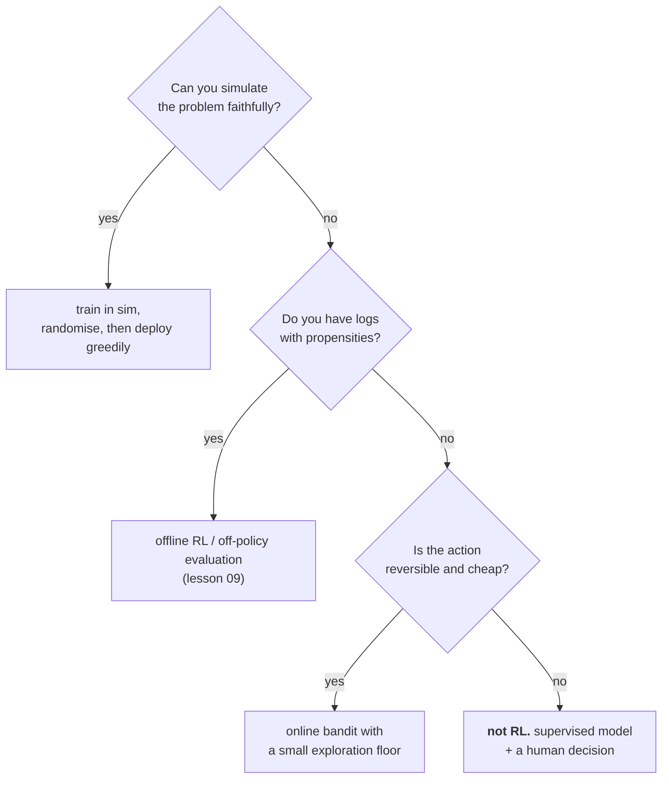

# Lesson 10 — RL in the Real World

**Goal:** know when to use RL, how it breaks outside the simulator, and what to
do instead most of the time.

## What you will learn

- The sim-to-real gap, measured — and found somewhere unexpected
- Domain randomisation
- Safety, and why exploration is the problem
- Where RL actually pays in a business

---

## Setup

```python
import sys
sys.path.insert(0, "/tmp")
import numpy as np
from cartpole import CartPole

BINS = [np.linspace(-2.4, 2.4, 4), np.linspace(-3, 3, 6),
        np.linspace(-0.21, 0.21, 12), np.linspace(-3, 3, 12)]

def discretise(s):
    return tuple(int(np.digitize(v, b)) for v, b in zip(s, BINS))

def make_env(seed, length=0.5, mass_pole=0.1, force=10.0):
    env = CartPole(seed=seed)
    env.length, env.mass_pole, env.force_mag = length, mass_pole, force
    return env

def train(episodes=1_500, alpha=0.1, gamma=0.99, seed=0, randomise=False):
    rng = np.random.default_rng(seed)
    Q = {}
    for ep in range(episodes):
        if randomise:                       # a different world every episode
            env = make_env(seed * 10_000 + ep,
                           length=float(rng.uniform(0.35, 0.75)),
                           mass_pole=float(rng.uniform(0.05, 0.25)),
                           force=float(rng.uniform(8.0, 12.0)))
        else:
            env = make_env(seed * 10_000 + ep)
        eps = max(0.02, 1.0 - ep / (episodes * 0.5))
        s = discretise(env.reset())
        for _ in range(500):
            q = Q.setdefault(s, np.zeros(2))
            a = int(rng.integers(2)) if rng.random() < eps else int(np.argmax(q))
            nxt_raw, r, done = env.step(a)
            nxt = discretise(nxt_raw)
            qn = Q.setdefault(nxt, np.zeros(2))
            Q[s][a] += alpha * (r + gamma * (0.0 if done else qn.max()) - Q[s][a])
            s = nxt
            if done:
                break
    return Q

def evaluate(Q, episodes=100, seed=9999, **kw):
    lengths = []
    for i in range(episodes):
        env = make_env(seed + i, **kw)
        s = discretise(env.reset())
        steps = 0
        for _ in range(500):
            a = int(np.argmax(Q.get(s, np.zeros(2))))
            nxt, r, done = env.step(a)
            s = discretise(nxt)
            steps += 1
            if done:
                break
        lengths.append(steps)
    return float(np.mean(lengths))

plain = [train(seed=s) for s in range(5)]
rand = [train(seed=s, randomise=True) for s in range(5)]
print("trained 10 agents")
```

```text
trained 10 agents
```

---

## The physics gap that was not there

The standard warning is that an agent trained in a simulator collapses when the
real hardware differs. So change the hardware.

```python
WORLDS = [("training physics", {}),
          ("pole 2x longer", {"length": 1.0}),
          ("pole 5x heavier", {"mass_pole": 0.5}),
          ("motor at half power", {"force": 5.0}),
          ("all three at once", {"length": 1.0, "mass_pole": 0.5, "force": 5.0})]

print(f"{'test world':<24}{'trained on one':>16}{'domain randomised':>20}")
for name, kw in WORLDS:
    a = np.mean([evaluate(Q, **kw) for Q in plain])
    b = np.mean([evaluate(Q, **kw) for Q in rand])
    print(f"{name:<24}{a:>16.1f}{b:>20.1f}")
```

```text
test world                trained on one   domain randomised
training physics                   133.0               152.6
pole 2x longer                     162.7               176.4
pole 5x heavier                    129.8               145.6
motor at half power                130.3               158.2
all three at once                  157.3               175.9
```

**Nothing broke.** Double the pole length, quintuple its mass, halve the motor
force — and performance is unchanged or better. The 2x pole even scores
**higher** than the training physics (162.7 against 133.0), because a longer
pole falls more slowly and is easier to catch.

This is a real result and it is worth sitting with. The story everyone repeats
— "parameter mismatch destroys the policy" — did not reproduce on this problem.
The coarse discretisation is doing the work: an agent that only sees which of
13 angle bins it is in cannot overfit to a decimal place of pole mass.

**The lesson is not "sim-to-real is a myth."** It is that *you do not know which
perturbation matters until you measure it*, and the one everyone talks about
was not the one.

---

## The gap that was there

Real deployments do not differ from simulators mainly in physics constants.
They differ in **timing and sensing**: the actuator responds late, the sensor is
noisy, the reading is slightly miscalibrated.

```python
def evaluate_real(Q, episodes=100, seed=9999, delay=0, noise=0.0, bias=0.0, **kw):
    """Evaluate with actuator delay and imperfect sensors."""
    lengths = []
    for i in range(episodes):
        env = make_env(seed + i, **kw)
        rng = np.random.default_rng(seed + i)
        raw = env.reset()
        pending = [0] * delay
        steps = 0
        for _ in range(500):
            obs = raw.copy()
            obs[2] += bias                       # miscalibrated angle sensor
            if noise:
                obs = obs + rng.normal(0, noise, 4)
            a = int(np.argmax(Q.get(discretise(obs), np.zeros(2))))
            if delay:
                pending.append(a)                # the motor acts on an old decision
                a = pending.pop(0)
            raw, r, done = env.step(a)
            steps += 1
            if done:
                break
        lengths.append(steps)
    return float(np.mean(lengths))

CASES = [("perfect sensors and motor", {}),
         ("1-step actuator delay", {"delay": 1}),
         ("2-step actuator delay", {"delay": 2}),
         ("sensor noise sd=0.02", {"noise": 0.02}),
         ("angle sensor bias +1 deg", {"bias": np.pi / 180}),
         ("delay 1 + noise 0.02", {"delay": 1, "noise": 0.02})]

print(f"{'deployment condition':<28}{'trained on one':>16}{'domain randomised':>20}")
for name, kw in CASES:
    a = np.mean([evaluate_real(Q, **kw) for Q in plain])
    b = np.mean([evaluate_real(Q, **kw) for Q in rand])
    print(f"{name:<28}{a:>16.1f}{b:>20.1f}")
```

```text
deployment condition          trained on one   domain randomised
perfect sensors and motor              133.0               152.6
1-step actuator delay                  105.3               123.5
2-step actuator delay                   61.0               106.2
sensor noise sd=0.02                   110.7               124.9
angle sensor bias +1 deg               166.2               260.1
delay 1 + noise 0.02                    91.4               116.1
```

**A two-step actuator delay halves performance: 133.0 to 61.0.** Forty
milliseconds of lag — less than one video frame — costs more than quintupling
the pole's mass.

That is the real sim-to-real gap. A simulator assumes the action applies
instantly to the state you observed. Hardware, network calls, message queues and
human operators all violate that, and the violation is invisible in every
physics-parameter sweep you might run.

Two more readings from that table.

**Domain randomisation helps against perturbations it never saw.** The
randomised agents trained on varying length, mass and force — never on delay or
noise — yet they hold 106.2 under a two-step delay against 61.0. Training
across a *distribution* of worlds produces a policy with slack, and the slack
generalises beyond the axis you randomised.

**And a one-degree sensor bias made things better** — 166.2, and 260.1 for the
randomised agents, the best number in either table. A systematic offset shifted
the agent's operating point into a region where its coarse bins happen to give
better control. Nobody would have predicted that, and an engineer who "fixed"
the miscalibration would have made the product worse.

**You cannot reason your way to which deployment imperfection matters. Build
the perturbation harness and measure.**

---

## Safety

The uncomfortable fact underneath this whole course: **exploration means
deliberately taking actions you believe are worse.**

In a slot machine that costs a few coins. In pricing, lending, medicine or
anything touching a person, it costs someone real. Lesson 05's cliff agent fell
in 26% of the time *after* it had learned the task, because epsilon-greedy never
stops.



Practical safety measures, in the order they are worth adding:

| Measure | What it does |
|---|---|
| **Action masking** | Illegal actions are never sampled. Cheap, and it always works |
| **Shielding** | A hand-written rule vetoes the agent near a known boundary |
| **Exploration floor and cap** | Never below 1%, never above 10%, and log every exploratory action |
| **Deploy greedily** | Learn in the simulator, act deterministically in production |
| **Holdout** | Data-Science lesson 10: 10% never acted on, so you can still measure |
| **Kill switch** | A human can stop it, and someone has tested the switch |

Action masking deserves its place at the top. A policy that cannot *represent*
the catastrophic action does not need to learn to avoid it, and no amount of
reward shaping is as reliable.

---

## Where RL actually pays

Be honest about the frequency. Most problems people bring to RL are supervised
problems with a decision attached, and the Data-Science course solves those
better.

| Problem | Honest tool |
|---|---|
| Which offer to show | **Contextual bandit.** Not full RL |
| Ad bidding, real-time pricing | Bandit, sometimes RL |
| Inventory and reordering | RL or classical stochastic control — often the latter wins |
| Recommendation sequences | RL, if you can measure long-term value. Usually you cannot |
| Games, robotics, simulated control | **RL.** Cheap, fast, safe exploration |
| Chip layout, compiler flags, scheduling | RL, when a fast simulator exists |
| Anything medical, financial or legal | Not RL online. Offline evaluation at most |

The pattern: **RL earns its cost when you have a fast, faithful simulator, or
when the action is cheap and reversible.** Without one of those, the machinery
is a liability.

A practical progression that has never once been the wrong first step:

```text
1. A fixed rule                 measure it (Data-Science lesson 05)
2. A supervised model + threshold  measure it
3. A bandit with a small exploration floor
4. A contextual bandit
5. Full RL, in a simulator
```

Most projects should stop at 2 or 3. If you are at 5 without having measured
1 through 4, you have skipped the part that would have told you whether any of
this was worth doing.

---

## Common mistakes

| Mistake | Why it hurts |
|---|---|
| Assuming the physics gap is the sim-to-real gap | Quintupling the pole mass changed nothing; 40ms of lag halved performance |
| Not simulating latency | The one perturbation that mattered, and it is free to add |
| "Fixing" a deployment imperfection without measuring | The 1-degree bias was the best condition in the table |
| Randomising only what you expect to vary | Randomising physics also bought robustness to delay |
| Exploring online in a consequential domain | Lesson 05's agent fell off the cliff 26% of the time after learning |
| Shaping a reward to discourage a catastrophic action | Mask it instead — it cannot be sampled at all |
| Reaching for RL before measuring a rule | Steps 1 and 2 answer most problems |

---

## Exercises

1. Add `delay` to the training loop as a randomised parameter (0, 1 or 2 steps)
   and retrain. Does robustness to delay improve, and what does it cost on the
   zero-delay case?
2. Sweep the angle bias from -3 to +3 degrees in half-degree steps. Plot
   performance. Is +1 degree a peak or a plateau, and would you trust it?
3. Implement action masking: forbid pushing further in the direction the pole is
   already falling past 10 degrees. Compare with the unmasked agent's worst
   episodes.
4. Take a decision at your own work and walk the five-step progression. Write
   down the measured number for step 1. If you cannot, that is the project.
5. Re-run the deployment table with the DQN from lesson 07 in place of the
   table. Is a neural policy more or less sensitive to actuator delay?

---

**Done with the lessons.** Next: [Project 11](../Project-11/) — an agent, and
the honest case for or against deploying it.
