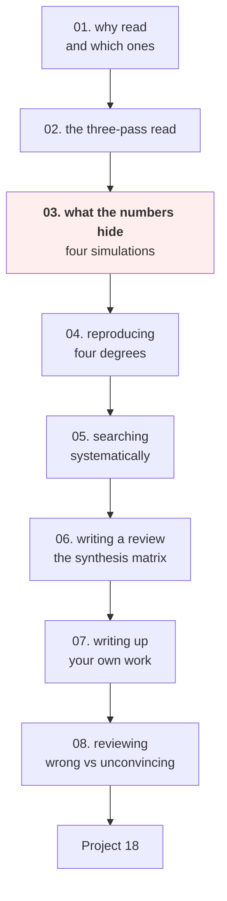

# Research and Review Papers — Tayel AI Labs

The eighteenth course. Reading papers well is a skill with a measurable payoff:
it stops you implementing a method that does not work, and it stops you
publishing a result that does not exist.

The centrepiece is **lesson 03**, where four simulations compare a method
against **itself** and produce improvements of up to 2.7 points — every one of
them from a research practice that is normal, common, and not dishonest.

**Prerequisites**

- [`../Data-Science`](../Data-Science) — lessons 03 (leakage), 05 (baselines and
  paired intervals) and 07 (reproducibility)
- [`../Communication-and-Documentation`](../Communication-and-Documentation) —
  lessons 02 and 03; writing up is the same discipline
- Any course whose subject you want to read about

---

## The path



## Lessons

| # | Lesson | The point |
|---|---|---|
| 01 | [Why Read Papers](lessons/01-why-read-papers.md) | A day measuring on your data usually beats a week reading |
| 02 | [The Three-Pass Read](lessons/02-the-three-pass-read.md) | Ten minutes, an hour, a day — and the note that makes it durable |
| 03 | [What the Numbers Hide](lessons/03-what-the-numbers-hide.md) | **Ten variants make an identical method "win" 90.8% of the time** |
| 04 | [Reproducing a Result](lessons/04-reproducing.md) | Your tuned baseline on their data is where most gains evaporate |
| 05 | [Searching the Literature](lessons/05-searching.md) | Snowball forwards: that is where the failed replications are |
| 06 | [Writing a Review](lessons/06-writing-a-review.md) | The synthesis matrix makes the cross-paper findings visible |
| 07 | [Writing Up Your Own Work](lessons/07-writing-up.md) | Write the ablation table before the introduction |
| 08 | [Reviewing](lessons/08-reviewing.md) | Most work is not wrong; it is unconvincing |

## Then

- **[`Project-18/`](Project-18/)** — a systematic review and a reproduction, on
  a question you actually have

---

## Setup

```bash
python3 -m venv .venv
source .venv/bin/activate
pip install -r requirements.txt
```

Only lesson 03 runs code. It takes about ten seconds.

---

## What lesson 03 measures

Every row below compares a method **against itself**. The true improvement is
zero in all of them.

| Practice | Reported "improvement" |
|---|---|
| Report the best of 20 runs | **+0.0225** |
| Try 10 variants, compare with one baseline run | **wins 90.8% of the time** |
| Tune your method 20x, the baseline once | **+0.0226** |
| Tune both 20x | -0.0001 (correct) |
| Leak 20% of the test set into training | 0.8778 -> **0.9056** |
| Leak 5% | 0.8778 -> 0.8778 (**invisible**) |

None of these require misconduct. They are what normal, well-intentioned
research looks like without the specific disciplines this course teaches — and
the last row is the reason you cannot detect contamination by looking at
results.

---

## What this course argues

1. **Read to generate hypotheses; measure to answer them.** Your data is not
   their data (lesson 01).
2. **Read the figures first.** They are the argument (lesson 02).
3. **An improvement smaller than the run-to-run variance is not an
   improvement** — and most papers do not report the variance (lesson 03).
4. **Run your own tuned baseline on their data.** That step, skipped by almost
   everyone, is where claimed gains disappear (lesson 04).
5. **A review organises by question, not by paper**, and its value is the
   findings that only appear across papers (lesson 06).
6. **Most work is not wrong, it is unconvincing** — and saying precisely what
   would convince you is the reviewer's whole job (lesson 08).
