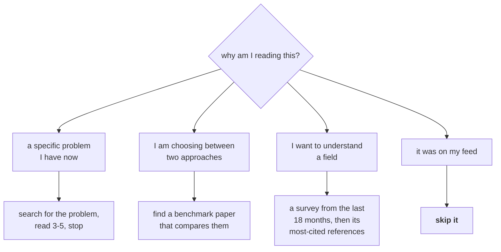

# Lesson 01 — Why Read Papers, and Which Ones

**Goal:** get value from the literature without drowning in it.

## What you will learn

- What papers are for, and what they are not
- Choosing what to read
- The reading budget
- Where papers fit beside documentation and blog posts

---

## What a paper is for

A paper is a **claim plus evidence**, written for other researchers, optimised
for novelty rather than usefulness. That shapes everything about how to read it.

| You want | Read |
|---|---|
| To use a method today | The library docs, then the paper's method section |
| To know whether a method is worth trying | The paper's **limitations** and its experiments |
| To understand why something works | The paper, slowly, plus its references |
| To find what has been tried | A **survey**, then its citations |
| To keep up with a field | Two or three good newsletters, not arXiv |
| To do something at work | Usually none of the above. Build the baseline first |

The last row is not cynicism. Data-Science lesson 05 measured a case where
tuning a regularisation parameter across three orders of magnitude moved the
metric by 0.0001, and lesson 01 of that course found an accurate model worth
nothing. **Most workplace problems are solved by better framing, not a better
method** — and reading papers can be an expensive way of avoiding that.

Read papers when you have a specific question the literature might answer.

---

## Choosing what to read

There are more papers published each week than anyone can read in a year. The
filter matters more than the reading.



Signals that a paper is worth your time, roughly in order:

| Signal | Why |
|---|---|
| **Code released, and it runs** | The single strongest signal of a real result |
| It reports variance across seeds | Lesson 03 explains why this is rare and valuable |
| A survey, if you are new to the area | One good survey replaces thirty papers |
| Cited by work you already trust | Cheap filtering |
| A negative or replication result | Rare, undervalued, usually more useful than the original |
| Published at a venue with real review | Weak signal, but not zero |
| High citation count | **Weak.** Age and topic dominate it |
| On social media this week | **Not a signal** |

And the strongest negative signal: **a paper with no limitations section, or one
that lists only "we would like to try larger models".** Lesson 03's checklist
tells you what an honest limitations section contains.

---

## The reading budget

Reading is not free, and treating it as free is how a week disappears.

```text
a realistic weekly budget for a working engineer:

  30 min   skim 5-10 titles/abstracts from a filtered source
  60 min   one first-pass read (lesson 02)
  60 min   one second-pass read, if the first pass earned it
  ---
  2.5 h    total, and it is enough
```

**One paper read properly beats ten skimmed.** The failure mode is the opposite:
fifty abstracts, a vague sense of the field, and nothing you could implement or
argue with.

If a paper survives a first pass and matters to your work, the third pass —
reproducing it — is lesson 04, and it costs a day. Budget that deliberately;
it is the most valuable reading you will do and the most expensive.

---

## Papers against the alternatives

| Source | Strength | Weakness |
|---|---|---|
| **Paper** | Method detail, evidence, honest about what was tested | Optimised for novelty; the flaws in lesson 03 |
| **Library docs** | What actually works today, with an API | Say nothing about when not to use it |
| **A good blog post** | Intuition, worked examples | Often a single unreplicated result |
| **A survey** | Map of a field | 12-24 months out of date by publication |
| **This track's courses** | Measured, on runnable code | Narrower than the literature |
| **Your own experiment** | Answers *your* question, on *your* data | Costs a day |

The last row is the one that is systematically undervalued. **A day spent
measuring on your own data usually beats a week of reading**, because the
literature's result was obtained on someone else's distribution, at someone
else's scale, with the search budget from lesson 03.

Read to generate hypotheses. Measure to answer them.

---

## Common mistakes

| Mistake | Why it hurts |
|---|---|
| Reading arXiv as a feed | Volume without filter; nothing retained |
| Reading before defining the question | You will find something interesting and irrelevant |
| Skimming fifty abstracts | Vague familiarity, no usable knowledge |
| Trusting citation count | It mostly measures age and topic popularity |
| Ignoring surveys | One survey replaces thirty papers |
| Never reading negative results | The most informative papers, and the rarest |
| Reading instead of measuring | Your data is not their data |

---

## Exercises

1. Write the specific question you want the literature to answer. If you cannot,
   you are not ready to read.
2. Find a survey from the last 18 months in your area. Read its taxonomy section
   only. What did it change about how you see the field?
3. Take three papers from your reading list and score them on the signals table.
   Drop the lowest.
4. Set your weekly reading budget and hold it for a month.
5. For one method you were about to read about, estimate how long it would take
   to just measure it on your own data instead.

---

**Next:** [Lesson 02 — The Three-Pass Read](02-the-three-pass-read.md)
