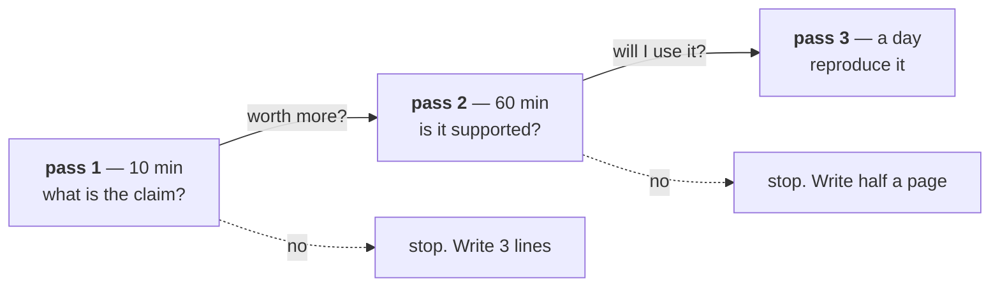

# Lesson 02 — The Three-Pass Read

**Goal:** get the right amount out of a paper at the right cost.

## What you will learn

- The three passes, and when to stop
- What to extract at each pass
- Reading the figures first
- The note that makes the reading durable

---

## Three passes



Most papers stop at pass 1. A few earn pass 2. **Perhaps two a year earn pass
3**, and those are the ones that change what you build.

---

## Pass 1 — ten minutes

Read, in this order:

```text
1. Title and abstract
2. THE FIGURES AND TABLES, with their captions
3. The introduction's last paragraph ("our contributions are...")
4. The conclusion
5. The limitations section, if it exists
```

Reading the figures before the text is the trick that makes this fast. **A
paper's figures are its argument.** If you cannot tell what the figures claim,
the text will not rescue it.

Answer four questions, in writing:

```text
CLAIM       what do they say is new or better?
EVIDENCE    what is the main number, on what benchmark?
COST        what does the method cost - compute, data, complexity?
FOR ME      does this apply to my problem, my scale, my data?
```

If "FOR ME" is no, **stop here.** Write three lines in your notes and move on.
That is a successful pass 1, not a wasted one.

---

## Pass 2 — an hour

Now read the method and the experiments properly, and read them **adversarially**
using lesson 03's checklist.

```text
METHOD      could I describe it to a colleague in 3 sentences?
            what is the ONE idea? Everything else is engineering
SETUP       what data, what baseline, what compute, what search budget?
RESULTS     does the improvement exceed the variance?
            is the baseline tuned as hard as the method?
ABLATIONS   which component actually causes the gain?
            if there are no ablations, the paper has not isolated anything
LIMITS      what do they admit? What do they not mention?
```

The ablation line deserves emphasis. A paper proposing five changes and
reporting one combined number has told you that **something** helped. An
ablation table tells you **which**, and very often it is one of the five and not
the one in the title.

Two questions to ask of any method section:

- **What would break this?** A method with no failure mode has not been tested.
- **What is the simplest baseline that would get 90% of this?** Often it is in
  the paper, under-tuned (lesson 03).

---

## Pass 3 — a day

Reproduce it. This is lesson 04, and it is the only pass that produces
knowledge you can rely on.

Reserve it for methods you are about to build on. The output is not "the paper
is true" — it is **a number on your data**, which is the only number that ever
mattered.

---

## The note

A paper you read and did not write down is a paper you did not read. The note is
short and has a fixed shape:

```text
PAPER      title, authors, year, venue, link
PASS       1 / 2 / 3
CLAIM      one sentence
EVIDENCE   the main number, the benchmark, the baseline it beat
SETUP      data, compute, seeds, search budget (or "not stated")
THE IDEA   three sentences, in your own words
COST       compute, data, complexity, what it adds to a system
FOR ME     does it apply? At my scale? To my data?
DOUBT      the weakest part of the argument
IF TRUE    what would I do differently?
```

Two lines do most of the work.

**`DOUBT`** forces you to read adversarially rather than receptively, which is
the difference between reading and absorbing.

**`IF TRUE`** connects the paper to a decision. A paper that changes nothing you
would do is a paper you can forget; writing that down explicitly is how you stop
re-reading it next year.

Keep these in one file, searchable, in a repository. Fifty of them is a personal
survey of your field, and it is worth more than any reading list.

---

## Reading a paper you do not understand

Normal, and not a failure. In order:

1. **Read the figures again.** Slowly.
2. **Find the survey** that places it in context.
3. **Find a blog post or a video** by someone who implemented it.
4. **Read the paper it most builds on** — often the one idea is there, explained
   more simply.
5. **Read the code**, if released. For many papers the code is clearer than the
   text.
6. **Skip it.** If three of the above failed, the paper is either badly written
   or too far from your background today. Both are fine.

Step 5 is underused. **Fifty lines of the released implementation frequently
explain more than five pages of notation.**

---

## Common mistakes

| Mistake | Why it hurts |
|---|---|
| Reading linearly from the abstract | The figures are the argument |
| Doing pass 2 on everything | Ten hours a week, for nothing |
| Stopping at pass 1 for a method you will build on | You will discover the flaw after implementing it |
| Reading receptively | No doubt recorded, nothing retained |
| No notes | A paper you cannot recall is a paper you did not read |
| Ignoring the ablations | You do not know which part worked |
| Feeling bad about not understanding | Steps 1-6, then skip |

---

## Exercises

1. Do a pass 1 on three papers in 30 minutes total. Write the four answers for
   each.
2. Do a pass 2 on the one that earned it, and fill in the full note.
3. For that paper, write the `DOUBT` line before reading the limitations
   section. Compare.
4. Find a paper whose code is clearer than its text.
5. Start the notes file. Add every paper you read for a month.

---

**Next:** [Lesson 03 — What the Numbers Are Not Telling You](03-what-the-numbers-hide.md)
