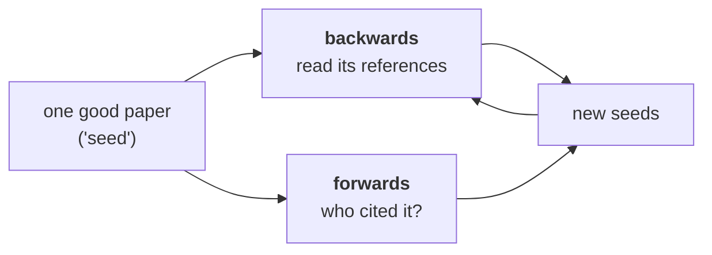

# Lesson 05 — Searching the Literature

**Goal:** find what is already known about your question, in an afternoon,
without missing the obvious.

## What you will learn

- Systematic search against ad-hoc search
- The query, and how to widen and narrow it
- Snowballing, forwards and backwards
- When to stop

---

## Ad-hoc against systematic

| | Ad-hoc | Systematic |
|---|---|---|
| Start | Type a phrase into a search box | Write the question first |
| Coverage | Whatever ranked highly | Documented, and repeatable |
| Bias | Recency and popularity | Reduced, not eliminated |
| Output | Some links | A table you can reason over |
| Cost | 20 minutes | An afternoon |

Use ad-hoc for "is there a library for this". Use systematic when the answer
will shape months of work, or when you are writing a review.

The difference is not effort; it is **writing down what you searched**, so that
you and others know what the search did and did not cover.

---

## The question first

A searchable question has four parts:

```text
POPULATION   Arabic customer support conversations
INTERVENTION retrieval-augmented generation
COMPARISON   fine-tuned classification
OUTCOME      answer accuracy and cost per request
```

Then the query is built from synonyms of each, not from the sentence:

```text
("Arabic" OR "multilingual" OR "low-resource")
AND ("retrieval-augmented" OR "RAG" OR "retrieval augmented generation")
AND ("customer support" OR "help desk" OR "dialogue")
```

Two rules that matter more than the syntax:

- **Search for the phrase the field uses, not the phrase you use.** If you find
  one relevant paper, mine its abstract and keywords for the field's vocabulary
  and search again. This single step usually doubles recall.
- **Record every query and the date.** Search results change; an
  undocumented search cannot be checked or repeated.

---

## Where to search

| Source | Good for | Note |
|---|---|---|
| **Google Scholar** | Broad recall, forward citations | No structured filters |
| **Semantic Scholar** | Citation graph, an API, TLDRs | Best for snowballing |
| **arXiv** | Newest work in ML | **Not peer reviewed** |
| **ACL / IEEE / ACM libraries** | Venue-filtered, peer reviewed | Paywalls |
| **Papers with Code** | Code and leaderboards | Leaderboards inherit lesson 03's problems |
| **Connected Papers / Litmaps** | Seeing a field's structure | A starting map, not evidence |

For ML specifically: start on Semantic Scholar or Google Scholar, verify the
venue, and treat an arXiv-only paper as **unreviewed** — which does not make it
wrong, but does mean lesson 03's checklist is the only review it has had.

---

## Snowballing

The highest-yield technique, and the cheapest.



**Backwards** finds the foundations: the three papers everyone in this area
cites. **Forwards** finds what happened next — including, crucially, the papers
that **failed to reproduce** or improved on your seed.

Forward citation search is how you discover that the method you were about to
implement was superseded eighteen months ago, or was shown not to generalise.
It takes ten minutes and it is skipped constantly.

Stop rule for snowballing: **when two rounds produce no new relevant papers.**
That is saturation, and it is the honest signal that you have covered the area.

---

## The search log

For a systematic search, this table *is* the deliverable:

```text
DATE        2026-09-29
QUESTION    does RAG beat fine-tuning for Arabic support answers?
SOURCES     Semantic Scholar, Google Scholar, ACL Anthology
QUERIES     ("Arabic" OR "multilingual") AND ("RAG" OR "retrieval-augmented")
            AND ("support" OR "dialogue")                     -> 214 hits
            + filter 2023-2026, + code released               -> 37 hits
INCLUDE     evaluates on Arabic or multilingual; reports accuracy AND cost
EXCLUDE     English only; no baseline; no evaluation
SCREENED    37 titles -> 14 abstracts -> 6 full reads
SNOWBALL    2 rounds, 3 additional papers, saturated
FINAL       9 papers
```

Anyone can now tell what you covered and what you did not — which is the
difference between "I looked into it" and a result someone can build on.

---

## When to stop

| Signal | Meaning |
|---|---|
| **Two snowball rounds, nothing new** | Saturation. Stop |
| The same 5 papers keep appearing | You have the core. Stop |
| You can state the field's disagreement | You understand it. Stop |
| You are 40 papers in and still finding new ones | Your question is too broad. **Narrow it** |
| You found nothing relevant | Check your vocabulary first, then consider that it may be genuinely new |

The fourth row is the common failure, and the fix is always the same: add a
constraint — a language, a scale, a domain, a metric — until the question is one
somebody could have answered.

---

## Common mistakes

| Mistake | Why it hurts |
|---|---|
| Searching before writing the question | You find interesting, irrelevant things |
| Using your vocabulary, not the field's | Halves your recall |
| Forward citations skipped | You miss the replication that says it does not work |
| No search log | The search cannot be checked or repeated |
| Stopping at the first good paper | It may be the one that was superseded |
| Treating arXiv as peer reviewed | It is not; lesson 03 is your only review |
| Searching forever | Saturation is a real stopping rule; use it |

---

## Exercises

1. Write your question in the four-part form, then build the query from
   synonyms.
2. Find one seed paper and snowball two rounds in both directions. How many new
   relevant papers?
3. Take the vocabulary from your best hit and re-run the search. How much did
   recall change?
4. Write the search log for one question you have investigated informally.
5. Find a paper whose forward citations include a failed replication.

---

**Next:** [Lesson 06 — Writing a Review](06-writing-a-review.md)
