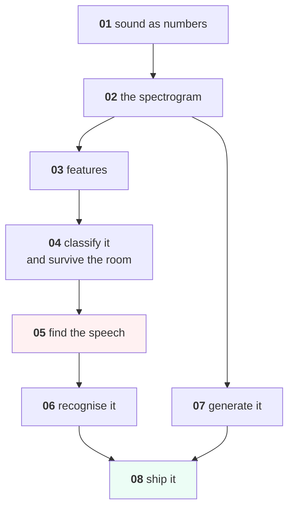

# Speech and Audio

Audio is the only modality where the model is usually the easy part. This
course spends five lessons on everything upstream of it — sampling,
spectrograms, features, noise and voice activity detection — because that is
where speech projects actually fail, and two on recognition and generation.

Everything runs on a laptop with **numpy and scipy only**. The audio is
synthesised by code inside [lesson 02](lessons/02-the-spectrogram.md) —
speech-like signals, a coffee grinder, a door chime, room tone — reproducible
from a seed.

**No downloads, no GPU, no audio libraries, no accounts.**

---

## Lessons

| # | Lesson | The measured finding |
|---|---|---|
| 01 | [Sound as Numbers](lessons/01-sound-as-numbers.md) | A 7,800 Hz tone sampled at 8 kHz measures as **200 Hz** — silently |
| 02 | [The Spectrogram](lessons/02-the-spectrogram.md) | 4 ms windows resolve time and not pitch; 128 ms the reverse. You must pick |
| 03 | [Features](lessons/03-features.md) | 26 numbers match 257 — and at six clips per class, **0.80 against 0.40** |
| 04 | [Classifying Sound](lessons/04-classifying-sound.md) | Trained clean: **1.0000 in the lab, 0.4938 in a loud room.** Trained noisy: free |
| 05 | [Finding the Speech](lessons/05-finding-the-speech.md) | At −5 dB the best VAD still **drops 66.2% of the speech** |
| 06 | [Speech Recognition](lessons/06-speech-recognition.md) | Four different outcomes all score **WER 0.167**, including inverting the action |
| 07 | [Generating Audio](lessons/07-generating-audio.md) | Griffin-Lim: spectral error **0.65 → 0.05**, waveform correlation **stays at zero** |
| 08 | [Speech in Production](lessons/08-speech-in-production.md) | The chunk is **1,000 ms of a 1,935 ms** latency; a VAD saves 11,700 EGP/month |

Every lesson is also a notebook: `lessons/NN-name.ipynb`, generated from the
markdown by `tools/build_notebooks.py`.

---

## The shape of the course



Lessons 01-05 are the pipeline. **They are the course.** A speech project that
fails almost never fails at lesson 06 — it fails because the sample rates were
mixed, the training audio was clean, or the VAD was eating a third of the
words, and nobody measured any of those.

---

## Three numbers to leave with

```text
0.4938   a clean-trained classifier, in a loud room
  66.2%  the speech an energy VAD drops at -5 dB
   0.167 the WER of inverting "cancel" into "confirm"
```

Each one is invisible in the metric a team normally reports.

---

## Project

**[Project 25 — One Audio System](Project-25/)** — build it end to end,
including the bill and the retention policy.

---

## Prerequisites

| You need | From |
|---|---|
| numpy, basic signal intuition | [Python](../Python/), [Foundations](../Foundations/) |
| Train/test discipline, baselines | [Machine-Learning](../Machine-Learning/) 01-06 |
| Why a feature must be computed once | [MLOps 07](../MLOps/lessons/07-monitoring.md) |

No Deep-Learning required. Nothing here is a neural network.

---

## What this course does not cover

- **Training a modern ASR or TTS model.** It needs thousands of GPU-hours and
  thousands of labelled hours. This course is what you need to use, evaluate
  and deploy one — which is what the job is.
- **Music information retrieval** — beat tracking, key detection, source
  separation. Different field, same lessons 01-03.
- **Audio deep learning architectures** — [Deep-Learning](../Deep-Learning/)
  for the general machinery; the spectrogram is just an image to a CNN.
- **The legal text itself** — [AI-Governance](../AI-Governance/) for consent,
  retention and special-category data.

---

## Setup

```bash
pip install -r requirements.txt
```

Every lesson runs in under a minute on a laptop CPU.
