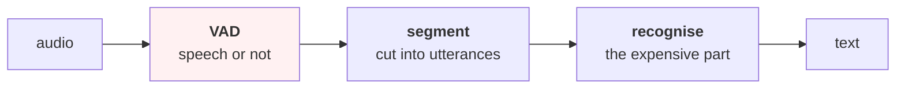

# Lesson 05 — Finding the Speech

**Goal:** decide which parts of a recording to process, and measure what that
decision throws away.

## What you will learn

- Why voice activity detection is the first stage of every speech pipeline
- An energy VAD in ten lines, and where to put its threshold
- What happens to it as the room gets louder — it drops 66% of the speech
- Segmentation and diarization, in outline

---

## The first stage

A recording of a one-hour meeting contains perhaps twenty minutes of speech.
Running a recogniser over the other forty minutes costs forty minutes of
compute and produces hallucinated text from silence.

So every speech pipeline starts with **voice activity detection**:



The red box is upstream of everything, which means **its errors are
unrecoverable**. Speech the VAD discards is speech the recogniser never sees,
and no amount of model quality downstream can get it back.

---

## Setup

```python
import numpy as np
SR = 16000

def clip(kind, rng, dur=1.0):
    """Four sounds you might hear in a cafe, synthesised from scratch."""
    n = int(SR * dur); t = np.arange(n) / SR
    if kind == "speech":                       # pitch + three formants + syllables
        f0 = rng.uniform(90, 200)
        x = sum(np.sin(2*np.pi*f0*h*t)/h for h in range(1, 12))
        for f, bw in [(rng.uniform(500,800),100), (rng.uniform(1200,1800),150),
                      (rng.uniform(2300,3000),200)]:
            x += 0.6*np.sin(2*np.pi*f*t) * np.exp(-((t % 0.25)-0.1)**2/(2*(bw/8000)**2))
        x *= 0.5 + 0.5*np.sin(2*np.pi*rng.uniform(3,6)*t)
    elif kind == "machine":                    # grinder: broadband + harmonics
        x = rng.normal(size=n)
        b = rng.uniform(55, 70)
        x = x*0.6 + sum(np.sin(2*np.pi*b*h*t) for h in range(1, 6))
    elif kind == "bell":                       # door chime: two decaying tones
        f = rng.uniform(900, 1400)
        x = (np.sin(2*np.pi*f*t) + 0.7*np.sin(2*np.pi*f*1.5*t)) * np.exp(-4*t)
    elif kind == "room":                       # room tone: low-pass noise
        x = np.convolve(rng.normal(size=n), np.ones(80)/80, mode="same")
    return (x / (np.abs(x).max() + 1e-9)).astype(np.float32)

CLASSES = ["speech", "machine", "bell", "room"]

def dataset(n_per=120, seed=0, dur=1.0):
    rng = np.random.default_rng(seed)
    X, y = [], []
    for ci, c in enumerate(CLASSES):
        for _ in range(n_per):
            X.append(clip(c, rng, dur)); y.append(ci)
    return np.array(X), np.array(y)

def add_noise(x, snr_db, rng):
    """Mix in white noise at a given signal-to-noise ratio."""
    noise = rng.normal(size=x.shape)
    ps = (x**2).mean(); pn = (noise**2).mean()
    return (x + np.sqrt(ps / (pn * 10**(snr_db/10))) * noise).astype(np.float32)
```

```python
def make_recording(seed=0, n_seg=14, snr=10):
    """Alternating room tone and speech, then noise over the whole thing."""
    rng = np.random.default_rng(seed)
    parts, labels = [], []
    for i in range(n_seg):
        if i % 2 == 0:
            d = rng.uniform(0.3, 0.9); x = clip("room", rng, d) * 0.05; lab = 0
        else:
            d = rng.uniform(0.4, 1.2); x = clip("speech", rng, d); lab = 1
        parts.append(x); labels.append(np.full(len(x), lab))
    return add_noise(np.concatenate(parts), snr, rng), np.concatenate(labels)

def vad(x, thresh_db, win=400, hop=160):
    """Frame energy above the noise floor by thresh_db means speech."""
    idx = np.arange(0, len(x)-win+1, hop)
    e = np.array([10*np.log10((x[i:i+win]**2).mean()+1e-12) for i in idx])
    floor = np.percentile(e, 10)              # the 10th percentile IS the floor
    out = np.zeros(len(x), dtype=bool)
    for i, f in zip(idx, e > floor + thresh_db):
        if f: out[i:i+win] = True
    return out
```

Two choices in that function are the whole design:

**The floor is estimated from the recording**, as its 10th-percentile frame
energy, rather than being a fixed number. A fixed threshold in dBFS works in
one room and fails in every other.

**The threshold is relative to that floor.** This is what makes the detector
transfer between a quiet office and a loud café — up to a point, which the
second experiment finds.

---

## Where to put the threshold

```python
sig, truth = make_recording(snr=10)
print(f"{'threshold':>12}{'precision':>11}{'recall':>9}{'F1':>8}{'speech kept':>14}")
for th in [3, 6, 9, 12, 15]:
    p = vad(sig, th)[:len(truth)]
    tp = (p & (truth == 1)).sum(); fp = (p & (truth == 0)).sum()
    fn = ((~p) & (truth == 1)).sum()
    pr = tp/(tp+fp+1e-9); rc = tp/(tp+fn+1e-9)
    print(f"{f'floor+{th} dB':>12}{pr:>11.3f}{rc:>9.3f}{2*pr*rc/(pr+rc+1e-9):>8.3f}"
          f"{p.mean():>13.1%}")
```

```text
   threshold  precision   recall      F1   speech kept
  floor+3 dB      0.956    0.845   0.897        53.8%
  floor+6 dB      0.968    0.751   0.846        47.2%
  floor+9 dB      0.981    0.652   0.784        40.4%
 floor+12 dB      0.993    0.528   0.689        32.3%
 floor+15 dB      0.997    0.300   0.461        18.3%
```

**Precision barely moves (0.956 → 0.997) while recall collapses (0.845 →
0.300).** Raising the threshold buys you almost nothing and costs you most of
the speech.

That asymmetry is not a property of this recording; it is structural. Loud
speech is easy to detect at any threshold, so precision is high everywhere.
What a higher threshold removes is the **quiet speech** — word endings,
unstressed syllables, the beginnings of utterances — which is exactly the
material a recogniser needs for context.

**So prefer the low threshold, and accept the false positives.** A frame of
room tone sent to the recogniser costs a few milliseconds of compute. A clipped
word ending costs a word.

The `speech kept` column is your compute bill: at floor+3 dB you process 53.8%
of the audio instead of 100%, which is a 46% saving before any model runs.

---

## As the room gets louder

```python
print(f"{'recording SNR':>14}{'best F1':>9}{'at threshold':>14}{'speech missed':>16}")
for snr in [20, 10, 5, 0, -5]:
    sig, truth = make_recording(snr=snr)
    best = (0, None, 0)
    for th in [3, 6, 9, 12, 15]:
        p = vad(sig, th)[:len(truth)]
        tp = (p & (truth == 1)).sum(); fp = (p & (truth == 0)).sum()
        fn = ((~p) & (truth == 1)).sum()
        pr = tp/(tp+fp+1e-9); rc = tp/(tp+fn+1e-9); f1 = 2*pr*rc/(pr+rc+1e-9)
        if f1 > best[0]: best = (f1, th, 1-rc)
    print(f"{f'{snr} dB':>14}{best[0]:>9.3f}{f'floor+{best[1]} dB':>14}{best[2]:>15.1%}")
print("\nevery second of speech the VAD drops is a second the recogniser never sees.")
```

```text
 recording SNR  best F1  at threshold   speech missed
         20 dB    0.944    floor+3 dB           5.4%
         10 dB    0.897    floor+3 dB          15.5%
          5 dB    0.846    floor+3 dB          24.8%
          0 dB    0.763    floor+3 dB          38.0%
         -5 dB    0.505    floor+3 dB          66.2%

every second of speech the VAD drops is a second the recogniser never sees.
```

**At -5 dB, the best possible threshold still misses 66.2% of the speech.**
Two thirds of what was said never reaches the recogniser, and the recogniser's
word error rate will be blamed for it.

Three consequences worth carrying into any speech project:

**Debug the pipeline before the model.** If transcription quality fell after a
deployment, measure the VAD first. A model that looks 30% worse is often a
VAD dropping 30% more audio.

**The best threshold does not change — the achievable quality does.** floor+3
dB wins at every SNR. There is no tuning that rescues -5 dB; the information
is not there.

**Report VAD recall alongside WER**, always. A system with 10% WER on the
audio it processed, having discarded a third of the speech, is not a 10% WER
system. This is the same accounting failure as
[Recommender-Systems 05](../../Recommender-Systems/lessons/05-cold-start.md),
where filtering cold users hid 49.1% of the orders.

Energy VAD is the floor, not the ceiling. A small neural VAD trained on
spectrograms is dramatically better in noise, and is what production systems
use — but it has the same property that its errors are unrecoverable, so it
needs the same accounting.

---

## Segmentation and diarization

VAD says *speech or not*. Two further questions usually follow:

```text
SEGMENTATION   where do utterances begin and end?
               merge speech regions closer than ~0.3 s
               split anything longer than ~30 s at the quietest point
               pad each segment by ~0.2 s so word edges survive

DIARIZATION    who spoke when?
               embed each segment (a speaker vector), then cluster
               hard when speakers overlap, and they always overlap
```

The padding in segmentation matters more than it sounds: a segment cut exactly
at the VAD boundary loses the quiet consonant that the detector already
struggled with, and the recogniser then sees a word with no beginning.

Diarization is where audio becomes a privacy problem rather than a modelling
one — a speaker embedding is a biometric identifier, which
[lesson 08](08-speech-in-production.md) and
[Data-Security-for-AI](../../Data-Security-for-AI/) both have something to say
about.

---

## Common mistakes

| Mistake | Why it hurts |
|---|---|
| A fixed dBFS threshold | Works in one room, fails in every other |
| A high threshold to "be sure" | Precision barely improved; recall fell to 0.300 |
| No VAD at all | You process silence and transcribe hallucinations |
| Reporting WER without VAD recall | At -5 dB, 66.2% of the speech was never seen |
| Blaming the recogniser for a VAD regression | Measure the first stage first |
| Segments cut exactly at the boundary | Word edges die; pad by ~0.2 s |
| Treating speaker embeddings as ordinary features | They are biometric identifiers |

---

## Exercises

1. Run the threshold sweep on your own recordings. Is floor+3 dB best there too?
2. Add a minimum-duration rule (ignore speech regions under 0.1 s). Does
   precision improve?
3. Implement the merge-and-pad segmentation. How many segments per minute?
4. Measure the compute saved by the VAD at your chosen threshold.
5. Report VAD recall and WER together for one recording. How different is the
   story?

---

**Next:** [Lesson 06 — Speech Recognition](06-speech-recognition.md)
