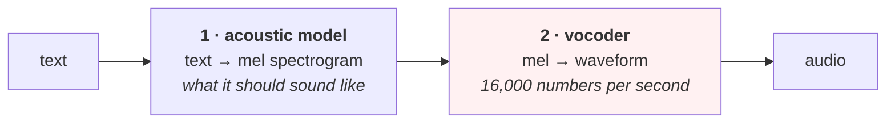

# Lesson 07 — Generating Audio

**Goal:** understand why producing audio is harder than recognising it, and
what a vocoder is for.

## What you will learn

- The two-stage shape of every TTS system
- Phase, and why you cannot just invert a spectrogram
- Griffin-Lim, measured: the spectrogram comes back, the waveform does not
- Evaluating generated audio, and voice-cloning consent

---

## Two stages

Every text-to-speech system has the same shape:



Stage 1 is a sequence model and is the part that resembles the rest of this
library. **Stage 2 is the hard part**, and this lesson is about why.

A mel spectrogram for one second is maybe 80 x 100 = 8,000 numbers. The
waveform is 16,000. Those are not far apart in count, but the spectrogram is
missing something the waveform has, and it is not a small thing.

---

## The missing half

[Lesson 02](02-the-spectrogram.md) built a spectrogram with `np.abs(...)`.
That `abs` discarded the **phase** — the alignment of every frequency component
in time — keeping only how much energy each frequency had.

For recognition that is correct: phase carries almost no information about
*which word was said*. For generation it is fatal: phase is most of what makes
a waveform a waveform rather than noise with the right spectrum.

---

## Setup

```python
import numpy as np
SR = 16000

def clip(kind, rng, dur=1.0):
    """Four sounds you might hear in a cafe, synthesised from scratch."""
    n = int(SR * dur); t = np.arange(n) / SR
    if kind == "speech":                       # pitch + three formants + syllables
        f0 = rng.uniform(90, 200)
        x = sum(np.sin(2*np.pi*f0*h*t)/h for h in range(1, 12))
        for f, bw in [(rng.uniform(500,800),100), (rng.uniform(1200,1800),150),
                      (rng.uniform(2300,3000),200)]:
            x += 0.6*np.sin(2*np.pi*f*t) * np.exp(-((t % 0.25)-0.1)**2/(2*(bw/8000)**2))
        x *= 0.5 + 0.5*np.sin(2*np.pi*rng.uniform(3,6)*t)
    elif kind == "machine":                    # grinder: broadband + harmonics
        x = rng.normal(size=n)
        b = rng.uniform(55, 70)
        x = x*0.6 + sum(np.sin(2*np.pi*b*h*t) for h in range(1, 6))
    elif kind == "bell":                       # door chime: two decaying tones
        f = rng.uniform(900, 1400)
        x = (np.sin(2*np.pi*f*t) + 0.7*np.sin(2*np.pi*f*1.5*t)) * np.exp(-4*t)
    elif kind == "room":                       # room tone: low-pass noise
        x = np.convolve(rng.normal(size=n), np.ones(80)/80, mode="same")
    return (x / (np.abs(x).max() + 1e-9)).astype(np.float32)

CLASSES = ["speech", "machine", "bell", "room"]

def dataset(n_per=120, seed=0, dur=1.0):
    rng = np.random.default_rng(seed)
    X, y = [], []
    for ci, c in enumerate(CLASSES):
        for _ in range(n_per):
            X.append(clip(c, rng, dur)); y.append(ci)
    return np.array(X), np.array(y)

def add_noise(x, snr_db, rng):
    """Mix in white noise at a given signal-to-noise ratio."""
    noise = rng.normal(size=x.shape)
    ps = (x**2).mean(); pn = (noise**2).mean()
    return (x + np.sqrt(ps / (pn * 10**(snr_db/10))) * noise).astype(np.float32)
```

```python
def stft(x, n=512, hop=128):
    idx = np.arange(0, len(x)-n+1, hop)
    F = np.stack([x[i:i+n] for i in idx]) * np.hanning(n)
    return np.fft.rfft(F, axis=1)                 # complex: magnitude AND phase

def istft(S, n=512, hop=128, length=None):
    F = np.fft.irfft(S, n=n, axis=1) * np.hanning(n)
    L = (len(F)-1)*hop + n
    out = np.zeros(L); wsum = np.zeros(L); w = np.hanning(n)**2
    for k in range(len(F)):
        out[k*hop:k*hop+n] += F[k]; wsum[k*hop:k*hop+n] += w
    out = out / np.maximum(wsum, 1e-8)            # overlap-add
    return out[:length] if length else out

def griffin_lim(mag, iters, n=512, hop=128, length=None, seed=0):
    """Guess the phase: alternate between the waveform and the magnitude."""
    rng = np.random.default_rng(seed)
    phase = np.exp(1j*rng.uniform(0, 2*np.pi, mag.shape))   # start from noise
    for _ in range(iters):
        x = istft(mag*phase, n, hop, length)
        phase = np.exp(1j*np.angle(stft(x, n, hop)))
        if phase.shape[0] != mag.shape[0]:
            phase = np.resize(phase, mag.shape)
    return istft(mag*phase, n, hop, length)
```

---

## What you can and cannot get back

```python
rng = np.random.default_rng(0)
x = clip("speech", rng, 1.0)
S = stft(x); mag = np.abs(S)

print(f"{'phase':<28}{'spectral error':>16}{'waveform corr':>16}")
perfect = istft(S, length=len(x))
print(f"{'kept (perfect)':<28}"
      f"{np.linalg.norm(np.abs(stft(perfect))-mag)/np.linalg.norm(mag):>16.4f}"
      f"{np.corrcoef(perfect, x)[0,1]:>16.4f}")
for it in [0, 1, 5, 20, 100]:
    y = griffin_lim(mag, it, length=len(x))
    err = np.linalg.norm(np.abs(stft(y))-mag)/np.linalg.norm(mag)
    print(f"{f'discarded, {it} GL iters':<28}{err:>16.4f}{np.corrcoef(y, x)[0,1]:>16.4f}")
print("\nthe spectrogram is recoverable. The waveform is not.")
```

```text
phase                         spectral error   waveform corr
kept (perfect)                        0.0000          0.9998
discarded, 0 GL iters                 0.6474          0.0063
discarded, 1 GL iters                 0.3984          0.0021
discarded, 5 GL iters                 0.2733         -0.0112
discarded, 20 GL iters                0.1837         -0.0219
discarded, 100 GL iters               0.0501         -0.0215

the spectrogram is recoverable. The waveform is not.
```

This is the most informative table in the lesson, and the two columns say
opposite things.

**The spectral error falls steadily: 0.6474 → 0.0501 over 100 iterations.** By
that measure Griffin-Lim is working well. Reconstructed audio has nearly the
right spectrogram.

**The waveform correlation never leaves zero: 0.0063 → -0.0215.** It is not
improving. The reconstructed signal is, sample by sample, **completely
unrelated** to the original — while having almost the same spectrogram.

Three things follow.

**Many different waveforms share one magnitude spectrogram.** Griffin-Lim
finds one of them. It is not the one you recorded, and nothing about the
magnitude alone can prefer the right one.

**Spectral distance is not an audio quality metric.** A reconstruction at
0.0501 spectral error sounds metallic and smeared — the characteristic
"Griffin-Lim sound" — while scoring well. If your TTS loss is a spectrogram
distance, you are optimising a metric that is blind to the defect your users
will hear.

**This is why neural vocoders exist.** WaveNet, HiFi-GAN, WaveGlow and their
successors *learn* what a plausible waveform looks like, so they can choose a
good member of that family instead of an arbitrary one. The whole subfield is
a response to the two columns above.

Note the control row: keeping the complex spectrogram and inverting it gives
0.9998 correlation. **The transform is lossless; the `abs` is what is lossy.**

---

## The rest of the pipeline, briefly

| Stage | What it does | What goes wrong |
|---|---|---|
| **Text normalisation** | `١٢٠ ج.م` → "مية وعشرين جنيه" | Numbers, dates, abbreviations, currency. Rule-based and endless |
| **Grapheme to phoneme** | Letters → sounds | Arabic without diacritics is genuinely ambiguous here |
| **Prosody** | Duration, pitch, emphasis | Flat prosody is what makes TTS sound robotic |
| **Acoustic model** | Phonemes → mel | The learnable part |
| **Vocoder** | Mel → waveform | This lesson |

For Arabic, **text normalisation and grapheme-to-phoneme are the hard stages**,
not the neural ones — undiacritised text does not determine pronunciation, so
the system must infer the vowels, which is a language problem rather than an
audio one ([NLP 12](../../NLP/lessons/12-arabic-nlp.md)).

---

## Evaluating generated audio

There is no good automatic metric. Be honest about that.

```text
MOS            humans rate 1-5. The standard, and expensive
                Use at least 15 listeners; report the confidence interval
A/B PREFERENCE cheaper and more sensitive than absolute MOS
INTELLIGIBILITY run ASR over the output and compute WER against the input text
                Cheap, automatable, catches catastrophic failures only
SPECTRAL DIST.  automatable, and the table above shows what it misses
```

The practical setup: **ASR-WER as a CI gate** (it catches the system producing
nothing, or producing the wrong words) plus **A/B preference tests before any
release that claims a quality improvement**. The gate is automatic, the quality
judgement is human, and conflating them is how teams ship a model that scores
better and sounds worse.

Treat the listening test as what it is — an experiment with people — and apply
[Data-Analysis Advanced 03](../../Data-Analysis/Advanced/lessons/03-ab-testing.md):
enough listeners, randomised order, and an interval on the result.

---

## Voice cloning, consent and provenance

Cloning a recognisable voice from a few minutes of audio is now routine, which
makes this a consent problem before it is an engineering one.

- **Recorded consent from the voice owner**, for the specific uses, stored with
  the model artefact and referenced in its
  [model card](../../Communication-and-Documentation/lessons/06-artifacts.md).
- **Do not clone a voice you were not given**, including public figures and
  including "just for a demo". A demo is a deepfake with a friendly name.
- **Disclose synthesis** to the listener when the voice could be mistaken for
  a real person speaking.
- **Watermark** the output if your framework supports it, and keep a log of
  what was generated.
- **A voice is biometric data.** Under most data-protection regimes that puts
  it in a special category with stricter rules than ordinary personal data —
  see [lesson 08](08-speech-in-production.md).

---

## Common mistakes

| Mistake | Why it hurts |
|---|---|
| Expecting to invert a mel spectrogram cleanly | Waveform correlation stayed at zero |
| A spectrogram distance as the quality loss | 0.0501 error and audibly metallic |
| Spectral distance as the release metric | It cannot hear the defect users hear |
| MOS with five colleagues | Not a measurement; use 15+ and an interval |
| Skipping text normalisation | Currency, numbers and dates are most of the errors |
| Ignoring prosody | Correct words, robotic delivery, unusable product |
| Cloning a voice without recorded consent | Legal and ethical exposure, no upside |
| Not disclosing synthesis | The listener cannot tell, which is the problem |

---

## Exercises

1. Run Griffin-Lim for 500 iterations. Does waveform correlation ever move?
2. Reconstruct from a **mel** spectrogram (40 bands) instead of the full 257.
   How much worse is the spectral error?
3. Write the text normalisation rules for prices and phone numbers in your
   domain. How many rules?
4. Run an ASR system over generated audio and compute WER against the input.
5. Design the listening test you would run before a release: how many
   listeners, what question, what interval?

---

**Next:** [Lesson 08 — Speech in Production](08-speech-in-production.md)
