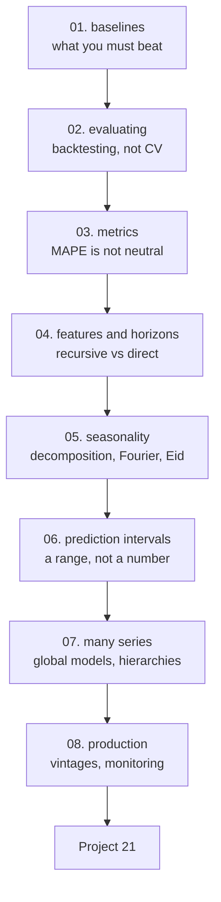

# Time Series and Forecasting — Tayel AI Labs

The twenty-second course. Forecasting is where the habits from the rest of this
track quietly break: the rows are ordered, a random split trains on the future,
and the one-line baseline is much harder to beat than anyone expects.

**Prerequisites**

- [`../Python`](../Python) — Basic track, especially pandas
- [`../Machine-Learning`](../Machine-Learning)
- [`../Data-Analysis`](../Data-Analysis) — Advanced lesson 04 analyses trends;
  this course forecasts them
- [`../Data-Science`](../Data-Science) — lessons 02, 03 and 06

---

## The path



## Lessons

| # | Lesson | The measured result |
|---|---|---|
| 01 | [The Baselines You Must Beat](lessons/01-baselines.md) | Drift and seasonal naive are within **8%** of the best model |
| 02 | [Evaluating a Forecast](lessons/02-evaluating.md) | Shuffled CV says 85.3; the honest split says **107.7**. Eight folds turn a "9% win" into **0.5%** |
| 03 | [Metrics](lessons/03-metrics.md) | MAPE **500.5%** where MAE is 1.00; identical MAE, **4x** the business cost |
| 04 | [Features and Horizons](lessons/04-features-and-horizons.md) | Direct beats recursive **73.1 against 124.9** at 28 days |
| 05 | [Seasonality](lessons/05-seasonality.md) | Autocorrelation peaks at 7, 14, 21, 28 — and Eid moves 11 days a year |
| 06 | [Prediction Intervals](lessons/06-prediction-intervals.md) | In-sample residuals give intervals **39% too narrow** |
| 07 | [Many Series at Once](lessons/07-many-series.md) | One global model, not a thousand local ones |
| 08 | [Forecasting in Production](lessons/08-production.md) | Keep the baseline running forever |

## Then

- **[`Project-21/`](Project-21/)** — a forecast that survives eight backtest
  folds, with calibrated intervals and a month of production monitoring

---

## Setup

```bash
python3 -m venv .venv
source .venv/bin/activate
pip install -r requirements.txt
```

Every lesson runs in seconds. `statsmodels` is optional and used only for
comparison in lessons 05 and 07.

---

## What this course argues

1. **Beat drift and seasonal naive, or you have produced nothing.** Three of the
   four baselines were within 8% of the best model (lesson 01).
2. **Random cross-validation understates the error by 26%** and hides the
   variance that matters (lesson 02).
3. **One split is not an evaluation.** A 9% win on the most recent window became
   0.5% across eight folds, and the model lost three of them (lesson 02).
4. **MAPE is asymmetric and explodes near zero.** Report MASE, and build a cost
   function when over- and under-forecasting differ (lesson 03).
5. **Errors compound through recursion.** Direct forecasting was 42% better at
   28 days (lesson 04).
6. **Intervals from training residuals are 39% too narrow.** Build them from the
   backtest, and check empirical coverage (lesson 06).
7. **Keep the baseline running in production**, so the day your model stops
   earning its place you have evidence rather than a suspicion (lesson 08).

---

## A note for Egyptian businesses

Lesson 05 covers the feature that matters most here and is missing from almost
every tutorial: **Ramadan and Eid move about 11 days earlier each Gregorian
year**, so `month` and `day-of-year` features cannot learn them. A days-to-Eid
feature joined from a Hijri calendar is usually the single largest accuracy
improvement available on Egyptian retail, restaurant and logistics series.
