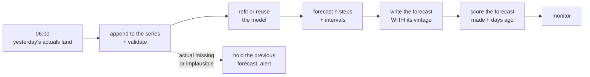

# Lesson 08 — Forecasting in Production

**Goal:** run a forecast every day without it quietly going wrong.

## What you will learn

- The retraining question
- What to monitor, and the signal unique to forecasting
- Revisions, and the number that changes after you published it
- The handover

---

## The daily job



Two boxes people leave out, and both cause incidents.

**`validate` before appending.** A late or partial day of actuals looks like a
collapse in demand, and the model will faithfully forecast the collapse forward.
The check is simple: is yesterday's value present, non-null, and within the
interval the model predicted for it? If not, hold and alert rather than
forecasting from a broken history — this is
[Data-Science lesson 09](../../Data-Science/lessons/09-monitoring-and-drift.md)'s
sentinel-value problem on a time axis.

**`score the forecast made h days ago`.** Today you can finally grade the
forecast you published 28 days ago. That is the only honest accuracy signal
production gives you, and it arrives with a delay equal to your horizon.

---

## How often to retrain

| Strategy | Cost | When |
|---|---|---|
| **Refit every run** | One fit per day — usually trivial | Small data, cheap model. **The default** |
| Refit weekly, forecast daily | Lower | Expensive fit, stable series |
| Refit on drift | Lowest, most complex | Expensive fit, and you have a drift signal |
| Never refit | Free, and wrong | Only with a fixed seasonal naive |

For most business series the fit costs seconds, so **refit every run** and
remove a whole class of staleness bug. The question only becomes interesting
when the fit costs hours.

And whichever you choose: **the model version goes on every forecast row**
([Data-Science lesson 08](../../Data-Science/lessons/08-shipping-the-model.md)),
so a change in the numbers can be traced to a change in the model.

---

## Vintages: the forecast you already published

A forecast table needs **two dates**, not one:

```text
forecast_date   the day the forecast was MADE          (the vintage)
target_date     the day being forecast
value, lo, hi   the forecast and its interval
model_version   which model produced it
```

With both, you can answer the three questions that otherwise cause arguments:

- *"What did we think on 1 October?"* — filter by `forecast_date`
- *"How did our view of November change?"* — filter by `target_date`, watch it
  move across vintages
- *"How accurate were we 28 days out?"* — join forecasts to actuals on
  `target_date` where the gap is 28 days

**Never overwrite a published forecast.** Append a new vintage. The old one was
the basis of a decision somebody made, and deleting it destroys the only record
of why.

---

## What to monitor

| Signal | Latency | Means |
|---|---|---|
| **The job ran, and wrote h rows** | minutes | The heartbeat. A silent stop looks like health |
| Actuals arrived, and are plausible | minutes | The input check above |
| **Forecast vs its own interval, h days later** | h days | The real accuracy signal |
| MASE against seasonal naive, rolling | h days | **Are you still beating free?** |
| Interval coverage, rolling | h days | A "90%" interval covering 70% |
| The forecast's level vs recent actuals | minutes | A sanity check available immediately |
| Share of series where MASE > 1.1 (lesson 07) | h days | Where you are doing harm |

The fourth row is the one specific to forecasting and the one most worth
alerting on. **A model that stops beating seasonal naive should be switched
off**, and without this monitor nobody ever notices — the forecast keeps being
produced, and it keeps being wrong in a way that looks plausible.

---

## Revisions, and telling people

Two kinds of change will arrive, and they feel identical to a stakeholder:

| Change | Cause | What to say |
|---|---|---|
| **The forecast moved** | New actuals; the model updated | "Our view of November fell 6% after three weak weeks" |
| **The history moved** | Upstream restated past data | "The underlying data was revised; this is not a forecast change" |

The second is the dangerous one. If your warehouse restates last month's
revenue, every backtest number, every accuracy report and every published
forecast built on it is now computed from different data — and it will look like
your model changed.

**Keep a hash of the input series with each forecast run**
([Data-Science lesson 07](../../Data-Science/lessons/07-reproducibility.md)).
When numbers move, you can say in ten seconds which of the two happened.

---

## The handover checklist

- [ ] The horizon, cadence and metric are written down, with **who asked for
      them**
- [ ] The baseline (seasonal naive) runs in production **alongside** the model
- [ ] MASE against that baseline is monitored, with an alert
- [ ] Every forecast row carries `forecast_date`, `model_version` and the input
      data hash
- [ ] Intervals come from **backtest** residuals, and coverage is monitored
      (lesson 06)
- [ ] Input validation holds the previous forecast rather than forecasting from
      broken history
- [ ] A heartbeat alerts when the job does not run
- [ ] Published vintages are never overwritten
- [ ] Someone other than you can rerun it, and has
- [ ] The decision the forecast feeds is named, with its owner

The second item is the one teams skip and the one that keeps you honest:
**keep the baseline running forever.** It costs one line, and the day your
model stops beating it, you will have the evidence rather than a suspicion.

---

## Common mistakes

| Mistake | Why it hurts |
|---|---|
| Appending actuals without validating | A partial day becomes a forecast collapse |
| One date column | You cannot answer "what did we think in October?" |
| Overwriting published forecasts | The basis of a past decision is gone |
| Never scoring h-days-ago forecasts | You have no accuracy signal at all |
| No baseline in production | You cannot tell when the model stopped earning its place |
| No heartbeat | A stopped job looks exactly like a healthy one |
| Not hashing the input series | "Did the data change or did the model?" is unanswerable |

---

## Exercises

1. Add `forecast_date` to your forecast table and backfill what you can.
2. Score the forecasts you made h days ago. What is your real production MASE?
3. Run seasonal naive alongside your model in production for a month. Compare.
4. Build the input-validation rule and test it with a deliberately partial day.
5. Write the handover checklist for your own forecast and find the gaps.

---

**Done with the lessons.** Next: [Project 21](../Project-21/) — a forecast that
survives eight backtest folds and a month in production.

---

## Where to go next

| Next | Why |
|---|---|
| [This course's project](../Project-21/) | It is the assessment, and it is not optional |
| [MLOps](../../MLOps/) | Forecasts decay faster than most models |
| [Data-Science 09](../../Data-Science/lessons/09-monitoring-and-drift.md) | Measuring the decay |
| [Data-Analysis Advanced 04](../../Data-Analysis/Advanced/lessons/04-time-series.md) | The analysis side |
